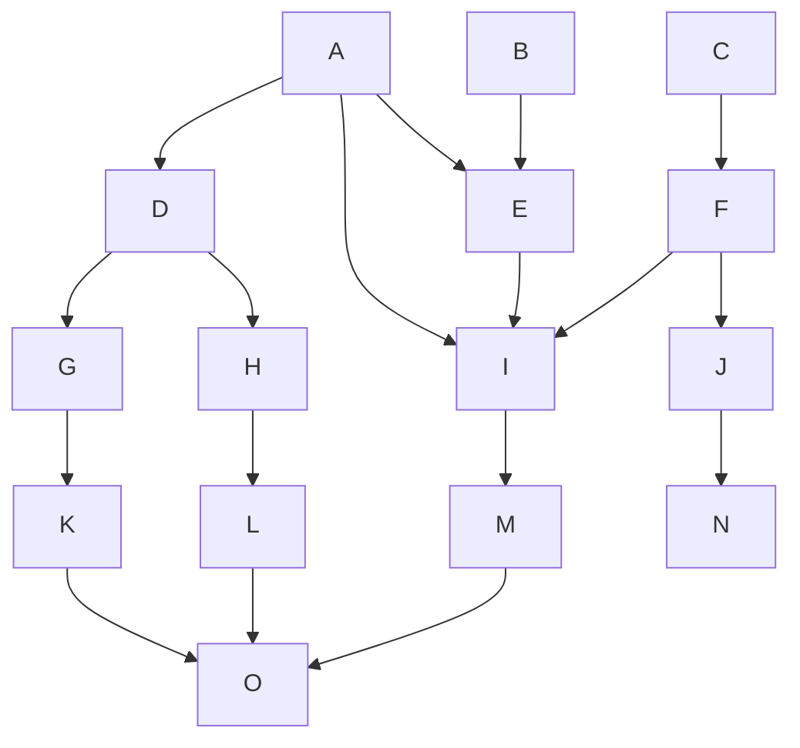
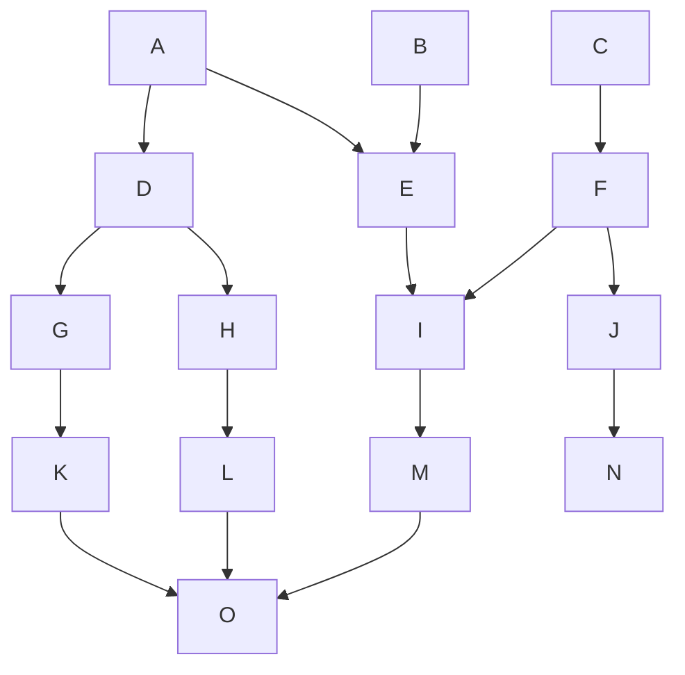
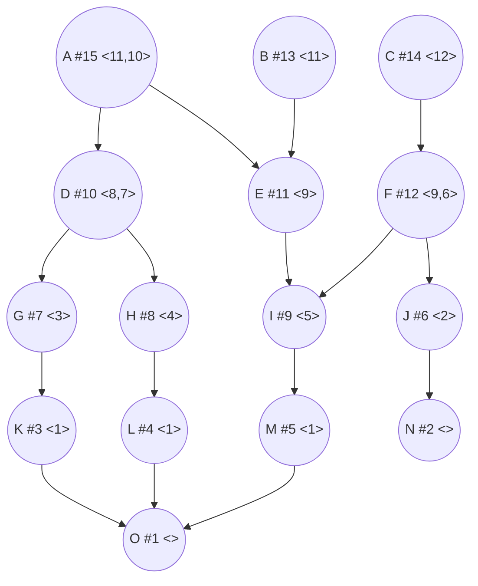

### Вариант 6
#### Таблица зависимостей:

| Предшествующее задание | A | A | A | B | C | D | D | E | F | F | G | H | I | J | K | L | M |
|------------------------|---|---|---|---|---|---|---|---|---|---|---|---|---|---|---|---|---|
| Последующее задание    | D | E | I | E | F | G | H | I | I | J | K | L | M | N | O | O | O |

#### Граф зависимостей:

В нашем графе ребро AI является транзитивным, так как есть путь A -> E -> I. Убираем транзитивное ребро.
### Без транзитивных ребер:

### Граф зависимостей с приоритетами:
Приоритет - # Строка приоритетов прямых потомков - <>

### Диаграмма Ганта:

```mermaid
gantt
    title Диаграмма Ганта
    dateFormat  HH:mm
    axisFormat %H:%M
    Начало выполнения работ : milestone, m1, 00:00, 0h
    section Исполнитель 1
    A :a1, 2025-01-21 00:00, 1h
    D :a2, after a1, 1h
    G :a3, after a2, 1h
    H :a4, after a3, 1h
    K :a5, after a4, 1h
    L :a6, after a5, 1h
    M :a7, after a6, 1h
    O :a8, after a7, 1h
    section Исполнитель 2
    B :b1, 2025-01-21 00:00, 1h
    E :b2, after b1, 1h
    C :b3, after b2, 1h
    F :b4, after b3, 1h
    I :b5, after b4, 1h
    J :b6, after b5, 1h
    N :b7, after b6, 1h
    Окончание выполнения работ : milestone, m1, 08:00, 0h
```

В конце у второго исполнителя простой 1 час. На выполнение всех задач потребовалось 7 часов.
