## ВАРИАНТ 5

Пропускная способность дуг сети и стоимость транспортировки указана в таблице.

| Дуги                      | sa | sb | sc | ba | bc | cd | ac | ad | dt |
|:--------------------------|:--:|:--:|:--:|:--:|:--:|:--:|:--:|:--:|:--:|
| Пропускная способность    | 6  | 6  | 6  | 6  | 5  | 10 | 5  | 8  | 15 |
| Стоимость транспортировки | 2  | 2  | 4  | 1  | 1  | 1  | 3  | 4  | 3  |

### 1. Построим сеть с источником **s**, стоком **t** и указанными пропускными способностями дуг для поиска максимального потока.

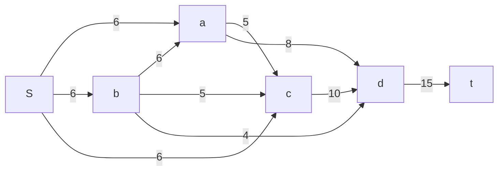

Построим остаточную сеть:

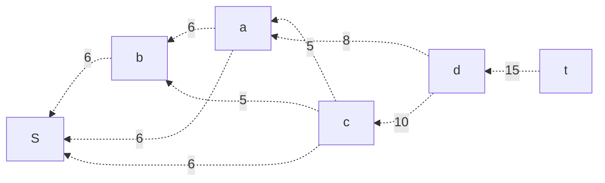

### 2. Проведем поиск увеличивающего пути в остаточной сети
В остаточной сети найден увеличивающий путь: **t -> d -> c -> S**. Минимальный вес дуг на этом пути равен 6.

Уменьшим вес дуг на найденном пути, дуги для которых вес стал нулевым удалим из остаточной сети (дуга c-.->S).

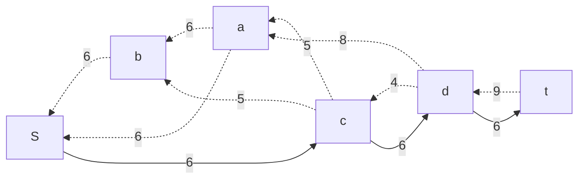

### 3. Продолжим поиск увеличивающего пути в остаточной сети
В остаточной сети найден увеличивающий путь: **t -> d -> a -> S**. Минимальный вес дуг на этом пути равен 6.

Уменьшим вес дуг на найденном пути, дуги для которых вес стал нулевым удалим из остаточной сети (дуга a-.->S).

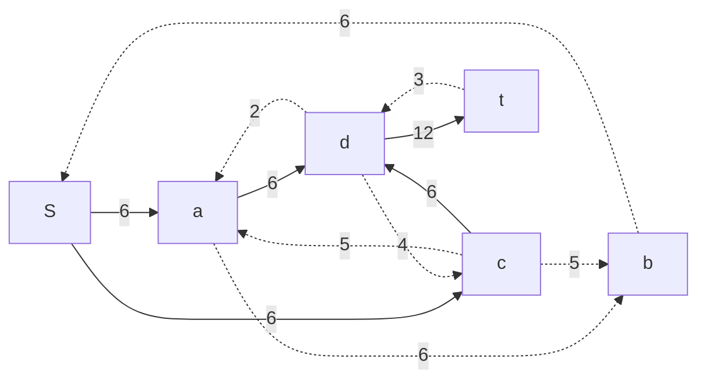

### 4. Продолжим поиск увеличивающего пути в остаточной сети
В остаточной сети найден увеличивающий путь: **t -> d -> c -> b -> S**. Минимальный вес дуг на этом пути равен 3.

Уменьшим вес дуг на найденном пути, дуги для которых вес стал нулевым удалим из остаточной сети (дуга t-.->d).

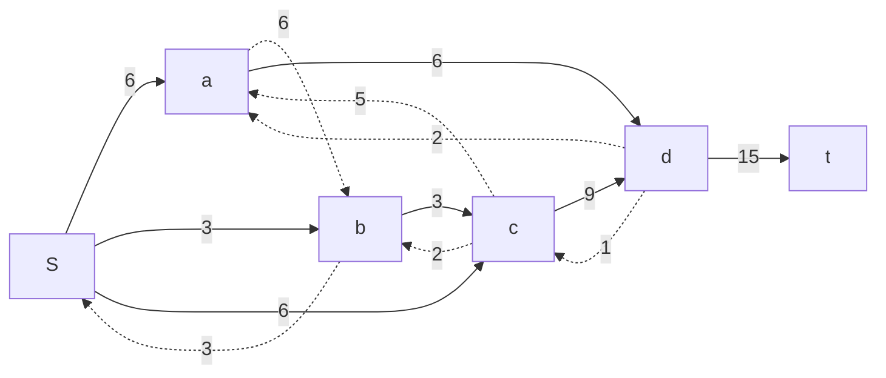

### 5. Продолжим поиск увеличивающего пути в остаточной сети

В остаточной сети не найдено увеличивающих путей, следовательно, алгоритм завершил работу и найденный поток величиной 15 является максимальным для данной сети.

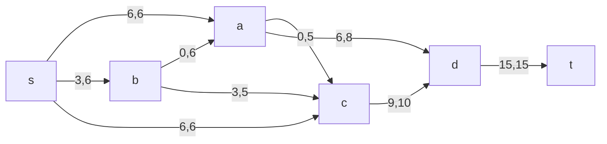

### 6. Рассчитаем стоимость полученного максимального потока.

Дуги                                            | sa | sb | sc | ba | bc | cd | ac | ad | dt | Итого  |
|:----------------------------------------------|:--:|:--:|:--:|:--:|:--:|:--:|:--:|:--:|:--:|:------:|
| Пропускная способность p(e)                   | 6  | 6  | 6  | 6  | 5  | 10 | 5  | 8  | 15 |        |
| Локальный поток f(e)                          | 6  | 3  | 6  | 0  | 3  | 9  | 0  | 6  | 15 |        |
| Стоимость транспортировки единицы потока c(e) | 2  | 2  | 4  | 1  | 1  | 1  | 3  | 4  | 3  |        |
| Суммарная стоимость f(e)*c(e)                 | 12 | 6  | 24 | 0  | 3  | 9  | 0  | 24 | 45 | **123**|

Стоимость полученного потока составляет **123**.

### 7. Попробуем уменьшить стоимость потока для чего построим остаточную сеть.
Для каждого ребра остаточной сети укажем стоимость транспортировки единицы потока.

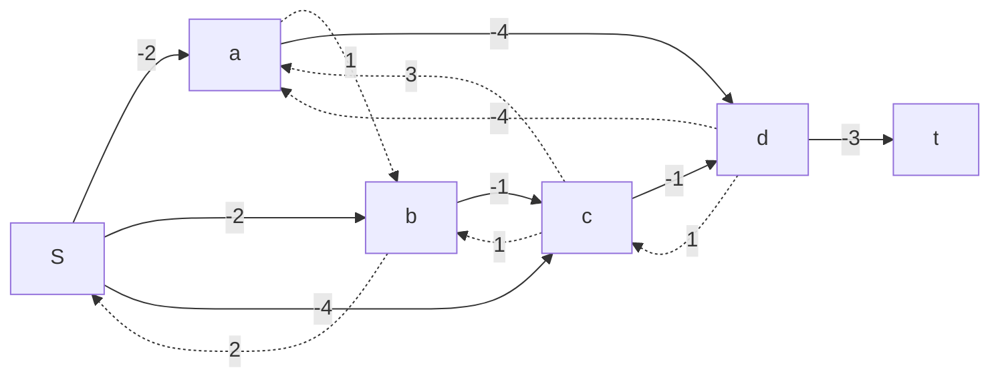

В остаточной сети найден ориентированный цикл отрицательной стоимости s -> c -> b -> s (- 4 + 1 + 2 = -1).

Найдем минимальный вес ребра в указанном цикле, изображенном **в остаточной сети с указанием величины потока**.

Минимальный вес ребра в цикле 2 - это неиспользованный резерв ребра c -> b.

Удалим найденный цикл - уменьшим на 2 вес всех ребер, входящих в цикл.

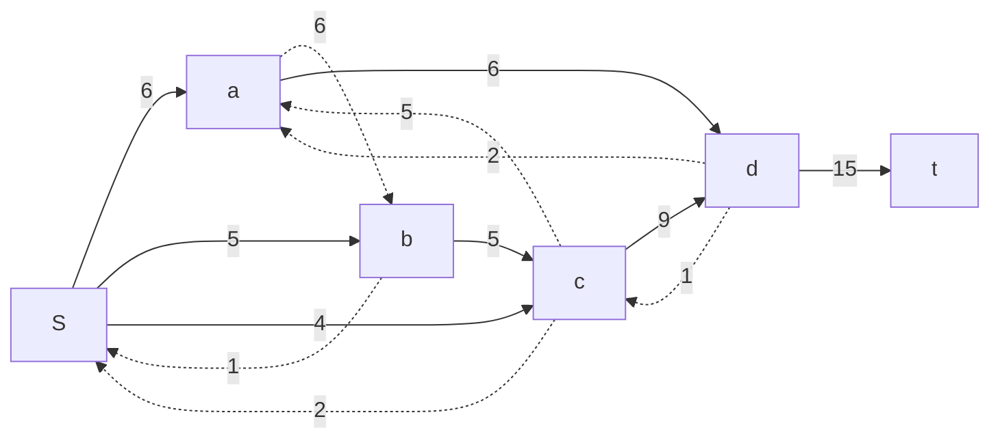

### 8. Проведем повторный поиск цикла отрицательной стоимости в остаточной сети.
Скорректируем остаточную сеть с указанием стоимости транспортировки единицы потока.

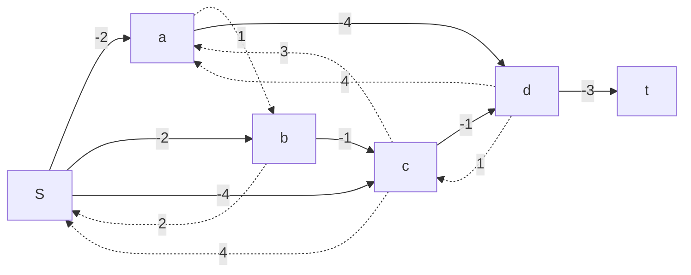

В остаточной сети найден ориентированный цикл отрицательной стоимости S -> a -> d -> c -> S (- 2 - 4 + 1 + 4 = -1).

Найдем минимальный вес ребра в указанном цикле, изображенном **в остаточной сети с указанием величины потока**.

Минимальный вес ребра в цикле 1 - это неиспользованный резерв ребра d -> c.

Удалим найденный цикл - уменьшим на 1 вес всех ребер, входящих в цикл.

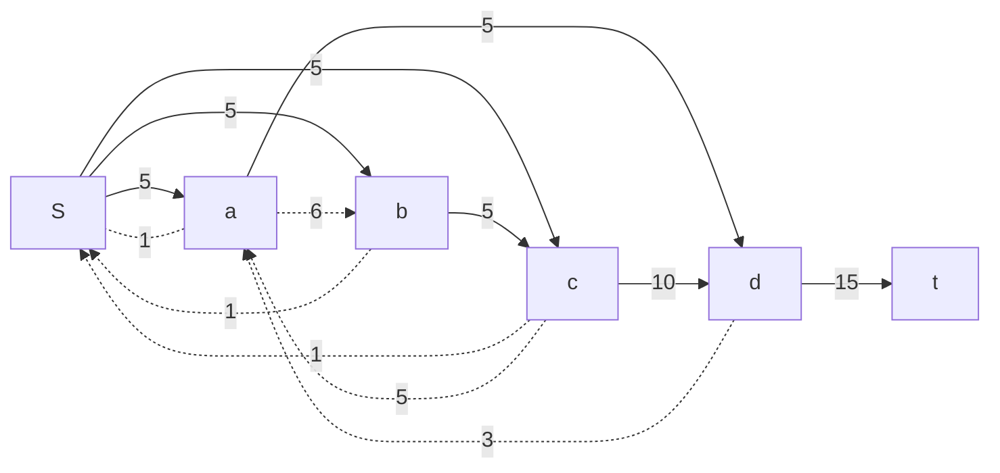

### 9. Проведем повторный поиск цикла отрицательной стоимости в остаточной сети.
Скорректируем остаточную сеть с указанием стоимости транспортировки единицы потока.

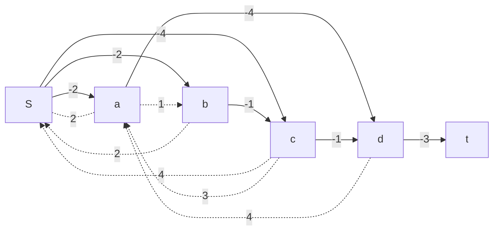

В остаточной сети отсутствуют циклы отрицательной стоимости, следовательно, стоимость потока минимальна.

### 10. Рассчитаем стоимость полученного максимального потока.

Дуги                                            | sa | sb | sc | ba | bc | cd | ac | ad | dt | Итого  |
|:----------------------------------------------|:--:|:--:|:--:|:--:|:--:|:--:|:--:|:--:|:--:|:------:|
| Пропускная способность p(e)                   | 6  | 6  | 6  | 6  | 5  | 10 | 5  | 8  | 15 |        |
| Локальный поток f(e)                          | 5  | 5  | 5  | 0  | 5  | 10 | 0  | 5  | 15 |        |
| Стоимость транспортировки единицы потока c(e) | 2  | 2  | 4  | 1  | 1  | 1  | 3  | 4  | 3  |        |
| Суммарная стоимость f(e)*c(e)                 | 10 | 10 | 20 | 0  | 5  | 10 | 0  | 20 | 45 | **120**|

Стоимость полученного потока составляет **120**.

### Ответ:
Максимальный поток в сети равен 15, минимальная стоимость потока 120, она реализуется следующим локальными потоками:

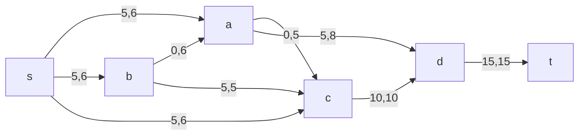