# Задание №10
# Задача о максимальном потоке минимальной стоимости. Вариант №1

## Задание
Для каждого варианта представлены условия задачи, в соответствии с которыми необходимо: 
1. Построить сеть с указанием пропускной способности дуг.
2. Построить остаточную сеть.
3. Определить максимальный поток методом поиска увеличивающих путей в остаточной сети.
4. Минимизировать стоимость максимального потока посредством поиска циклов отрицательной стоимости.
5. Оформить решение задачи по шагам с подробными комментариями, таблицами и диаграммами.
6. В ответе указать максимальную величину потока, минимальную стоимость транспортировки и сеть с указанием соответствующих локальных потоков.

## Постановка задачи
1. Дана сеть (взвешенный ориентированный граф) с источником s и стоком t.
2. Для каждой дуги определена пропускная способность и стоимость транспортировки.
3. Необходимо найти для указанной сети максимальный поток минимальной стоимости. 

## Решение задачи на поиск максимального потока минимальной стоимости

#### Пропускная способность дуг сети p(e) и стоимость транспортировки  единицы потока c(e):

| Дуги                      | sc | sb | sa | bc | cd | bd | ad | dt |
|:--------------------------|:--:|:--:|:--:|:--:|:--:|:--:|:--:|:--:|
| Пропускная способность    | 3  | 4  | 5  | 4  | 3  | 4  | 5  | 10 |
| Стоимость транспортировки | 4  | 3  | 1  | 2  | 1  | 3  | 2  | 2  |

### 1. Построим сеть с источником **s**, стоком **t** и указанными пропускными способностями дуг для поиска максимального потока.

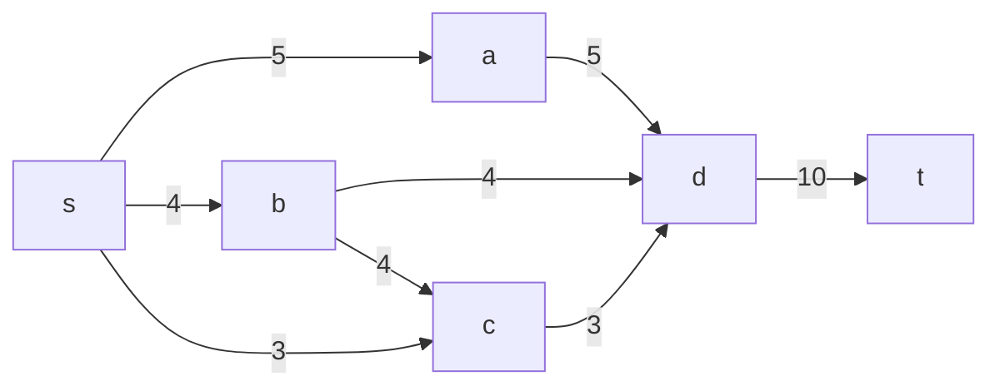

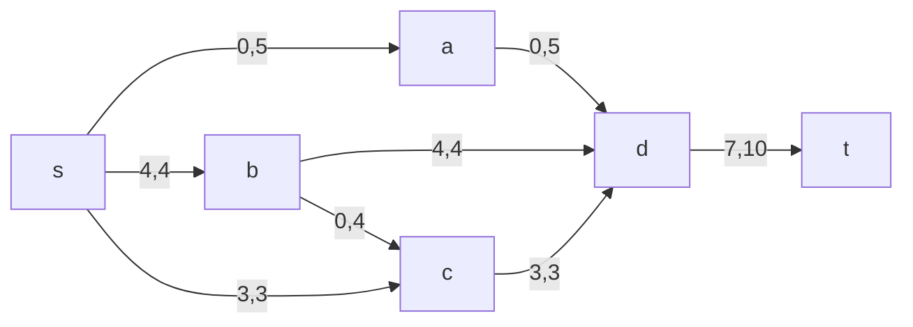

Укажем начальный поток величиной 7. Построим соответствующую остаточную сеть.

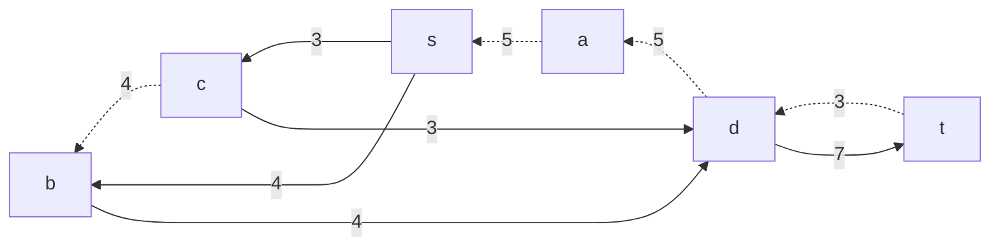

### 2. Проведем поиск увеличивающего пути в остаточной сети
В остаточной сети найден увеличивающий путь t -> d -> a -> s. Минимальный вес дуг на этом пути равен 3.

Уменьшим вес дуг на найденном пути, дуги для которых вес стал нулевым удалим из остаточной сети.

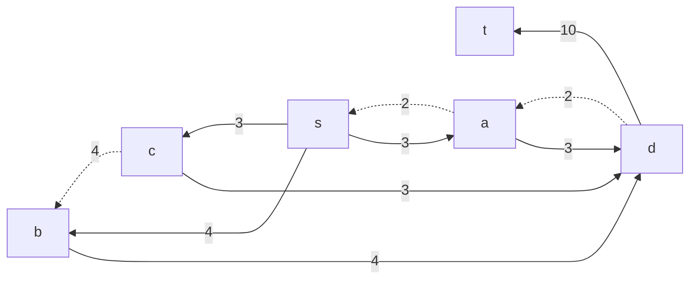

### 3. Продолжим поиск увеличивающего пути в остаточной сети

В остаточной сети не найдено увеличивающих путей, следовательно, алгоритм завершил работу и найденный поток величиной 10 является максимальным для данной сети.

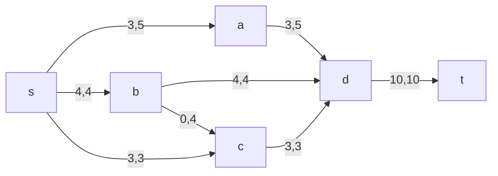

### 4. Рассчитаем стоимость полученного максимального потока.

| Дуги                                          | sc | sb | sa | bc | cd | bd | ad | dt  | Итого |
|:----------------------------------------------|:--:|:--:|:--:|:--:|:--:|:--:|:--:|:---:|:----:|
| Пропускная способность p(e)                   | 3  | 4  | 5  | 4  | 3  | 4  | 5  | 10  |      |
| Стоимость транспортировки единицы потока c(e) | 4  | 3  | 1  | 2  | 1  | 3  | 2  | 2   |      |
| Локальный поток f(e)                          | 3  | 4  | 3  | 0  | 3  | 4  | 3  |  10 |      |
| Суммарная стоимость f(e)*c(e)                 | 12 | 12 | 3  | 0  | 3 | 12  | 6  | 20  | **68** |

Стоимость полученного потока составляет 68. 

### 5. Попробуем уменьшить стоимость потока для чего построим остаточную сеть.
Для каждого ребра остаточной сети укажем стоимость транспортировки единицы потока.

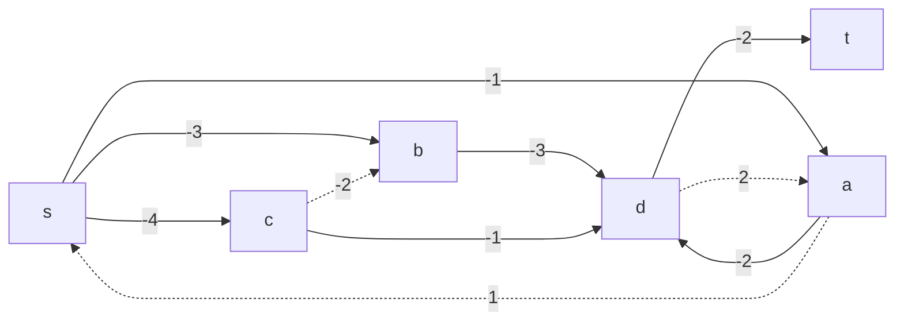

В остаточной сети найден ориентированный цикл отрицательной стоимости s -> c -> d -> a -> s (- 4 - 1 + 2 + 1 = -2). 

Найдем минимальный вес ребра в указанном цикле, изображенном **в остаточной сети с указанием величины потока**.  

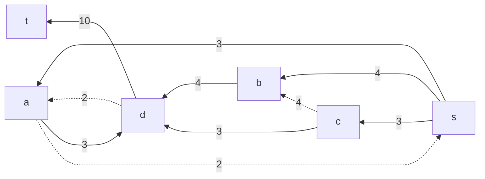

Минимальный вес ребра в цикле 2 - это неиспользованный резерв ребра a -> d и a -> s.

Удалим найденный цикл - уменьшим на 2 вес всех ребер, входящих в цикл.

### 6. Проведем повторный поиск цикла отрицательной стоимости в остаточной сети.
Скорректируем остаточную сеть с указанием стоимости транспортировки единицы потока.

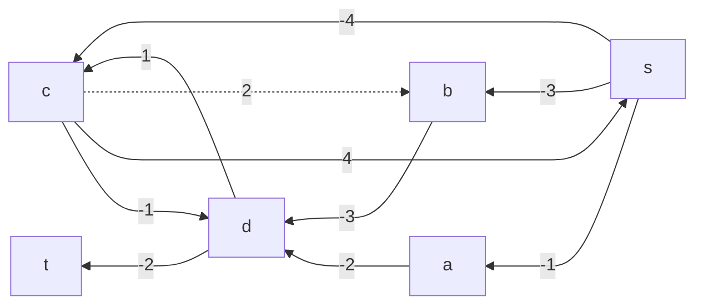

В остаточной сети найден ориентированный цикл отрицательной стоимости s -> b -> d -> c -> s (- 3 - 3 + 4 + 1 = -1). 

Найдем минимальный вес ребра в указанном цикле, изображенном **в остаточной сети с указанием величины потока**.  

Минимальный вес ребра в цикле 2 - это неиспользованный резерв ребер d -> c и c -> s.

Удалим найденный цикл - уменьшим на 2 вес всех ребер, входящих в цикл.

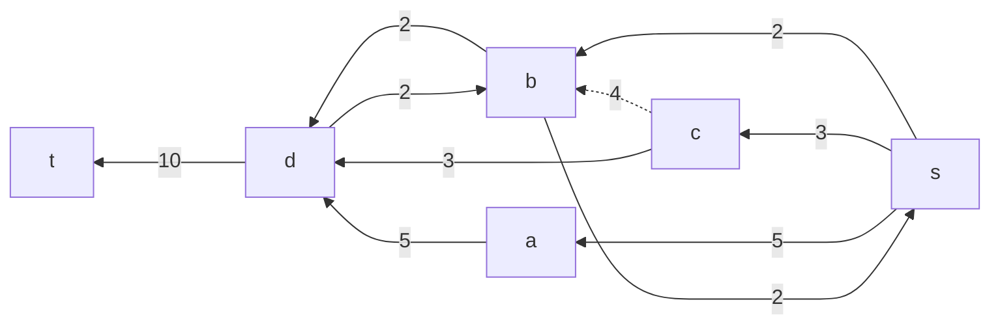

### 7. Проведем повторный поиск цикла отрицательной стоимости в остаточной сети.
Скорректируем остаточную сеть с указанием стоимости транспортировки единицы потока.

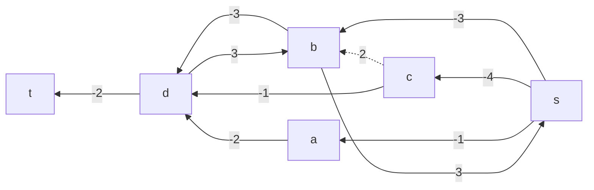

В остаточной сети отсутствуют циклы отрицательной стоимости, следовательно, стоимость потока минимальна.

### 8. Рассчитаем стоимость полученного максимального потока.

| Дуги                                          | sc | sb | sa | bc | cd | bd | ad | dt  | Итого |
|:----------------------------------------------|:--:|:--:|:--:|:--:|:--:|:--:|:--:|:---:|:----:|
| Пропускная способность p(e)                   | 3  | 4  | 5  | 4  | 3  | 4  | 5  | 10  |      |
| Стоимость транспортировки единицы потока c(e) | 4  | 3  | 1  | 2  | 1  | 3  | 2  | 2   |      |
| Локальный поток f(e)                          | 3  | 2  | 5  | 0  | 3  | 2  | 5  |  10 |      |
| Суммарная стоимость f(e)*c(e)                 | 12 | 6  | 5  | 0  | 3 | 6  | 10  | 20  | **62** |

Стоимость полученного потока составляет 62. 

### Ответ:
Максимальный поток в сети равен 10, минимальная стоимость потока 62, она реализуется следующим локальными потоками:

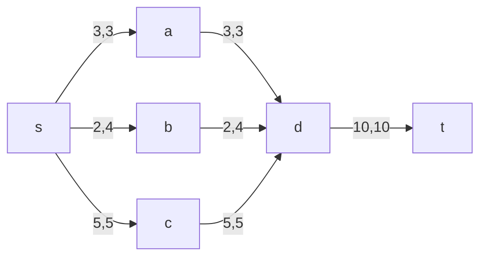