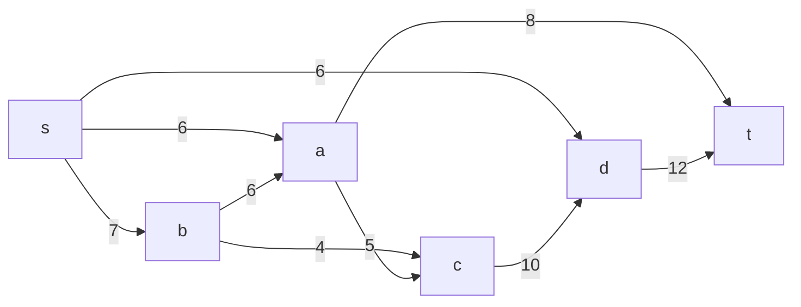
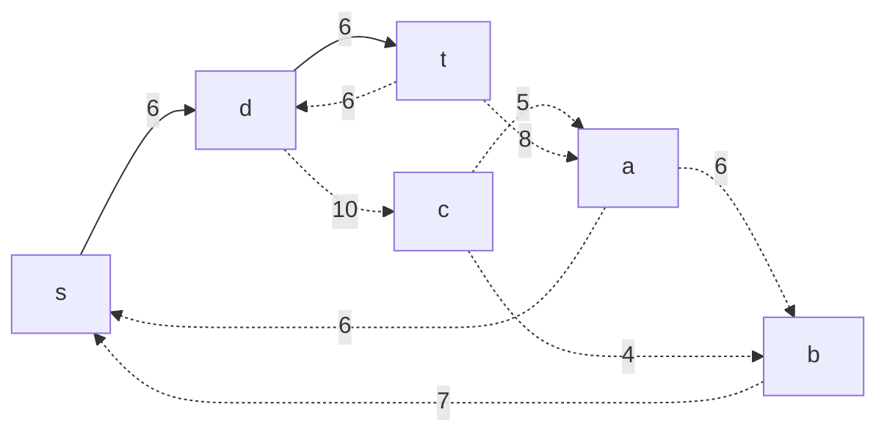
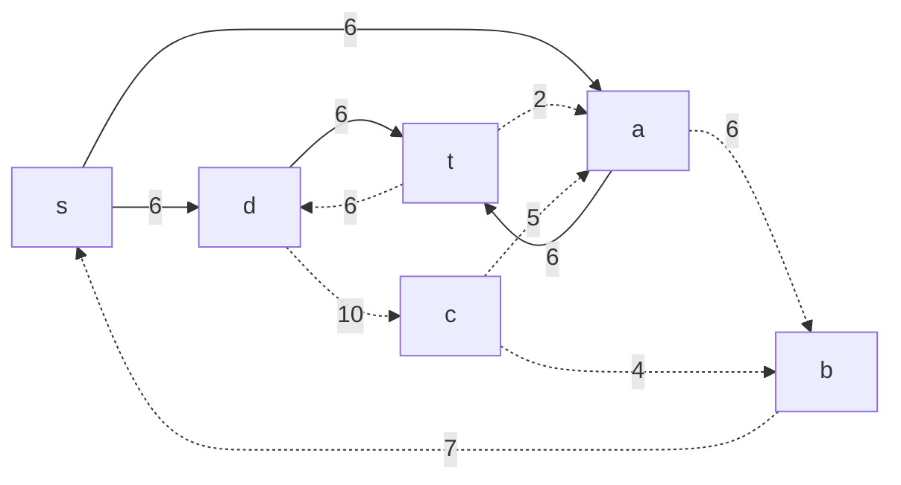
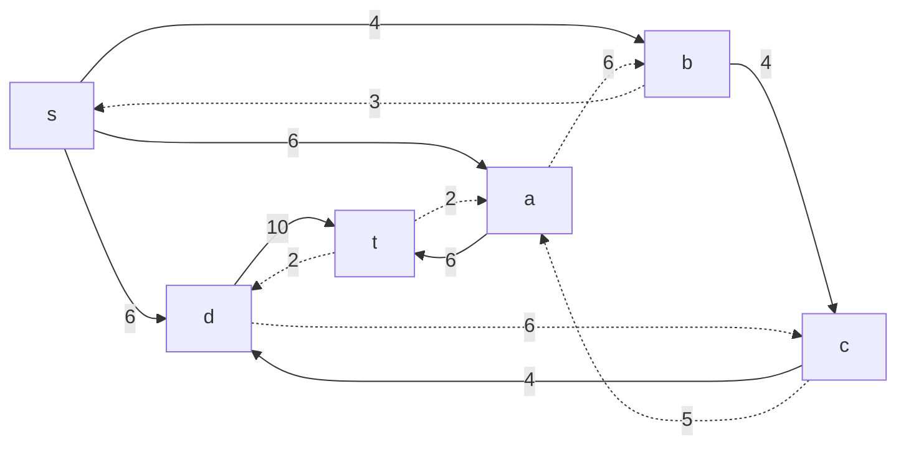
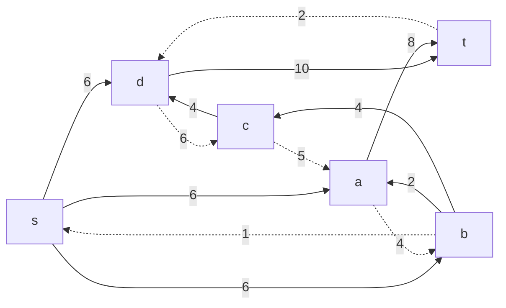
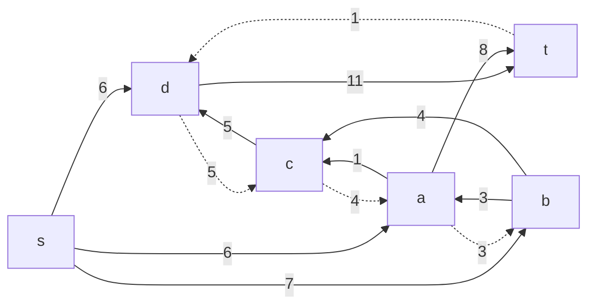
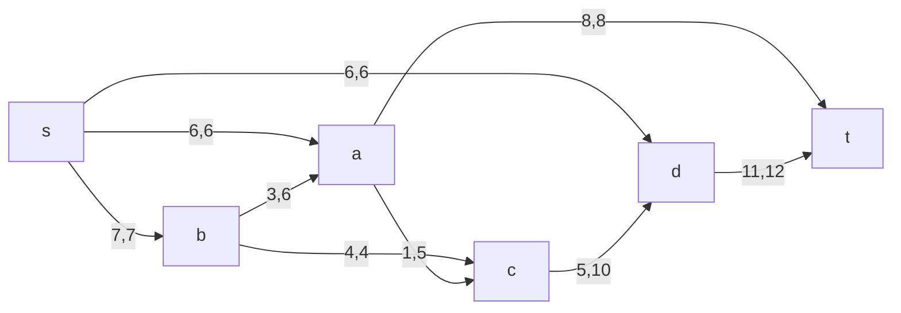
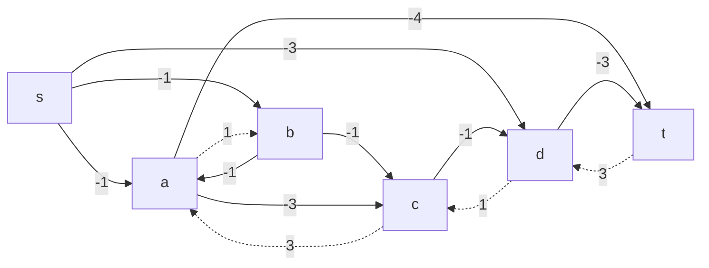
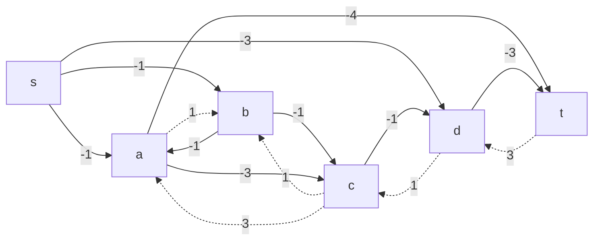

### Вариант 8:
#### Пропускная способность дуг сети p(e) и стоимость транспортировки  единицы потока c(e):

| Дуги                      | sa | sb | sd | ba | bc | cd | ac | at | dt |
|:--------------------------|:--:|:--:|:--:|:--:|:--:|:--:|:--:|:--:|:--:|
| Пропускная способность    | 6  | 7  | 6  | 6  | 4  | 10 | 5  | 8  | 12 |
| Стоимость транспортировки | 1  | 1  | 3  | 1  | 1  | 1  | 3  | 4  | 3  |

### Построим сеть с источником **s**, стоком **t** и указанными пропускными способностями дуг для поиска максимального потока.

Укажем начальный поток величиной 6 **s -> d -> t**. Построим соответствующую остаточную сеть.

В остаточной сети найден увеличивающий путь t -> a -> s. Минимальный вес дуг на этом пути равен 6.

Уменьшим вес дуг на найденном пути, дуги для которых вес стал нулевым удалим из остаточной сети.

В остаточной сети найден увеличивающий путь t -> d -> c -> b -> s. Минимальный вес дуг на этом пути равен 4.

Уменьшим вес дуг на найденном пути, дуги для которых вес стал нулевым удалим из остаточной сети.

В остаточной сети найден увеличивающий путь t -> a -> b -> s. Минимальный вес дуг на этом пути равен 2.

Уменьшим вес дуг на найденном пути, дуги для которых вес стал нулевым удалим из остаточной сети.

В остаточной сети найден увеличивающий путь t -> d -> c -> a -> b -> s. Минимальный вес дуг на этом пути равен 1.

Уменьшим вес дуг на найденном пути, дуги для которых вес стал нулевым удалим из остаточной сети.

В остаточной сети не найдено увеличивающих путей, следовательно, алгоритм завершил работу и найденный поток величиной 19 является максимальным для данной сети.

| Дуги                           | sa | sb | sd | ba | bc | cd | ac | at | dt | Итого |
|:-------------------------------|:--:|:--:|:--:|:--:|:--:|:--:|:--:|:--:|:--:|:-----:|
| Пропускная способность         | 6  | 7  | 6  | 6  | 4  | 10 | 5  | 8  | 12 |       |
| Локальный поток f(e)           | 6  | 7  | 6  | 3  | 4  | 5  | 1  | 8  | 11 |       |
| Стоимость транспортировки      | 1  | 1  | 3  | 1  | 1  | 1  | 3  | 4  | 3  |       |
|Суммарная стоимость f(e)*c(e)   | 6  | 7  | 18 | 3  | 4  | 5  | 3  | 32 | 33 |**111**|

Стоимость полученного потока составляет 111.

### Попробуем уменьшить стоимость потока для чего построим остаточную сеть.
Для каждого ребра остаточной сети укажем стоимость транспортировки единицы потока.

В остаточной сети отсутствуют циклы отрицательной стоимости, следовательно, стоимость потока минимальна.

## (Чтобы попрактиковаться со второй частью изменим конфигурацию потоков)

Найден максимальный поток.

| Дуги                           | sa | sb | sd | ba | bc | cd | ac | at | dt | Итого |
|:-------------------------------|:--:|:--:|:--:|:--:|:--:|:--:|:--:|:--:|:--:|:-----:|
| Пропускная способность         | 6  | 7  | 6  | 6  | 4  | 10 | 5  | 8  | 12 |       |
| Локальный поток f(e)           | 6  | 7  | 6  | 4  | 3  | 5  | 2  | 8  | 11 |       |
| Стоимость транспортировки      | 1  | 1  | 3  | 1  | 1  | 1  | 3  | 4  | 3  |       |
|Суммарная стоимость f(e)*c(e)   | 6  | 7  | 18 | 4  | 3  | 5  | 6  | 32 | 33 |**114**|

В остаточной сети найден ориентированный цикл отрицательной стоимости b -> a -> c -> b (-1 - 3 + 1 = -3).

Найдем минимальный вес ребра в указанном цикле, изображенном **в остаточной сети с указанием величины потока**.

Минимальный вес ребра в цикле 1. Удалим найденный цикл - уменьшим на 1 вес всех ребер, входящих в цикл.

Скорректируем остаточную сеть с указанием стоимости транспортировки единицы потока.

В остаточной сети отсутствуют циклы отрицательной стоимости, следовательно, стоимость потока минимальна.

Рассчитаем стоимость полученного максимального потока.

| Дуги                           | sa | sb | sd | ba | bc | cd | ac | at | dt | Итого |
|:-------------------------------|:--:|:--:|:--:|:--:|:--:|:--:|:--:|:--:|:--:|:-----:|
| Пропускная способность         | 6  | 7  | 6  | 6  | 4  | 10 | 5  | 8  | 12 |       |
| Локальный поток f(e)           | 6  | 7  | 6  | 3  | 4  | 5  | 1  | 8  | 11 |       |
| Стоимость транспортировки      | 1  | 1  | 3  | 1  | 1  | 1  | 3  | 4  | 3  |       |
|Суммарная стоимость f(e)*c(e)   | 6  | 7  | 18 | 3  | 4  | 5  | 3  | 32 | 33 |**111**|

Стоимость полученного потока составляет 111.

### Ответ:
Максимальный поток в сети равен 19, минимальная стоимость потока 111, она реализуется следующим локальными потоками:

