# Задание №10
# Задача о максимальном потоке минимальной стоимости. Green, вариант 4

Пропускная способность дуг сети и стоимость транспортировки указана в таблице.
| Дуги                      | sa | sb | ac | ba | bc | bd | cd | at | dt |
|:--------------------------|:--:|:--:|:--:|:--:|:--:|:--:|:--:|:--:|:--:|
| Пропускная способность    | 3  | 10 | 4  | 1  | 3  | 10 | 8  | 5  | 12 |
| Стоимость транспортировки | 1  | 1  | 1  | 2  | 3  | 5  | 1  | 3  | 1  |

### 1. Построим сеть с источником **s**, стоком **t** и указанными пропускными способностями дуг для поиска максимального потока.

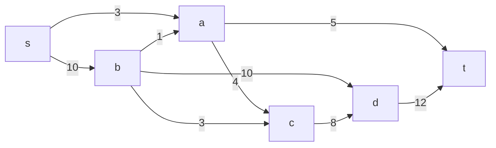
Укажем начальный поток величиной 3 **s -> a -> t**. Построим соответствующую остаточную сеть.

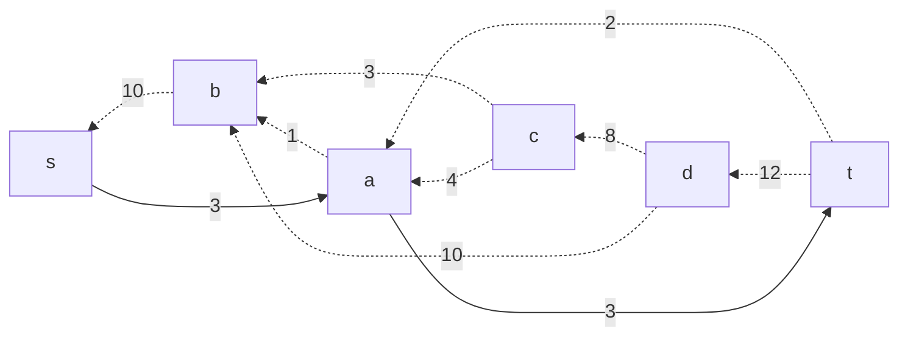

### 2. Проведем поиск увеличивающего пути в остаточной сети
В остаточной сети найден увеличивающий путь t -> d -> b -> s. Минимальный вес дуг на этом пути равен 10.
Уменьшим вес дуг на найденном пути, дуги для которых вес стал нулевым удалим из остаточной сети.

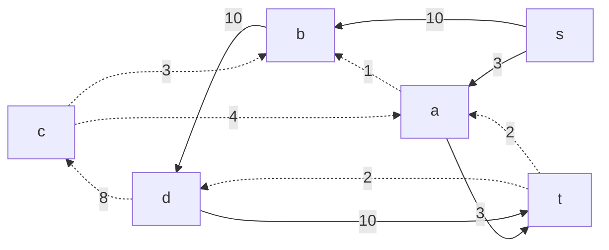

### 3. Продолжим поиск увеличивающего пути в остаточной сети
В остаточной сети не найдено увеличивающих путей, следовательно, алгоритм завершил работу и найденный поток величиной 13 является максимальным для данной сети.

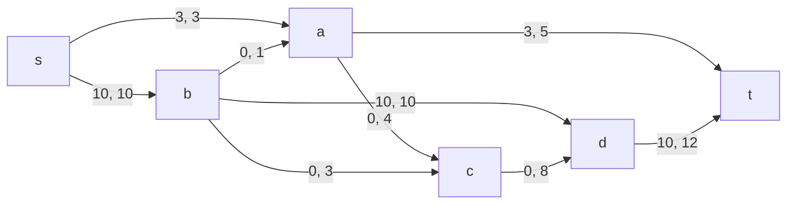
### 4. Рассчитаем стоимость полученного максимального потока.

| Дуги                                          | sa | sb | ac | ba | bc | bd | cd | at | dt |Итого|
|:--------------------------                    |:--:|:--:|:--:|:--:|:--:|:--:|:--:|:--:|:--:|:--:|
| Пропускная способность                        | 3  | 10 | 4  | 1  | 3  | 10 | 8  | 5  | 12 |
| Локальный поток f(e)                          | 3  | 10 | 0  | 0  | 0  | 10 | 0  | 3  | 10 |
| Стоимость транспортировки c(e)                | 1  | 1  | 1  | 2  | 3  | 5  | 1  | 3  | 1  |
| Суммарная стоимость f(e)*c(e)                 | 3  | 10 | 0  | 0  | 0  | 50 | 0  | 9  |10 |**82**|

Стоимость полученного потока составляет 82. 

### 5. Попробуем уменьшить стоимость потока для чего построим остаточную сеть.
Для каждого ребра остаточной сети укажем стоимость транспортировки единицы потока.

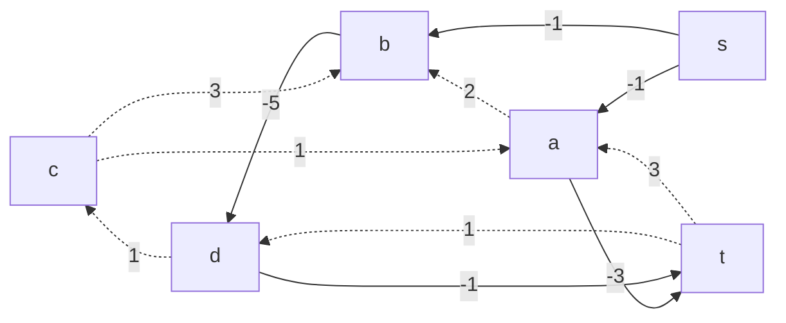
В остаточной сети найден ориентированный цикл отрицательной стоимости c -> a -> b -> d -> c (1 + 2 - 5 + 1 = -1). 

Найдем минимальный вес ребра в указанном цикле, изображенном **в остаточной сети с указанием величины потока**.  

Минимальный вес ребра в цикле 1 - a -> b.

Удалим найденный цикл - уменьшим на 1 вес всех ребер, входящих в цикл.

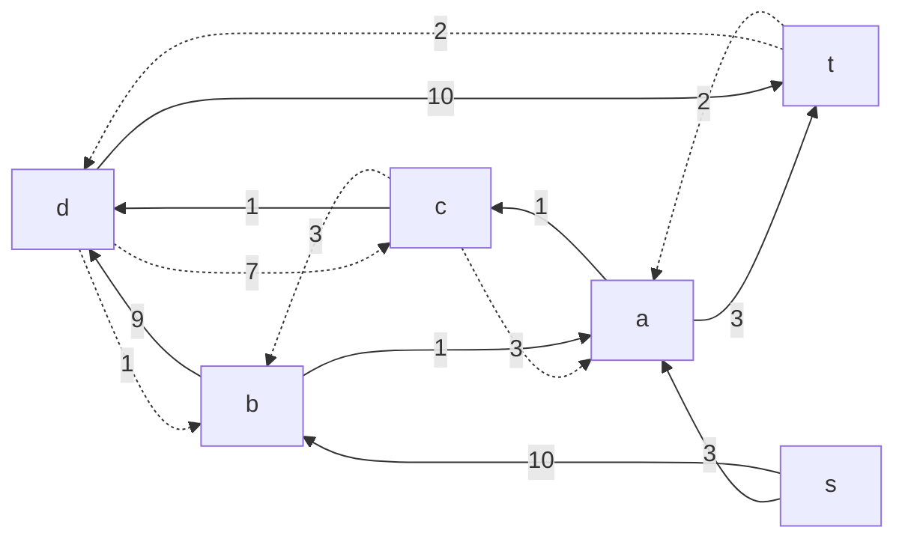
### 6. Проведем повторный поиск цикла отрицательной стоимости в остаточной сети.
Скорректируем остаточную сеть с указанием стоимости транспортировки единицы потока.

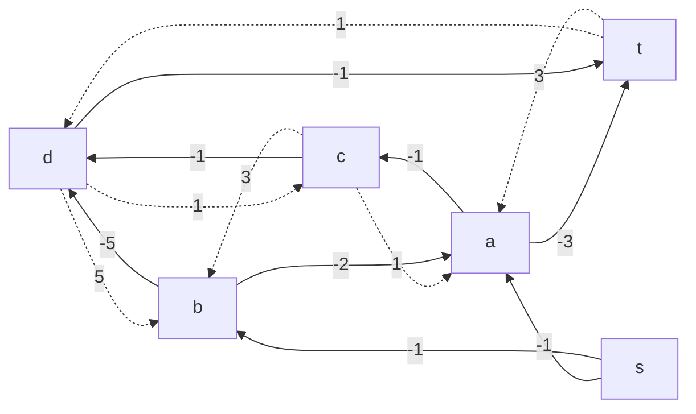

В остаточной сети найден ориентированный цикл отрицательной стоимости d -> t -> a -> c -> b -> d (- 1 + 3 - 1 + 3 -5 = -1). 

Найдем минимальный вес ребра в указанном цикле, изображенном **в остаточной сети с указанием величины потока**.  

Минимальный вес ребра в цикле 2 - это неиспользованный резерв ребер s -> a и a -> d.
Удалим найденный цикл - уменьшим на 2 вес всех ребер, входящих в цикл.

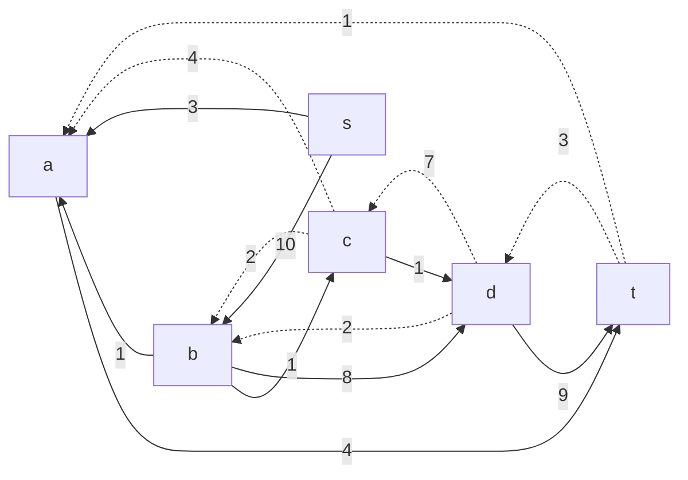

### 7. Проведем повторный поиск цикла отрицательной стоимости в остаточной сети.
Скорректируем остаточную сеть с указанием стоимости транспортировки единицы потока.

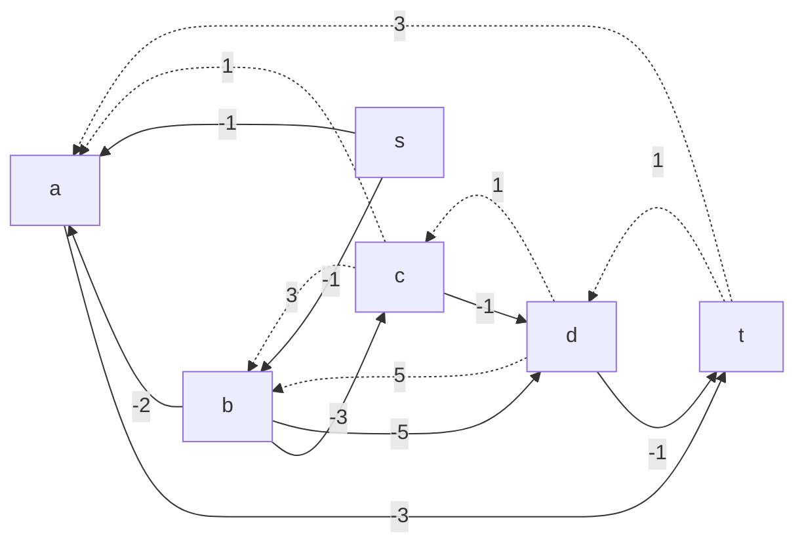

В остаточной сети найден ориентированный цикл отрицательной стоимости c -> b -> d -> c (3-5+1=-1). 

Найдем минимальный вес ребра в указанном цикле, изображенном **в остаточной сети с указанием величины потока**.  

Минимальный вес ребра в цикле 2 - это неиспользованный резерв ребер b -> c.
Удалим найденный цикл - уменьшим на 2 вес всех ребер, входящих в цикл.

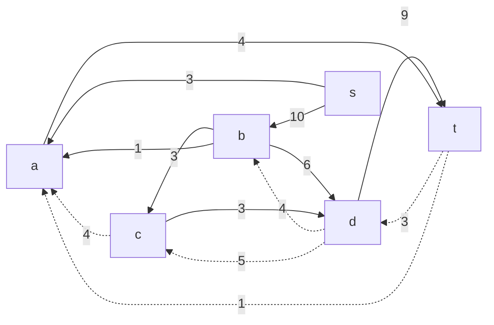

### 8. Проведем повторный поиск цикла отрицательной стоимости в остаточной сети.
Скорректируем остаточную сеть с указанием стоимости транспортировки единицы потока.

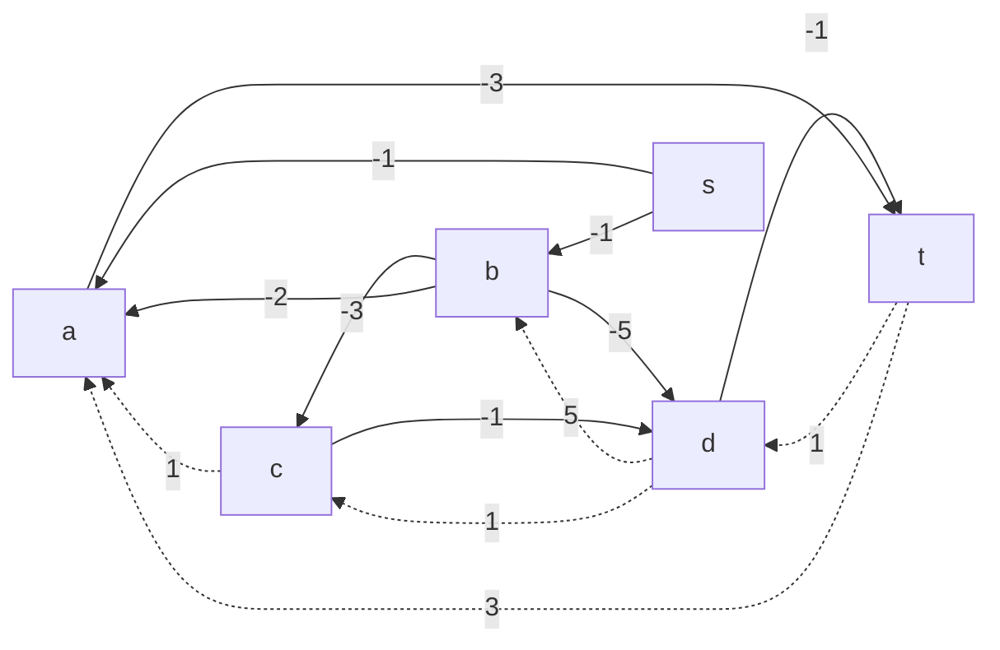

В остаточной сети отсутствуют циклы отрицательной стоимости, следовательно, стоимость потока минимальна.

### 9. Рассчитаем стоимость полученного максимального потока.

| Дуги                                        | sa | sb | ac | ba | bc | bd | cd | at | dt |Итого|
|:--------------------------                  |:--:|:--:|:--:|:--:|:--:|:--:|:--:|:--:|:--:|:--:|
| Пропускная способность                      | 3  | 10 | 4  | 1  | 3  | 10 | 8  | 5  | 12 |
| Локальный поток f(e)                        | 3  | 10 | 0  | 1  | 3  | 6  | 3  | 4  | 9  |
| Стоимость транспортировки c(e)              | 1  | 1  | 1  | 2  | 3  | 5  | 1  | 3  | 1  |
| Суммарная стоимость f(e)*c(e)               | 3  | 10 | 0  | 2  | 9  | 30 | 3  | 12 | 9  |**78**|
Стоимость полученного потока составляет 78. 

### Ответ:
Максимальный поток в сети равен 13, минимальная стоимость потока 78, она реализуется следующим локальными потоками:

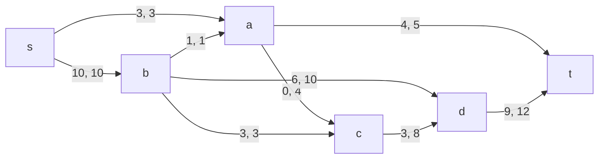