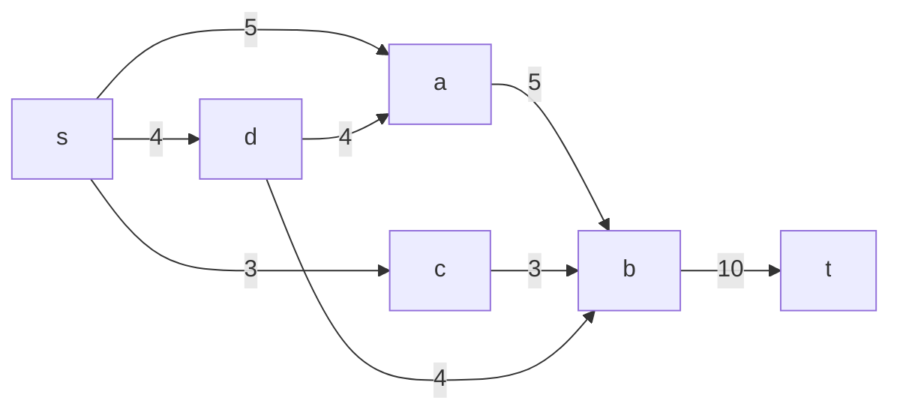
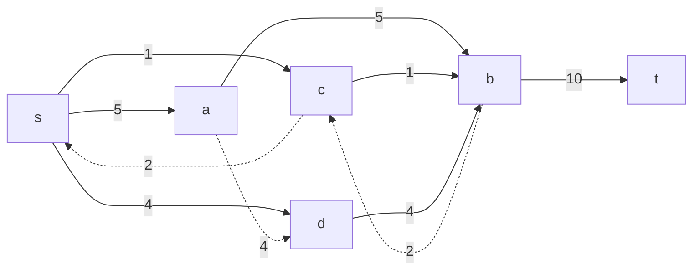
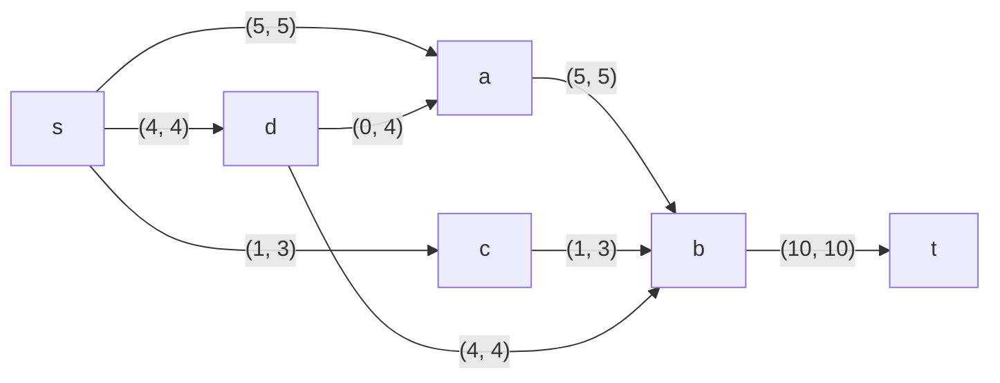
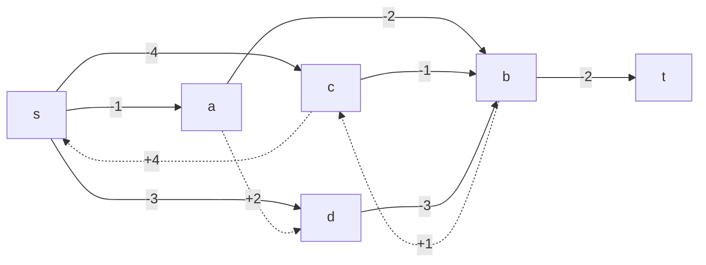
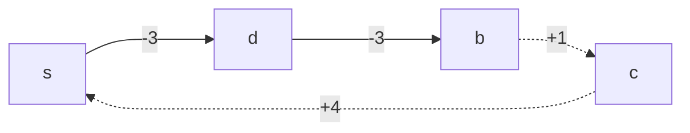
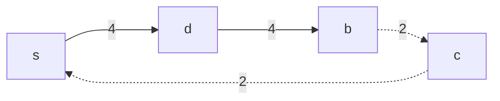
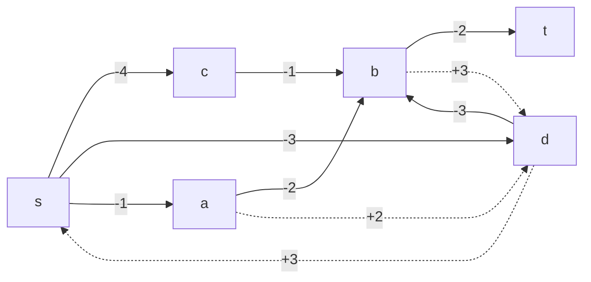
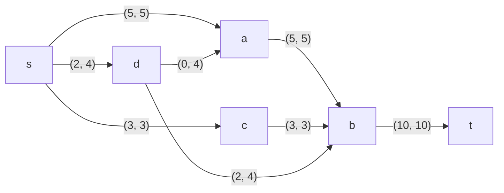

# Задача о максимальном потоке минимальной стоимости. Вариант 10.

## Постановка задачи
1. Дана сеть (взвешенный ориентированный граф) с источником s и стоком t.
2. Для каждой дуги определена пропускная способность *р(е)* и стоимость транспортировки *с(е)*.

| Дуги                      | sc | sd | sa | ab | bt | da | cb | db |
|:--------------------------|:--:|:--:|:--:|:--:|:--:|:--:|:--:|:--:|
| Пропускная способность    | 3  | 4  | 5  | 5  | 10 | 4  | 3  | 4  |
| Стоимость транспортировки | 4  | 3  | 1  | 2  | 2  | 2  | 1  | 3  |

3. Необходимо найти для указанной сети максимальный поток минимальной стоимости. 

## Определим максимальный поток в сети

Построим сеть с источником *s*, стоком *t* и указанными пропускными способностями дуг.

Укажем начальный поток величиной 10. Построим соответствующую остаточную сеть.

Так как в остаточной сети нет ни одного ориентированного пути из *t* в *s*, то добавить новые потоки нельзя. Следовательно, данный поток является максимальным. 

Скорректируем исходную сеть с учетом локального потока:

## Рассчитаем стоимость полученного максимального потока

| Дуги                          | sc | sd | sa | ab | bt | da | cb | db | Сумма  |
|:------------------------------|:--:|:--:|:--:|:--:|:--:|:--:|:--:|:--:|:------:|
| Пропускная способность    p(e)| 3  | 4  | 5  | 5  | 10 | 4  | 3  | 4  |        |
| Стоимость транспортировки c(e)| 4  | 3  | 1  | 2  | 2  | 2  | 1  | 3  |        |
| Локальный поток f(e)          | 1  | 4  | 5  | 5  | 10 | 0  | 1  | 4  |        |
| Суммарная стоимость f(e)*c(e) | 4  | 12 | 5  | 10 | 20 | 0  | 1  | 12 | **64** |

Стоимость полученного потока составляет *64*. 

## Попробуем уменьшить стоимость потока.

Для каждого ребра остаточной сети укажем стоимость транспортировки единицы потока.

В остаточной сети найден ориентированный цикл отрицательной стоимости *-1*. 

Найдем минимальный вес ребра в указанном цикле, изображенном **в остаточной сети с указанием величины потока**.  

Минимальный вес ребра в цикле равен *2*. Удалим найденный цикл - уменьшим на 2 вес всех ребер, входящих в цикл.

Новая остаточная сеть имеет следующий вид:

## Проведем повторный поиск цикла отрицательной стоимости в остаточной сети

Скорректируем остаточную сеть с указанием стоимости транспортировки единицы потока.

В остаточной сети отсутствуют циклы отрицательной стоимости, следовательно, стоимость потока минимальна.

## Рассчитаем стоимость полученного максимального потока

| Дуги                          | sc | sd | sa | ab | bt | da | cb | db | Сумма  |
|:------------------------------|:--:|:--:|:--:|:--:|:--:|:--:|:--:|:--:|:------:|
| Пропускная способность    p(e)| 3  | 4  | 5  | 5  | 10 | 4  | 3  | 4  |        |
| Стоимость транспортировки c(e)| 4  | 3  | 1  | 2  | 2  | 2  | 1  | 3  |        |
| Локальный поток f(e)          | 3  | 2  | 5  | 5  | 10 | 0  | 3  | 2  |        |
| Суммарная стоимость f(e)*c(e) | 12 | 6  | 5  | 10 | 20 | 0  | 3  | 6  | **62** |

Стоимость полученного потока составляет *62*. 

## Ответ:
Максимальный поток в сети равен *10*, минимальная стоимость потока *62*, она реализуется следующим локальными потоками:

