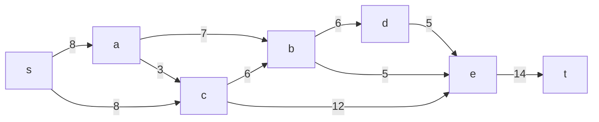
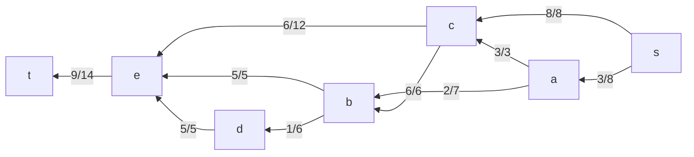

Задача о максимальном потоке минимальной стоимости (Вариант 6)

### Постановка задачи
1. Дана сеть (взвешенный ориентированный граф) с источником **s** и стоком **t**.
2. Указаны пропускные способности **p(e)** и стоимость транспортировки **c(e)**.

#### Пропускная способность дуг сети **p(e)** и стоимость транспортировки единицы потока **c(e)**:
| Дуги                      | sa | sс | ab | ac | cb | bd | de | be | ce | et |
|:--------------------------|:--:|:--:|:--:|:--:|:--:|:--:|:--:|:--:|:--:|:--:|
| Пропускная способность    | 8  | 8  | 7  | 3  | 6  | 6  | 5  | 5  | 12 | 14 |
| Стоимость транспортировки | 2  | 2  | 2  | 1  | 1  | 2  | 2  | 5  | 7  | 3  |

### 1. Составим граф сети



### 2. Поиск максимального потока методом поиска увеличивающих путей

 Шаг 1. Выберем путь: s → a → b → d → e → t

 Резервы дуг:
 - s → a: 8
 - a → b: 7
 - b → d: 6
 - d → e: 5
 - e → t: 14

 Минимальный резерв = 5. Передаём поток 5 по этому пути и строим остаточную сеть.



Шаг 2. Выберем путь: s → c → e → t

Резервы дуг:
s → c: 8

 ```mermaid
graph RL
    s-->|3/8|a
    s-->|0/8|c
    a-->|2/7|b
    a-->|3/3|c
    c-->|6/12|e
    c-->|6/6|b
    b-->|1/6|d
    b-->|5/5|e
    d-->|5/5|e
    e-->|9/14|t
 ```

 Минимальный резерв = 8. Передаём поток 8 по этому пути:

 Шаг 3. Выберем путь: s → a → b → e → t
 Резервы дуг:
 - s → a: остаток 3
 - a → b: остаток 2
 - b → e: 5 (не использована ранее по этому пути)
 - e → t: остаток 1

 Минимальный резерв = 1. Передаём поток 1 по этому пути:

 ```mermaid
 graph RL
    s-->|2/8|a
    s-->|0/8|c
    a-->|1/7|b
    a-->|3/3|c
    c-->|6/12|e
    c-->|6/6|b
    b-->|1/6|d
    b-->|5/5|e
    d-->|5/5|e
    e-->|9/14|t

 ```


После трёх шагов суммарный поток из s равен 5 + 8 + 1 = 14. Алгоритм завершается, так как увеличивающих путей нет.

Итоговая схема максимального потока:

graph LR
    s-->|6/8|a
    s-->|8/8|c
    a-->|6/7|b
    a-->|0/3|c
    c-->|4/12|e
    c-->|4/6|b
    b-->|5/6|d
    b-->|5/5|e
    d-->|5/5|e
    e-->|14/14|t


 ### 3. Расчёт стоимости полученного потока

| Дуги   | sa   | sc   | ab   | ac   | cb   | bd   | de   | be   | ce   | et   |
| :----- | :--- | :--- | :--- | :--- | :--- | :--- | :--- | :--- | :--- | :--- |
| Пропускная способность | 8    | 8    | 7    | 3    | 6    | 6    | 5    | 5    | 12   | 14   |
| Локальный поток f(e)   | 6    | 8    | 6    | 0    | 0    | 5    | 5    | 1    | 8    | 14   |
| Стоимость c(e)       | 2    | 2    | 2    | 1    | 1    | 2    | 2    | 5    | 7    | 3    |
| Суммарная стоимость   | 12   | 16   | 12   | 0    | 0    | 10   | 10   | 5    | 56   | 42   |

Стоимость полученного потока равна 163

 ### 4. Минимизация стоимости потока (поиск циклов отрицательной стоимости)

Найден цикл отрицательной стоимости:

Цикл: b → e → c → b

Стоимость по циклу: 5 + (-7) + 1 = -1
Минимальный резерв = 4
Корректируем поток по циклу:

Увеличиваем поток по b → e на 4: 1 → 5.
Уменьшаем поток по c → e на 4: 8 → 4.
Увеличиваем поток по c → b на 4: 0 → 4.

 ### 5. Пересчёт стоимости потока после корректировки

 | Дуги                  | sa  | sc  | ab  | ac  | cb  | bd  | de  | be  | ce  | et  |
| --------------------- | --- | --- | --- | --- | --- | --- | --- | --- | --- | --- |
| Пропускная способность | 8   | 8   | 7   | 3   | 6   | 6   | 5   | 5   | 12  | 14  |
| Локальный поток f(e)   | 6   | 8   | 6   | 0   | 4   | 5   | 5   | 5   | 4   | 14  |
| Стоимость c(e)       | 2   | 2   | 2   | 1   | 1   | 2   | 2   | 5   | 7   | 3   |
| Суммарная стоимость   | 12  | 16  | 12  | 0   | 4   | 10  | 10  | 25  | 28  | 42  |
| Итого                  |  |  |  |  |  |  |  |  |  | 159 |

 Стоимость транспортировки потока уменьшена до 159

 ### 6. Итоговый ответ
 Максимальный поток в сети равен 14, минимальная стоимость транспортировки потока составляет 159, что реализуется следующими локальными потоками:

 ```mermaid
 graph LR
    s-->|6/8|a
    s-->|8/8|c
    a-->|6/7|b
    a-->|0/3|c
    c-->|4/12|e
    c-->|4/6|b
    b-->|5/6|d
    b-->|5/5|e
    d-->|5/5|e
    e-->|14/14|t
 ```