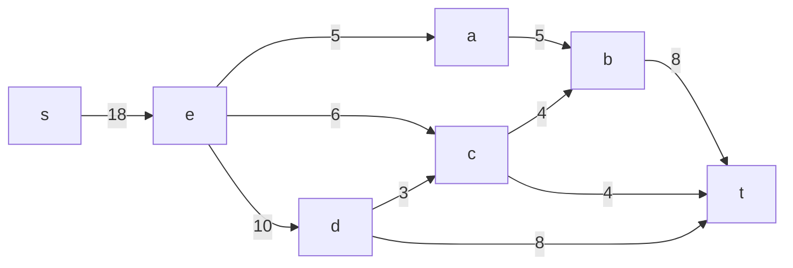
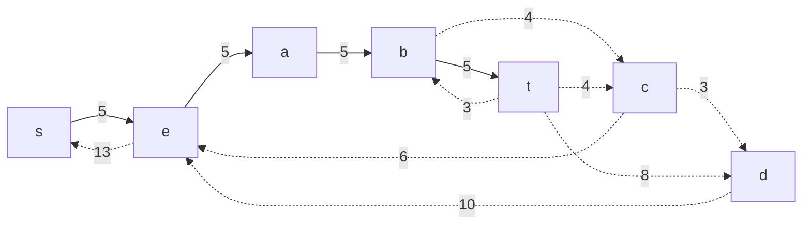
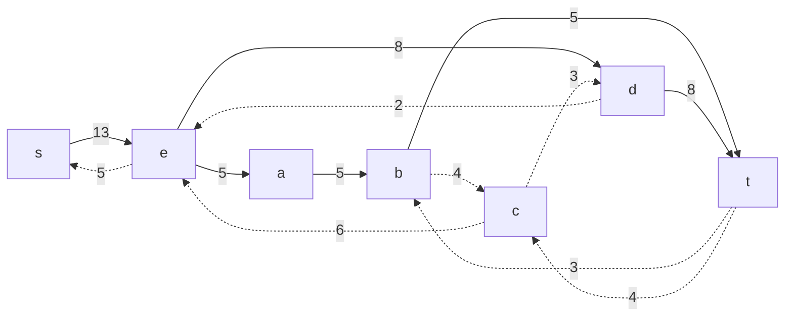
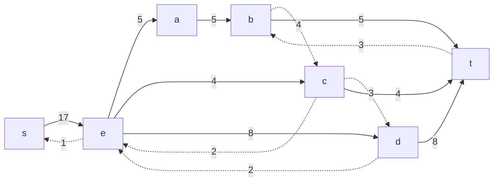
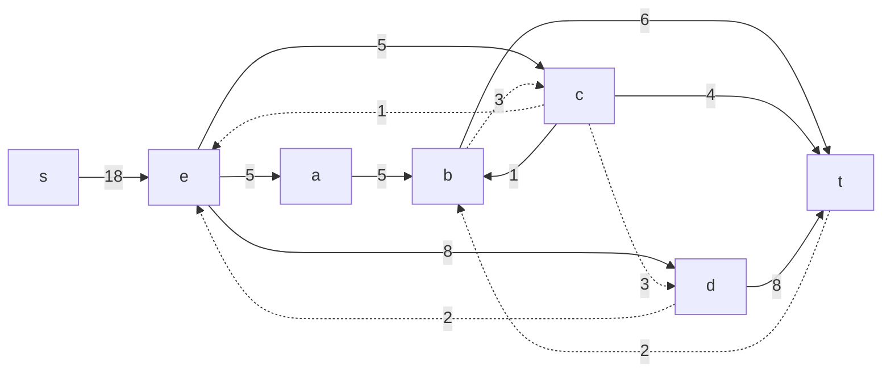
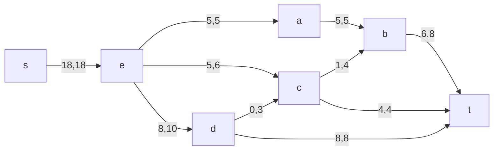
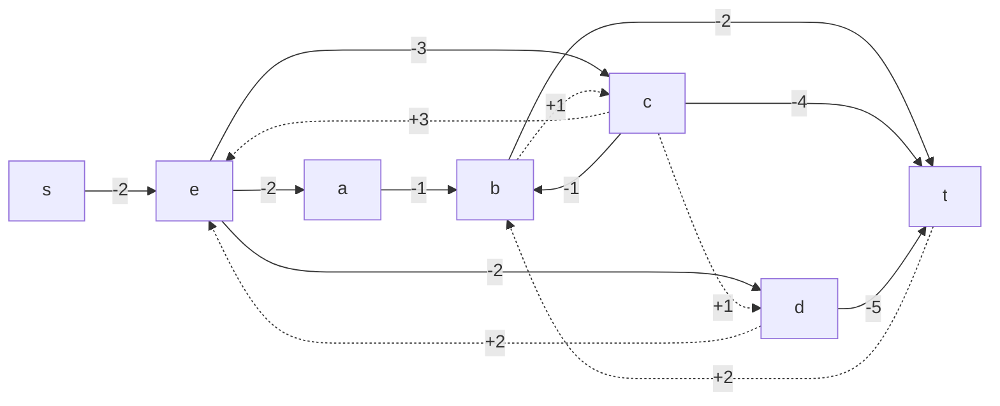
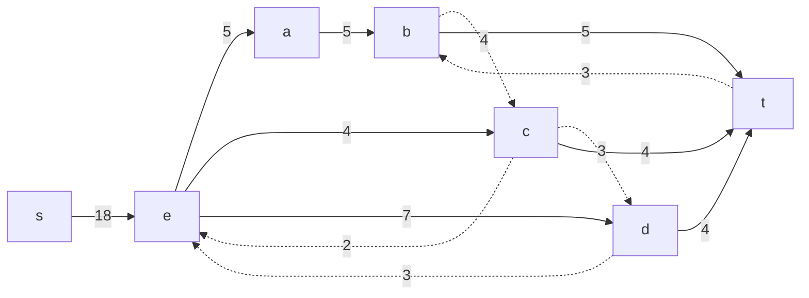
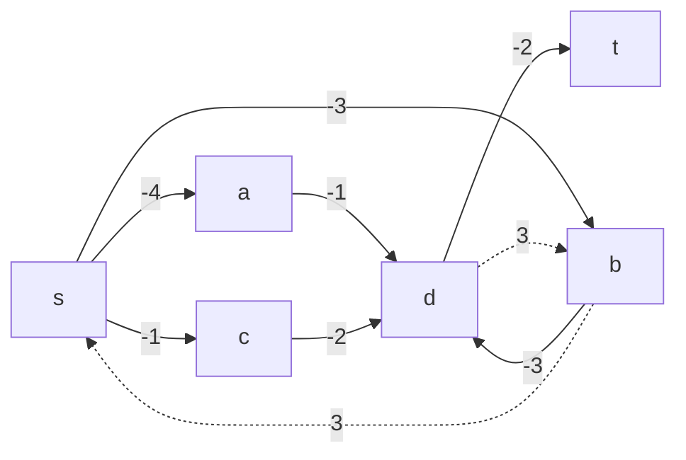
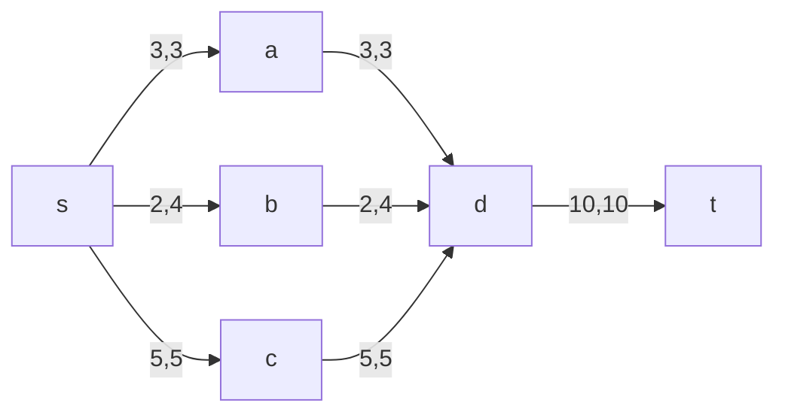

## Вариант 7

Пропускная способность дуг сети и стоимость транспортировки указана в таблице.

| Дуги                      | se | ea | ec | ed | ab | cb | dc | bt | ct | dt |
|:--------------------------|:--:|:--:|:--:|:--:|:--:|:--:|:--:|:--:|:--:|:--:|
| Пропускная способность    | 18 | 5  | 6  | 10 | 5  | 4  | 3  | 8  | 4  | 8  |
| Стоимость транспортировки | 2  | 2  | 3  | 2  | 1  | 1  | 1  | 2  | 4  | 5  |

### 1. Построим сеть с источником **s**, стоком **t** и указанными пропускными способностями дуг для поиска максимального потока.

Укажем начальный поток величиной 5 **s -> e -> a -> b -> t**. Построим соответствующую остаточную сеть.

### 2. Проведем поиск увеличивающего пути в остаточной сети
В остаточной сети найден увеличивающий путь t -> d -> e -> s. Минимальный вес дуг на этом пути равен 8.

Уменьшим вес дуг на найденном пути, дуги для которых вес стал нулевым удалим из остаточной сети.

### 3. Продолжим поиск увеличивающего пути в остаточной сети
В остаточной сети найден увеличивающий путь t -> c -> e -> s. Минимальный вес дуг на этом пути равен 4.

Уменьшим вес дуг на найденном пути, дуги для которых вес стал нулевым удалим из остаточной сети.

### 4. Продолжим поиск увеличивающего пути в остаточной сети
В остаточной сети найден увеличивающий путь t -> b -> c -> e -> s. Минимальный вес дуг на этом пути равен 1.

Уменьшим вес дуг на найденном пути, дуги для которых вес стал нулевым удалим из остаточной сети.

### 5. Продолжим поиск увеличивающего пути в остаточной сети

В остаточной сети не найдено увеличивающих путей, следовательно, алгоритм завершил работу и найденный поток величиной 18 является максимальным для данной сети.

### 6. Рассчитаем стоимость полученного максимального потока.

| Дуги                                          | se | ea | ec | ed | ab | cb | dc | bt | ct | dt | Итого  |
|:----------------------------------------------|:--:|:--:|:--:|:--:|:--:|:--:|:--:|:--:|:--:|:--:|:------:|
| Пропускная способность p(e)                   | 18 | 5  | 6  | 10 | 5  | 4  | 3  | 8  | 4  | 8  |        |
| Локальный поток f(e)                          | 18 | 5  | 5  | 8  | 5  | 1  | 3  | 6  | 4  | 8  |        |
| Стоимость транспортировки единицы потока c(e) | 2  | 2  | 3  | 2  | 1  | 1  | 1  | 2  | 4  | 5  |        |
| Суммарная стоимость f(e)*c(e)                 | 36 | 10 | 15 | 16 | 5  | 1  | 3  | 12 | 8  | 40 | **146** |

Стоимость полученного потока составляет 146. 

### 7. Попробуем уменьшить стоимость потока для чего построим остаточную сеть.
Для каждого ребра остаточной сети укажем стоимость транспортировки единицы потока.

В остаточной сети найден ориентированный цикл отрицательной стоимости e -> d -> t -> b -> c -> e (- 2 - 5 + 2 + 1 + 3 = -1). 

Найдем минимальный вес ребра в указанном цикле, изображенном **в остаточной сети с указанием величины потока**.  

ЗДЕСЯЯЯЯЯЯЯЯЯ

Минимальный вес ребра в цикле 1 - это неиспользованный резерв ребра c -> e.

Удалим найденный цикл - уменьшим на 1 вес всех ребер, входящих в цикл.

### 8. Проведем повторный поиск цикла отрицательной стоимости в остаточной сети.
Скорректируем остаточную сеть с указанием стоимости транспортировки единицы потока.

В остаточной сети найден ориентированный цикл отрицательной стоимости d -> t -> b -> c -> d (- 5 + 2 + 1 + 1 = -1). 

Найдем минимальный вес ребра в указанном цикле, изображенном **в остаточной сети с указанием величины потока**.  

Минимальный вес ребра в цикле 3 - это неиспользованный резерв ребер c -> d.

Удалим найденный цикл - уменьшим на 3 вес всех ребер, входящих в цикл.

### 7. Проведем повторный поиск цикла отрицательной стоимости в остаточной сети.
Скорректируем остаточную сеть с указанием стоимости транспортировки единицы потока.

В остаточной сети отсутствуют циклы отрицательной стоимости, следовательно, стоимость потока минимальна.

### 8. Рассчитаем стоимость полученного максимального потока.

| Дуги                                          | sa | sb | sc | ad | bd | cd | dt | Итого  |
|:----------------------------------------------|:--:|:--:|:--:|:--:|:--:|:--:|:--:|:------:|
| Пропускная способность p(e)                   | 3  | 4  | 5  | 3  | 4  | 5  | 10 |        |
| Локальный поток f(e)                          | 3  | 2  | 5  | 3  | 2  | 5  | 10 |        |
| Стоимость транспортировки единицы потока c(e) | 4  | 3  | 1  | 1  | 3  | 2  | 2  |        |
| Суммарная стоимость f(e)*c(e)                 | 12 | 6  | 5  | 3  | 6  | 10 | 20 | **62** |

Стоимость полученного потока составляет 62. 

### Ответ:
Максимальный поток в сети равен 10, минимальная стоимость потока 62, она реализуется следующим локальными потоками:

