## Задача о максимальном потоке минимальной стоимости
## Вариант 3

Пропускная способность дуг сети и стоимость транспортировки указана в таблице:

| Дуги                      | sa | sb | sc | ba | bc | cd | ac | ad | dt |
|:--------------------------|:--:|:--:|:--:|:--:|:--:|:--:|:--:|:--:|:--:|
| Пропускная способность    | 6  | 7  | 6  | 6  | 4  | 10 | 5  | 8  | 12 |
| Стоимость транспортировки | 1  | 1  | 3  | 1  | 1  | 1  | 3  | 4  | 1  |

### 1. Построим сеть с источником **s**, стоком **t** и указанными пропускными способностями дуг для поиска максимального потока.

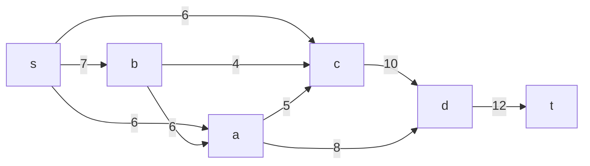
Укажем начальный поток величиной 6 **s -6-> a -8-> d -12-> t**. Построим соответствующую остаточную сеть.

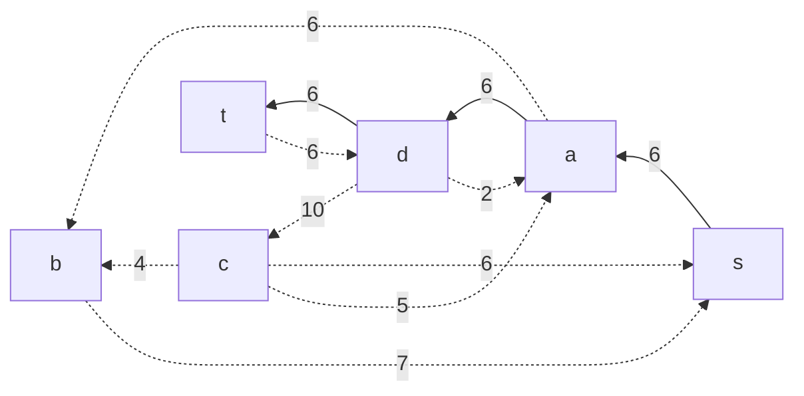

### 2. Проведем поиск увеличивающего пути в остаточной сети
В остаточной сети найден увеличивающий путь t -6-> d -2-> a -6-> b -7-> s. Минимальный вес дуг на этом пути равен 2.

Уменьшим вес дуг на найденном пути, дуги для которых вес стал нулевым удалим из остаточной сети.

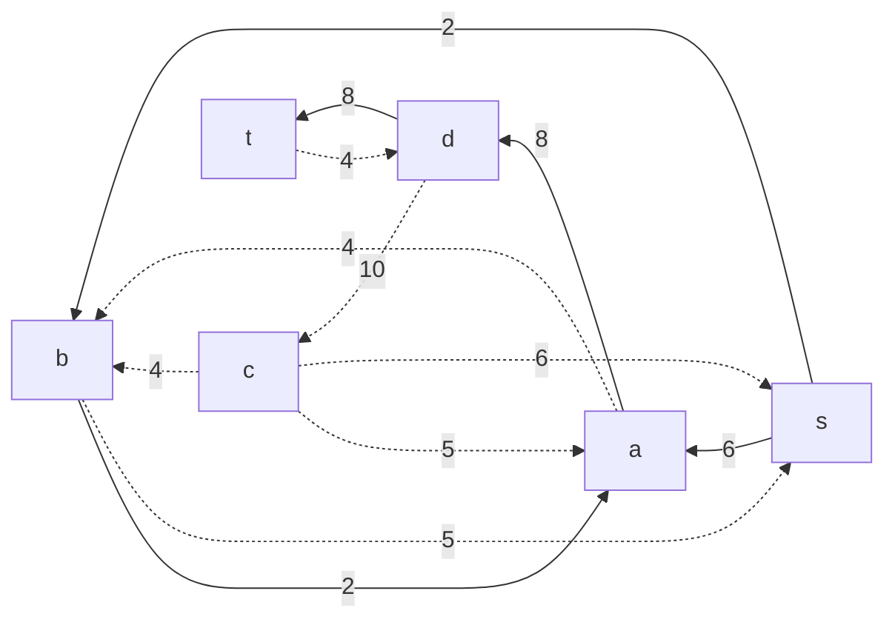

### 3. Продолжим поиск увеличивающего пути в остаточной сети
В остаточной сети найден увеличивающий путь t -4-> d -10-> c -6-> s. Минимальный вес дуг на этом пути равен 4.

Уменьшим вес дуг на найденном пути, дуги для которых вес стал нулевым удалим из остаточной сети.

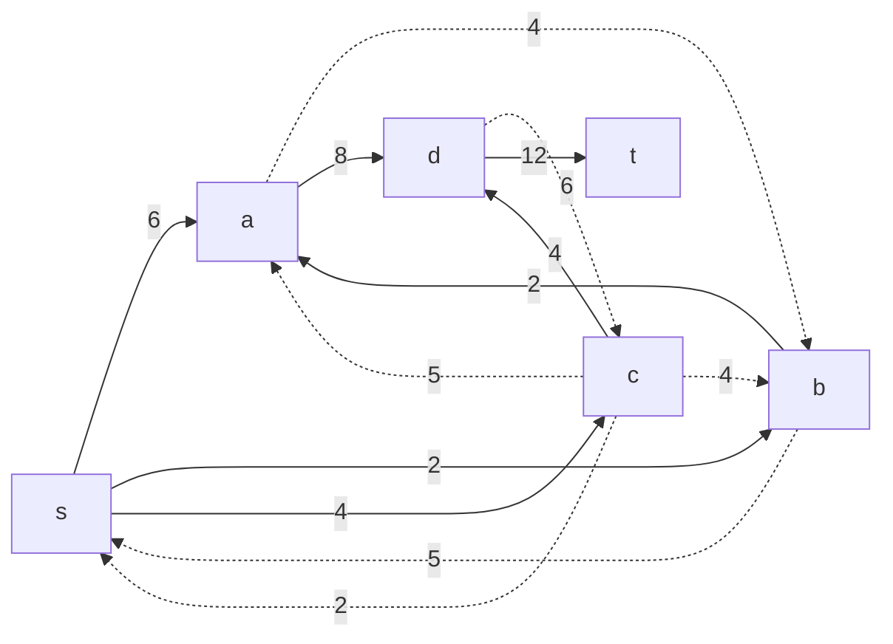

### 4. Продолжим поиск увеличивающего пути в остаточной сети

В остаточной сети не найдено увеличивающих путей, следовательно, алгоритм завершил работу и найденный поток величиной 12 является максимальным для данной сети.

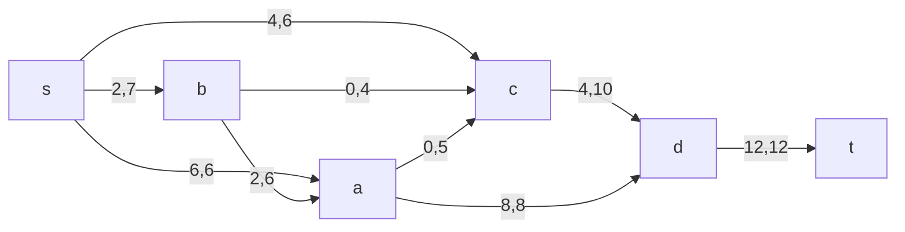

### 5. Рассчитаем стоимость полученного максимального потока.

| Дуги                                          | sa | sb | sc | ba | bc | cd | ac | ad | dt | Итого  |
|:----------------------------------------------|:--:|:--:|:--:|:--:|:--:|:--:|:--:|:--:|:--:|:------:|
| Пропускная способность p(e)                   | 6  | 7  | 6  | 6  | 4  | 10 | 5  | 8  | 12 |        |
| Локальный поток f(e)                          | 6  | 2  | 4  | 2  | 0  | 4  | 0  | 8  | 12 |        |
| Стоимость транспортировки единицы потока c(e) | 1  | 1  | 3  | 1  | 1  | 1  | 3  | 4  | 1  |        |
| Суммарная стоимость f(e)*c(e)                 | 6  | 2  | 12 | 2  | 0  | 4  | 0  | 32 | 12 | **70** |

Стоимость полученного потока составляет 70. 

### 6. Попробуем уменьшить стоимость потока для чего построим остаточную сеть.
Для каждого ребра остаточной сети укажем стоимость транспортировки единицы потока.

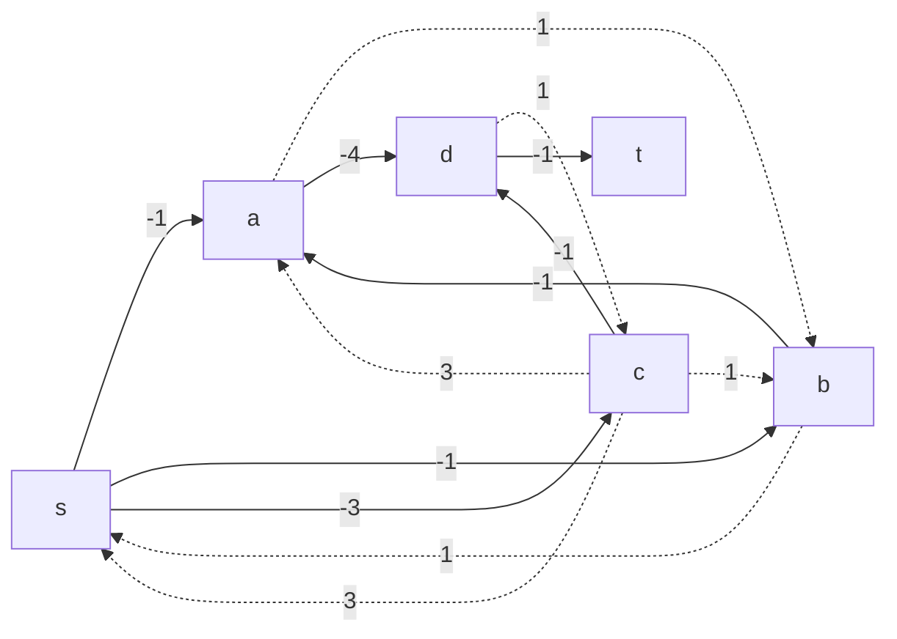

В остаточной сети найден ориентированный цикл отрицательной стоимости s -> a -> d -> c -> s (- 1 - 4 + 1 + 3 = -1). 

Найдем минимальный вес ребра в указанном цикле, изображенном **в остаточной сети с указанием величины потока**.  

Минимальный вес ребра в цикле 2 - это неиспользованный резерв ребра c -> s.

Удалим найденный цикл - уменьшим на 2 вес всех ребер, входящих в цикл.

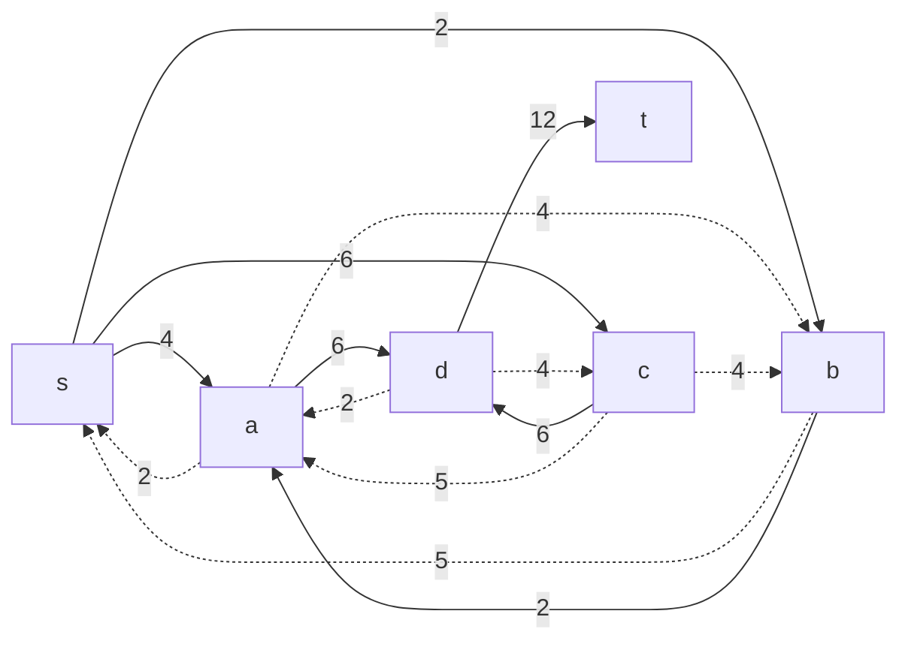

### 7. Проведем повторный поиск цикла отрицательной стоимости в остаточной сети.
Скорректируем остаточную сеть с указанием стоимости транспортировки единицы потока.

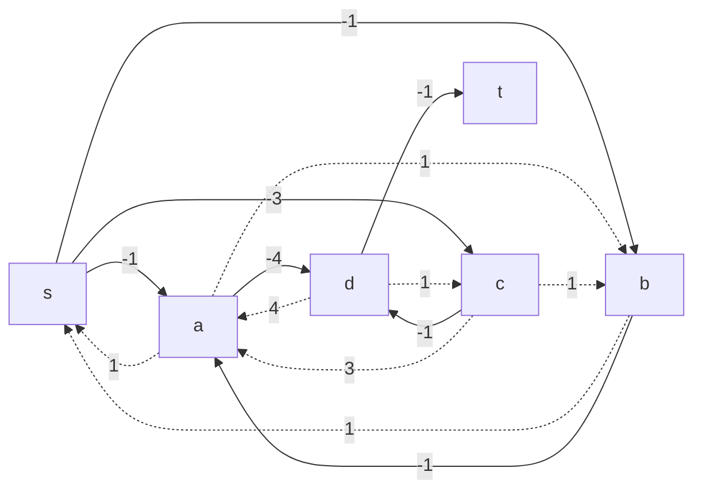

В остаточной сети найден ориентированный цикл отрицательной стоимости s -> b -> a -> s (- 1 - 1 + 1 = -1). 

Найдем минимальный вес ребра в указанном цикле, изображенном **в остаточной сети с указанием величины потока**.  

Минимальный вес ребра в цикле 2.

Удалим найденный цикл - уменьшим на 2 вес всех ребер, входящих в цикл.

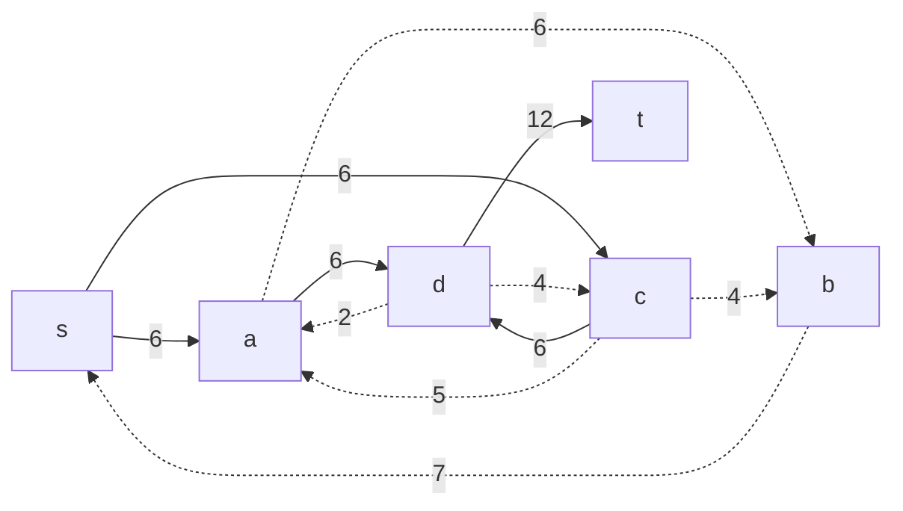

### 8. Проведем повторный поиск цикла отрицательной стоимости в остаточной сети.
Скорректируем остаточную сеть с указанием стоимости транспортировки единицы потока.

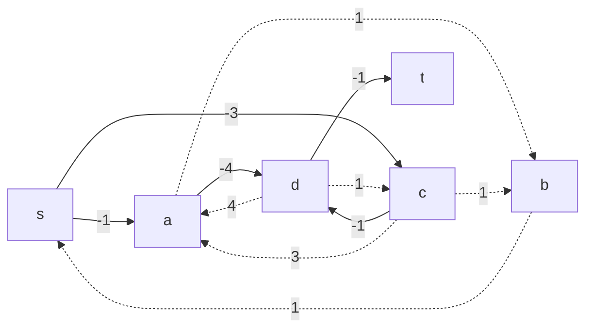

В остаточной сети найден ориентированный цикл отрицательной стоимости s -> a -> d -> c -> b -> s (- 1 - 4 + 1 + 1 + 1 = -2). 

Найдем минимальный вес ребра в указанном цикле, изображенном **в остаточной сети с указанием величины потока**.  

Минимальный вес ребра в цикле 4.

Удалим найденный цикл - уменьшим на 4 вес всех ребер, входящих в цикл.

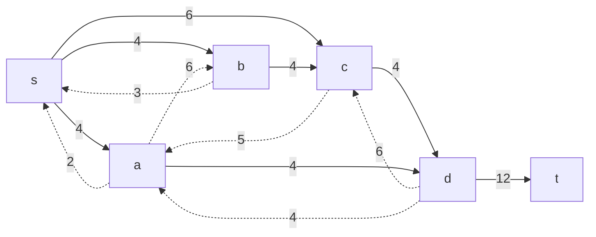
### 9. Проведем повторный поиск цикла отрицательной стоимости в остаточной сети.
Скорректируем остаточную сеть с указанием стоимости транспортировки единицы потока.

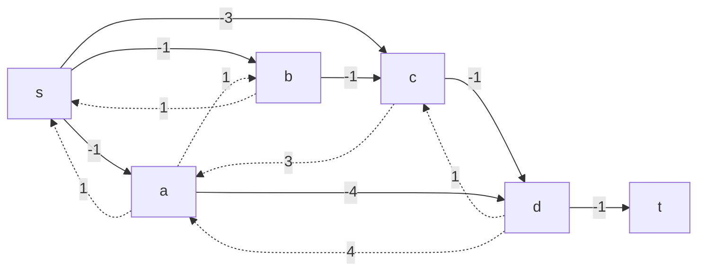

В остаточной сети отсутствуют циклы отрицательной стоимости, следовательно, стоимость потока минимальна.

### 9. Рассчитаем стоимость полученного максимального потока.

| Дуги                                          | sa | sb | sc | ba | bc | cd | ac | ad | dt | Итого  |
|:----------------------------------------------|:--:|:--:|:--:|:--:|:--:|:--:|:--:|:--:|:--:|:------:|
| Пропускная способность p(e)                   | 6  | 7  | 6  | 6  | 4  | 10 | 5  | 8  | 12 |        |
| Локальный поток f(e)                          | 4  | 4  | 6  | 0  | 4  | 4  | 0  | 4  | 12 |        |
| Стоимость транспортировки единицы потока c(e) | 1  | 1  | 3  | 1  | 1  | 1  | 3  | 4  | 1  |        |
| Суммарная стоимость f(e)*c(e)                 | 4  | 4  | 18 | 0  | 4  | 4  | 0  | 16 | 12 | **62** |

Стоимость полученного потока составляет 62. 

### Ответ:
Максимальный поток в сети равен 12, минимальная стоимость потока 62, она реализуется следующим локальными потоками:

