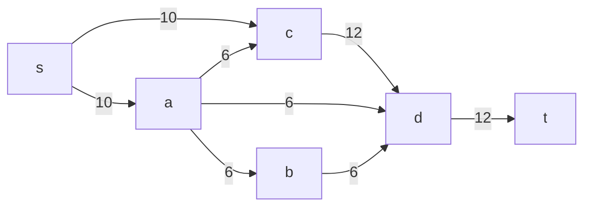
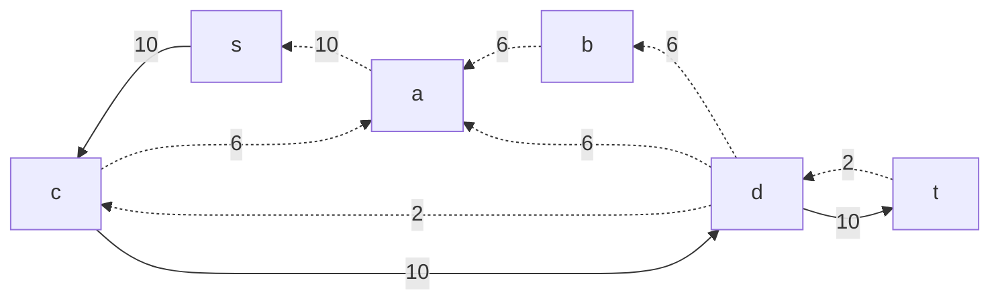
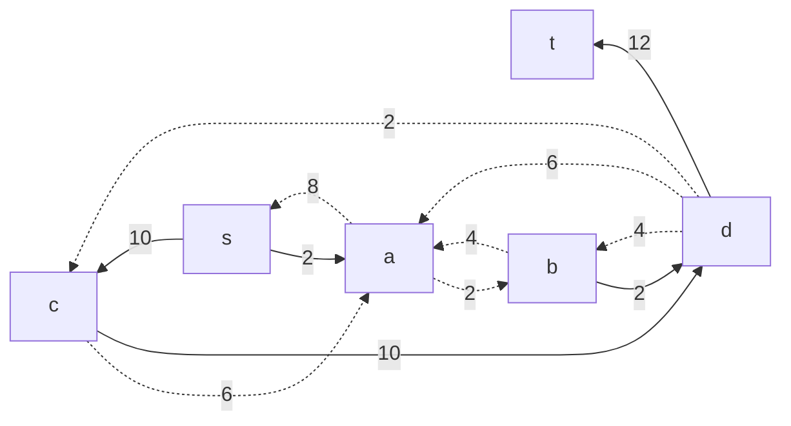
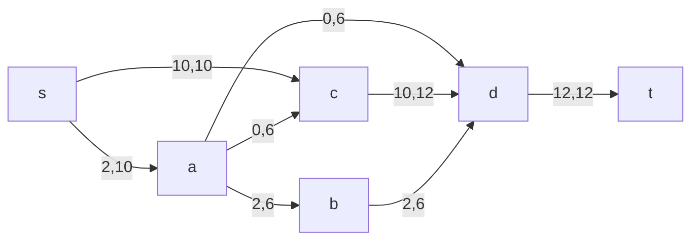
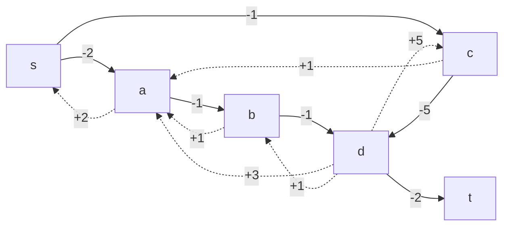
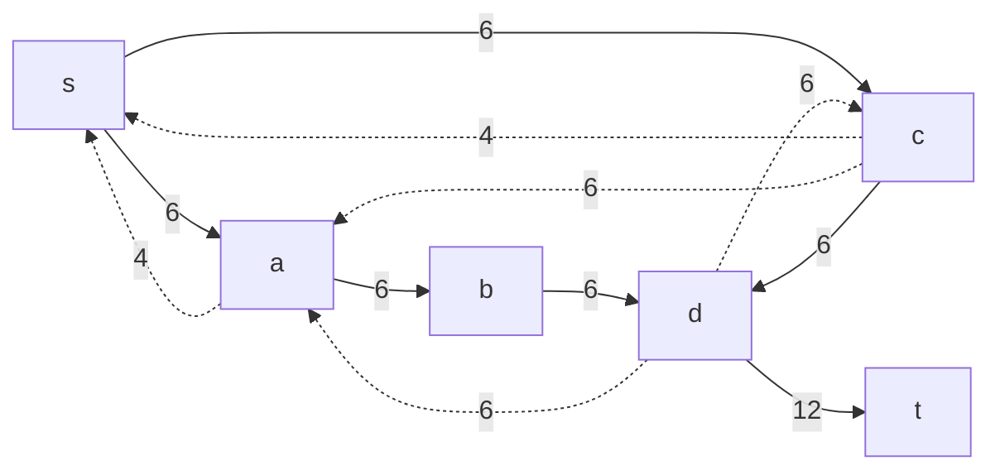
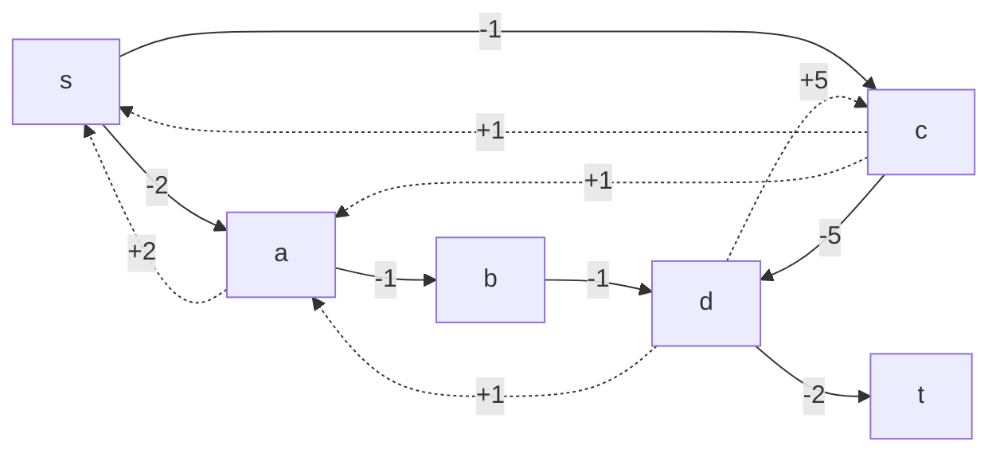
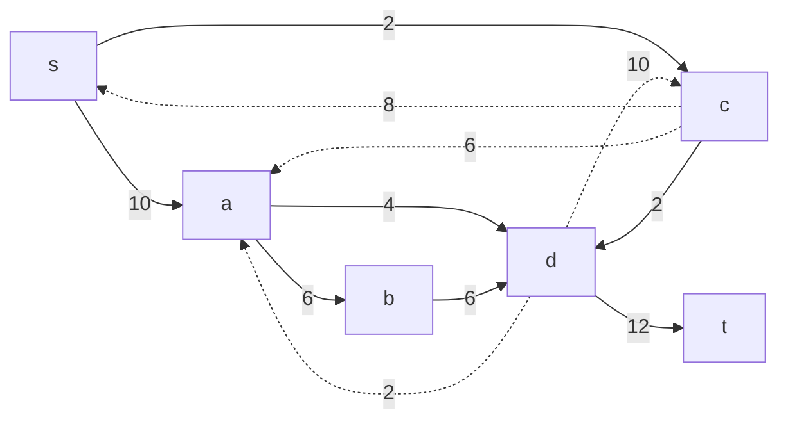
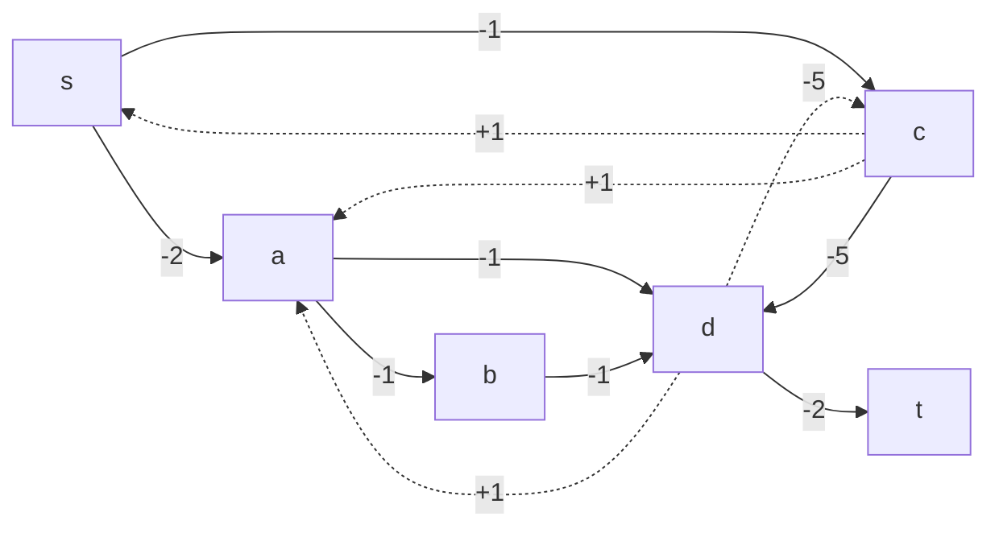
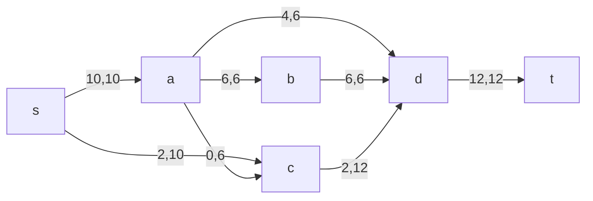

## Вариант 2

| Дуги                   | sa | sс | ab | ad | ac | cd | bd | dt |
|------------------------|----|----|----|----|----|----|----|----|
| Пропускная способность p(e) | 10 | 10 | 6  | 6  | 6  | 12 | 6  | 12 |
| Стоимость транспортировки единицы потока c(e) | 2  | 1  | 1  | 3  | 1  | 5  | 1  | 2  |

## 1. Построим сеть с источником s, стоком t и указанными пропускными способностями дуг для поиска максимального потока.

Укажем начальный поток величиной 10 s -> c -> d -> t. Построим соответствующую остаточную сеть.

## 2. Проведем поиск увеличивающего пути в остаточной сети

В остаточной сети найден увеличивающий путь t -> d -> b -> a -> s. Минимальный вес дуг на этом пути равен 2.

Уменьшим вес дуг на найденном пути, дуги для которых вес стал нулевым удалим из остаточной сети.

## 3. Продолжим поиск увеличивающего пути в остаточной сети

В остаточной сети не найдено увеличивающих путей, следовательно, алгоритм завершил работу и найденный поток величиной 12 является максимальным для данной сети.

## 4. Рассчитаем стоимость полученного максимального потока

| Дуги                                      | sa | sc | ab | ad | ac | cd | bd | dt | Итого |
|------------------------------------------|----|----|----|----|----|----|----|----|-------|
| Пропускная способность p(e)              | 10 | 10 | 6  | 6  | 6  | 12 | 6  | 12 |       |
| Локальный поток f(e)                     | 2  | 10 | 2  | 0  | 0  | 10 | 2  | 12 |       |
| Стоимость транспортировки единицы потока c(e)| 2  | 1  | 1  | 3  | 1  | 5  | 1  | 2  |       |
| Суммарная стоимость f(e)*c(e)            | 4  | 10 | 2  | 0  | 0  | 50 | 2  | 24 | 92    |

## 5. Попробуем уменьшить стоимость потока для чего построим остаточную сеть

Для каждого ребра остаточной сети укажем стоимость транспортировки единицы потока.

В остаточной сети найден ориентированный цикл отрицательной стоимости s -> c -> d -> b -> a -> s (- 1 - 5 + 1 + 1 + 2 = -3)

Минимальный вес ребра в цикле 4 - это неиспользованный резерв рёбер b -> d и a -> b.

Удалим найденный цикл - уменьшим на 4 вес всех ребер, входящих в цикл.

## 6. Проведем повторный поиск цикла отрицательной стоимости в остаточной сети

Скорректируем остаточную сеть с указанием стоимости транспортировки единицы потока.

В остаточной сети найден ориентированный цикл отрицательной стоимости s -> c -> d -> a -> s (- 1 - 5 + 1 + 2 = -3).

Минимальный вес ребра в цикле 4 - это неиспользованный резерв ребра s -> a.

Удалим найденный цикл - уменьшим на 4 вес всех ребер, входящих в цикл.

## 7. Проведем повторный поиск цикла отрицательной стоимости в остаточной сети

Скорректируем остаточную сеть с указанием стоимости транспортировки единицы потока.

В остаточной сети отсутствуют циклы отрицательной стоимости, следовательно, стоимость потока минимальна.

## 8. Рассчитаем стоимость полученного максимального потока

| Дуги                                      | sa | sc | ab | ad | ac | cd | bd | dt | Итого |
|------------------------------------------|----|----|----|----|----|----|----|----|-------|
| Пропускная способность p(e)              | 10 | 10 | 6  | 6  | 6  | 12 | 6  | 12 |       |
| Локальный поток f(e)                     | 10  | 2  | 6  | 4  | 0  | 2  | 6  | 12 |       |
| Стоимость транспортировки единицы потока c(e)| 2  | 1  | 1  | 3  | 1  | 5  | 1  | 2  |       |
| Суммарная стоимость f(e)*c(e)            | 20 | 2  | 6  | 12 | 1  | 10 | 6  | 24 | 81    |

## Ответ:

Максимальный поток в сети равен 12, минимальная стоимость потока 81, она реализуется следующим локальными потоками:

