# Задание №11+
# Транспортная задача. Решение с использованием алгоритма поиска максимального потока минимальной стоимости.
# Вариант 3

## Постановка задачи
Два завода имеют производительность 6 и 9, а два складских помещения имеют вместимость 7 и 10. Матрица затрат на перевозку одной единицы товара (строки – это заводы, столбцы – это склады) имеет вид:

$$
 \begin{pmatrix}    
  3 & 5 \\ 
  1 & 4 \\ 
 \end{pmatrix}    
$$

Требуется:
1. Найти стоимость перевозки с первого завода на первый склад 6 единиц товара, а со второго завода на второй склад 7 единиц товара;
2. Используя алгоритм поиска максимального потока минимальной стоимости, скорректировать указанный выше вариант перевозки товаров, так чтобы объём перевозимых товаров не изменился, а стоимость их перевозки стала минимальной.

## Решение
### 1.
Производительность заводов:
- A = 6;
- B = 9.

Вместимость складов:
- I = 7;
- II = 10.

Построим полный двудольный граф и добавим вершину-источник *s* и вершину-сток *t*. Для каждого ребра укажем пары чисел *(f(e), p(e))*, где *f(e)* - локальный поток, *p(e)* - пропускная способность дуги. По условию задачи, локальный поток равен *13*: *6* единиц товара проходит по дуге (A, I) и *7* единиц - по дуге (B, II). 

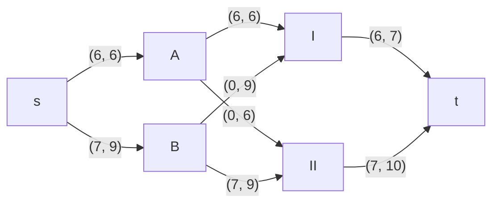

Возьмем затраты на транспортировку из матрицы и рассчитаем стоимость полученного потока.

| Дуги                          | sA | sB | AI | AII | BI | BII | It | IIt | Сумма  |
|:------------------------------|:--:|:--:|:--:|:---:|:--:|:---:|:--:|:---:|:------:|
| Пропускная способность    p(e)| 6  | 9  | 6  | 6   | 9  | 9   | 7  | 10  |        |
| Стоимость транспортировки c(e)| 0  | 0  | 3  | 5   | 1  | 4   | 0  | 0   |        |
| Локальный поток f(e)          | 6  | 7  | 6  | 0   | 0  | 7   | 6  | 7   |        |
| Суммарная стоимость f(e)*c(e) | 0  | 0  | 18 | 0   | 0  | 28  | 0  | 0   | **46** |

Стоимость полученного потока составляет *46*. 

### 2.
Используя алгоритм поиска максимального потока минимальной стоимости попытаемся уменьшить стоимость перевозки. 

Построим остаточную сеть с резервами.

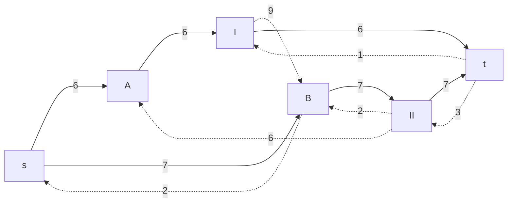

Для каждого ребра остаточной сети укажем стоимость транспортировки единицы потока.

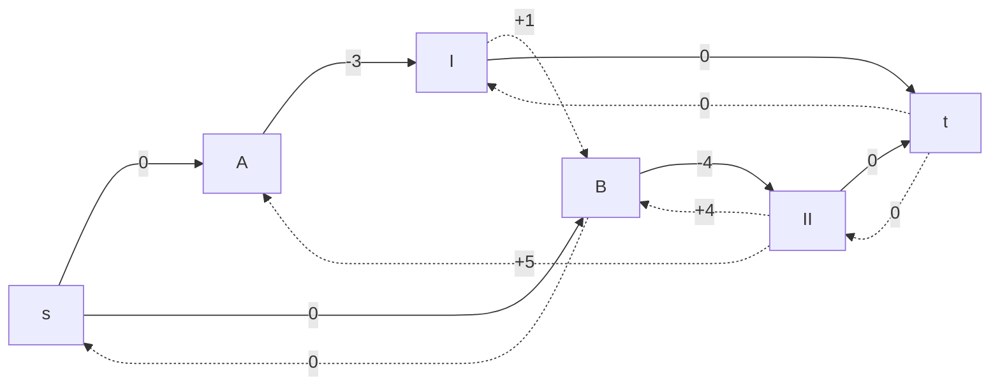

В остаточной сети найден ориентированный цикл отрицательной стоимости *-3*. 

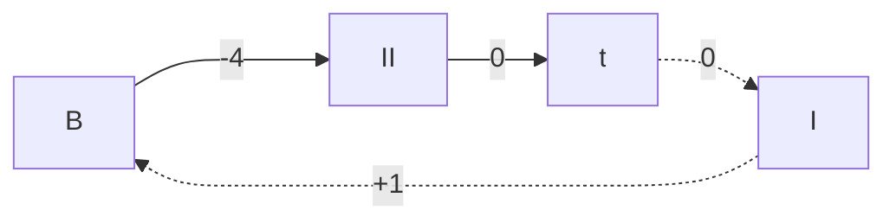

Найдем минимальный вес ребра в указанном цикле, изображенном **в остаточной сети с указанием величины потока**.  

Минимальный вес ребра в цикле равен *1*. Удалим найденный цикл - уменьшим на 1 вес всех ребер, входящих в цикл.

Новая остаточная сеть имеет следующий вид:

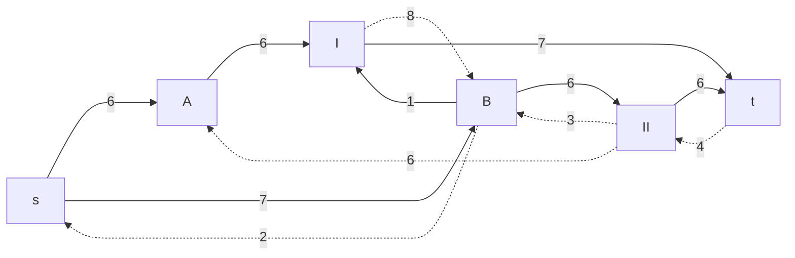
### 3.
Проведем повторный поиск цикла отрицательной стоимости в остаточной сети. Скорректируем остаточную сеть с указанием стоимости транспортировки единицы потока.

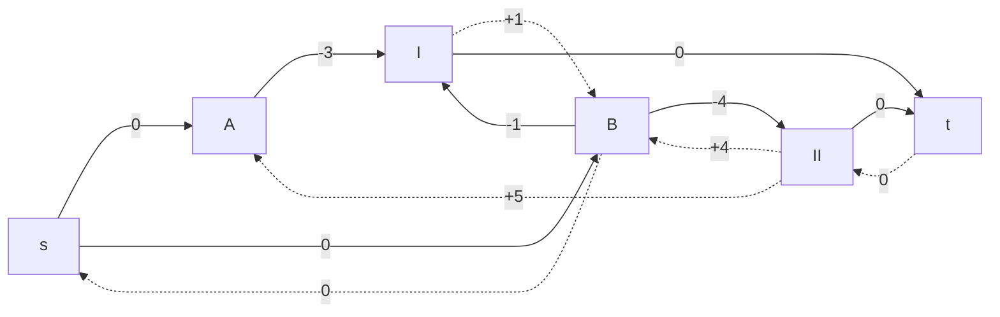

В остаточной сети найден ориентированный цикл отрицательной стоимости *-2*. 

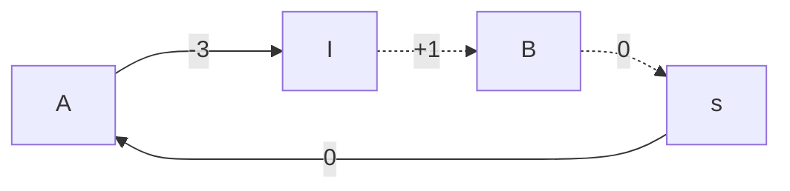

Найдем минимальный вес ребра в указанном цикле, изображенном **в остаточной сети с указанием величины потока**.  

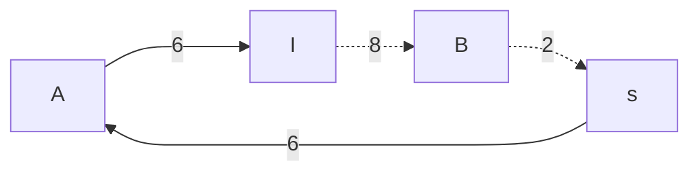

Минимальный вес ребра в цикле равен *2*. Удалим найденный цикл - уменьшим на 2 вес всех ребер, входящих в цикл.

Новая остаточная сеть имеет следующий вид:

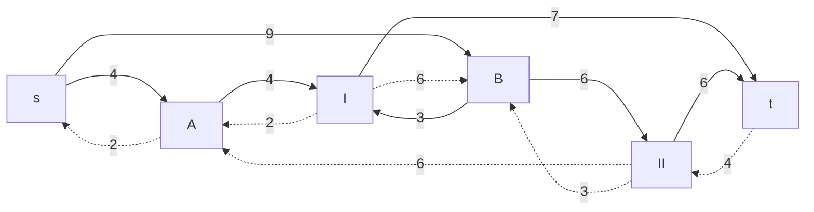
### 4.
Проведем повторный поиск цикла отрицательной стоимости в остаточной сети. Скорректируем остаточную сеть с указанием стоимости транспортировки единицы потока.

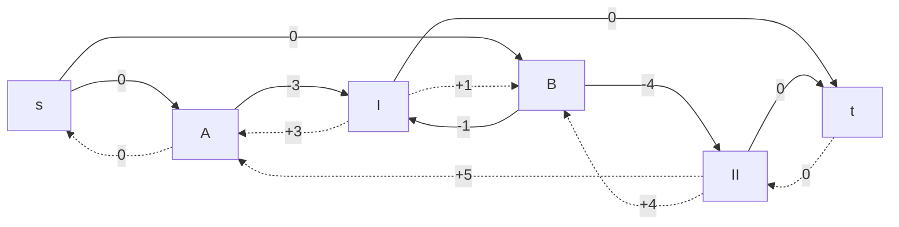
В остаточной сети найден ориентированный цикл отрицательной стоимости *-1*. 

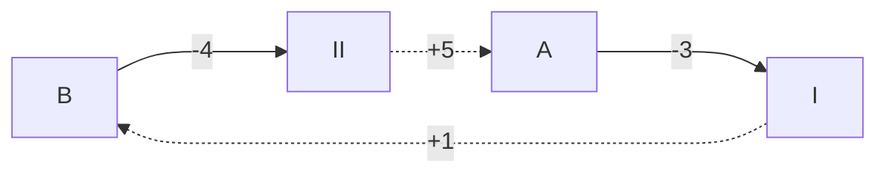

Найдем минимальный вес ребра в указанном цикле, изображенном **в остаточной сети с указанием величины потока**.  

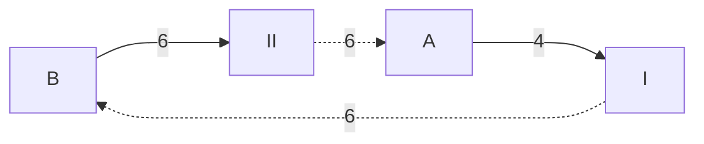

Минимальный вес ребра в цикле равен *4*. Удалим найденный цикл - уменьшим на 4 вес всех ребер, входящих в цикл.

Новая остаточная сеть имеет следующий вид:

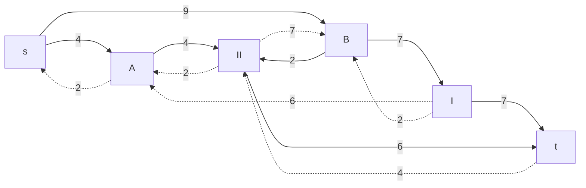
### 5.
Проведем повторный поиск цикла отрицательной стоимости в остаточной сети. Скорректируем остаточную сеть с указанием стоимости транспортировки единицы потока.

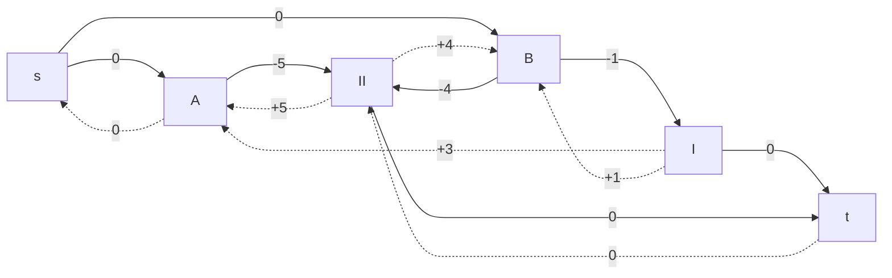
В остаточной сети отсутствуют циклы отрицательной стоимости, следовательно, стоимость потока минимальна.

### 6.
Рассчитаем стоимость полученного потока.

| Дуги                          | sA | sB | AI | AII | BI | BII | It | IIt | Сумма  |
|:------------------------------|:--:|:--:|:--:|:---:|:--:|:---:|:--:|:---:|:------:|
| Пропускная способность    p(e)| 6  | 9  | 6  | 6   | 9  | 9   | 7  | 10  |        |
| Стоимость транспортировки c(e)| 0  | 0  | 3  | 5   | 1  | 4   | 0  | 0   |        |
| Локальный поток f(e)          | 4  | 9  | 0  | 4   | 7  | 2   | 7  | 6   |        |
| Суммарная стоимость f(e)*c(e) | 0  | 0  | 0  | 20  | 7  | 8   | 0  | 0   | **35** |

Стоимость полученного потока составляет *35*. 

## Ответ:
Поток в сети равен *13*, минимальная стоимость потока *35*, она реализуется следующим локальными потоками:

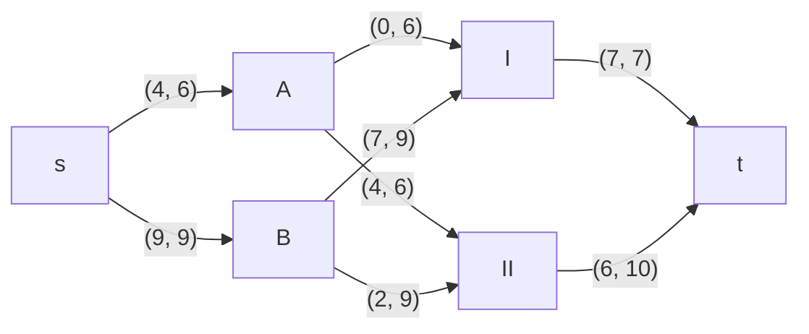