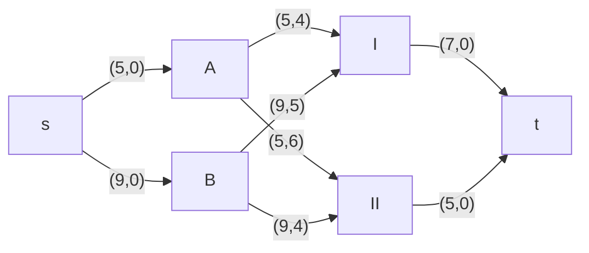
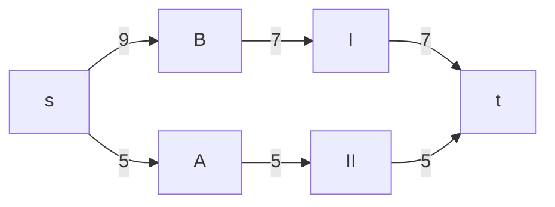
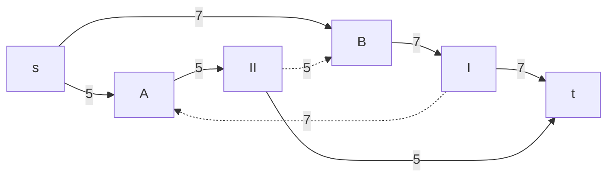
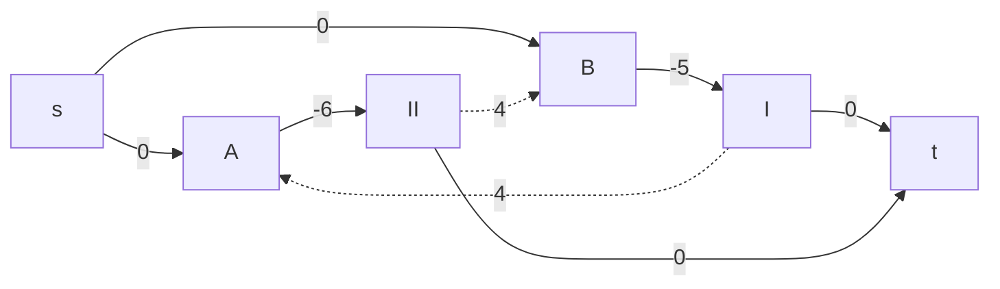
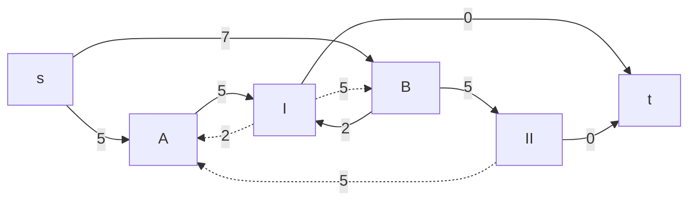
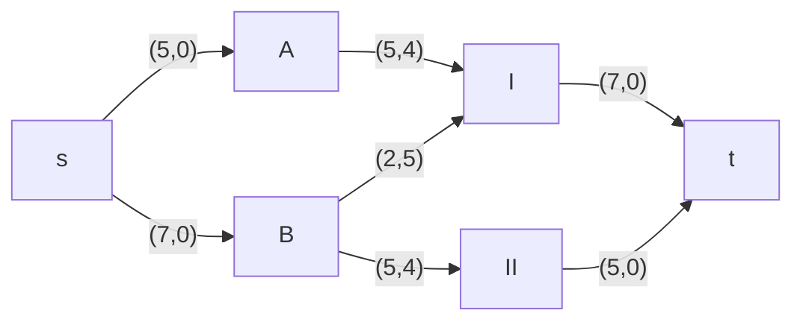
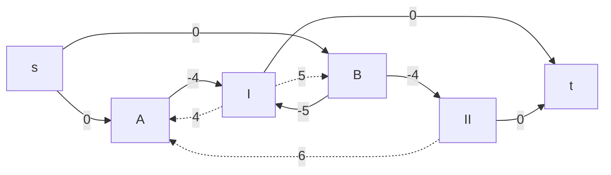

# Задание №11+
# Транспортная задача. Решение с использованием алгоритма поиска максимального потока минимальной стоимости.
## Вариант 1:

Два завода имеют производительность 5 и 9, а два складских помещения имеют вместимость 7 и 5. Матрица затрат на перевозку одной единицы товара (строки – это заводы, столбцы – это склады) имеет вид:

$$
 \begin{pmatrix}    
  4 & 6 \\ 
  5 & 4 \\ 
 \end{pmatrix}    
$$

Требуется:
1. Найти стоимость перевозки с первого завода на второй склад 5 единиц товара, а со второго завода на первый склад 7 единиц товара;
2. Используя алгоритм поиска максимального потока минимальной стоимости, скорректировать указанный выше вариант перевозки товаров, так чтобы объём перевозимых товаров не изменился, а стоимость их перевозки стала минимальной.

### Решение:
1. Представление поставщиков и потребителей в виде вершин графа.
2. Добавление вспомогательного источника и стока для моделирования поставок и спроса.
3. Определение пропускных способностей рёбер как ограничений на перевозки.
4. Использование стоимости перевозки $C_{ij}$ как весов рёбер.

## Шаг 1

## Шаг 2

A --> II --> B --> I --> A (-6 + 4 - 5 + 4 = -3). Минимумальное значение = 5.

## Шаг 3

Нет отрицательного цикла.

A -5-> I 5 * 4 = 20. B -2-> I и B -5-> II 2 * 5 + 5 * 4 = 10 + 20 = 30. В сумме 50.
