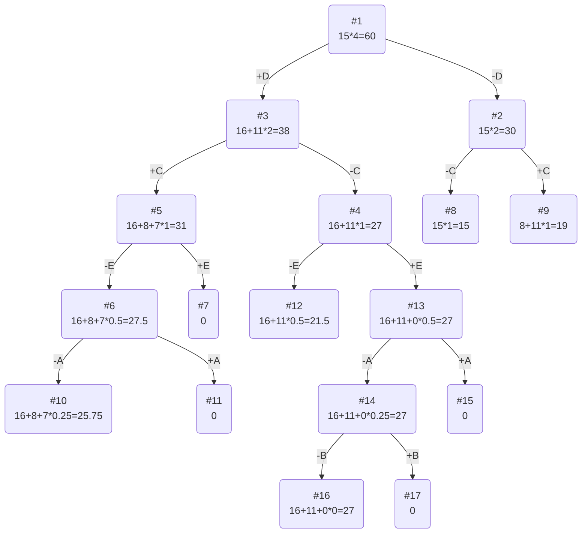

# Задание №11
# Задача о рюкзаке (Knapsack problem). Метод ветвей и границ.

**Для выполнения задания рекомендуется установить [Плагин отображения диаграмм Markdown Preview Mermaid Support](https://marketplace.visualstudio.com/items?itemName=bierner.markdown-mermaid)**

## Задание
Для каждого варианта представлены условия задачи, в соответствии с которыми необходимо: 
1. Решить задачу о рюкзаке с применением метода ветвей и границ.
2. Оформить решение задачи по шагам с подробными комментариями, таблицами и диаграммами.
3. В ответе указать:
   - максимально возможную стоимость предметов в рюкзаке,
   - набор предметов, обеспечивающих максимальную стоимость,
   - общий вес предметов в рюкзаке,
   - свободное место в рюкзаке.

Условия для каждого варианта расположены в файле task-11/task.md в ветке main репозитория manual-tasks. 

Решение задачи нужно оформить в формате Markdown в отдельном файле с названием <название_команды>.md, который добавить в каталог task-11 данного репозитория.

## Информация по Markdown разметке:
[Система верстки LaTeX, которую можно использовать для математических формул](https://grammarware.net/text/syutkin/MathInLaTeX.pdf)

[Рисуем диаграммы Mermaid.js в README-файлах GitHub](https://habr.com/ru/articles/652867/)

## Для выполнения задания необходимо:
1. Обновить ветку main в локальном репозитории (git pull).
2. От ветки main создать ветвь с названием <название_команды>-task-11.
3. В созданной ветке в каталог task-11 добавить файл с решением задачи с названием <название_команды>.md.
4. Зафиксировать изменения на ветке (git commit).
5. Отравить ветку с изменениями в репозиторий на Github (git push).
6. Создать на Github запрос на слияние (pull request), указав в качестве base-ветки main, в качестве compare-ветки <название_команды>-task-11.

## Постановка задачи
Задача о рюкзаке (англ. Knapsack problem) — дано N предметов, ni предмет имеет массу wi > 0 и стоимость pi > 0. Необходимо выбрать из этих предметов такой набор, чтобы суммарная масса не превосходила заданной величины W (вместимость рюкзака), а суммарная стоимость была максимальна. 

## Пример решения задачи о рюкзаке
## Условия задачи

| Предметы  |  A  | B  | C | D  | E  |
|:----------|:---:|:--:|:-:|:--:|:--:|
| Стоимость |  5  | 3  | 8 | 16 | 11 |
| Вес       | 10  | 12 | 4 | 4  | 11 |

Ограничение вместимости: 15

## Решение
### 1. Рассчитаем ценность каждого предмета
| Предметы  |  A  |  B  | C | D  | E  |
|:----------|:---:|:---:|:-:|:--:|:--:|
| Стоимость |  5  |  3  | 8 | 16 | 11 |
| Вес       | 10  | 12  | 4 | 4  | 11 |
| Ценность  | 1/2 | 1/4 | 2 | 4  | 1  |

### 2. Отсортируем предметы по убыванию ценности
| Предметы  | D  | C | E  |  A  |  B  |
|:----------|:--:|:-:|:--:|:---:|:---:|
| Стоимость | 16 | 8 | 11 |  5  |  3  |
| Вес       | 4  | 4 | 11 | 10  | 12  |
| Ценность  | 4  | 2 | 1  | 1/2 | 1/4 |

### 3. Рассчитаем оценку сверху для пустого рюкзака

Свободное место в рюкзаке: 15

Наибольшая ценность предмета: 4

Оценка сверху для пустого рюкзака: 15 * 4 = 60

### 4. Найдем решение задачи с использованием метода ветвей и границ

### Ответ
- Наибольшая стоимость предметов в рюкзаке 27.
- Набор предметов, обеспечивающих максимальную стоимость, D, E, общим весом 15.
- Свободное место в рюкзаке 0.
