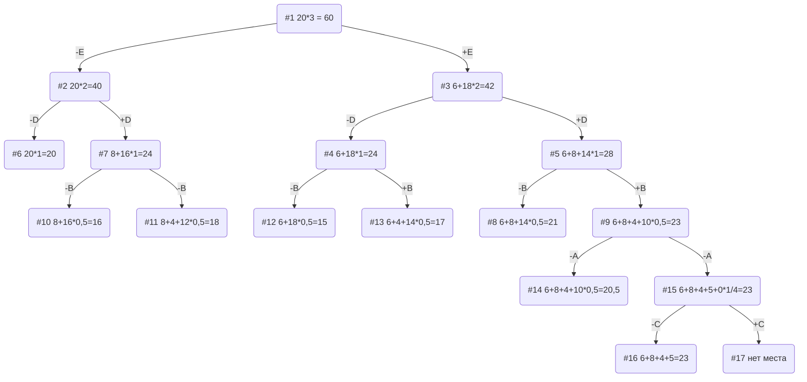

# Задача о рюкзаке. Метод ветвей и границ.

### Вариант 4

## Решение

| Предметы  |  A  | B |  C  | D | E |
|:----------|:---:|:-:|:---:|:-:|:-:|
| Стоимость |  5  | 4 |  3  | 8 | 6 |
| Вес       | 10  | 4 | 12  | 4 | 2 |

Ограничение вместимости: 20

Для начала посчитаем ценность = стоимость / вес

A = 1/2;

B = 1; 

C = 1/4;

D = 2;

E = 3

Добавим значения в таблицу: 

| Предметы  |  A  | B |  C  | D | E |
|:----------|:---:|:-:|:---:|:-:|:-:|
| Стоимость |  5  | 4 |  3  | 8 | 6 |
| Вес       | 10  | 4 | 12  | 4 | 2 |
| Ценность  | 1/2 | 1 | 1/4 | 2 | 3 |

Отсортируем по убыванию: 

| Предметы  |  E  | D | B |  A  |  C |
|:----------|:---:|:-:|:-:|:---:|:--:|
| Стоимость |  6  | 8 | 4 |  5  |  3 |
| Вес       |  2  | 4 | 4 | 10  | 12 |
| Ценность  |  3  | 2 | 1 | 1/2 | 1/4|

Место в рюкзаке = 20

Наибольшая ценность = 3

Оценка сверху для пустого рюкзака = 20*3 = 60

### Ответ
- Наибольшая стоимость предметов в рюкзаке 23.
- Набор предметов, обеспечивающих максимальную стоимость: A, B, D, E с общим весом 20.
- Свободное место в рюкзаке 0.