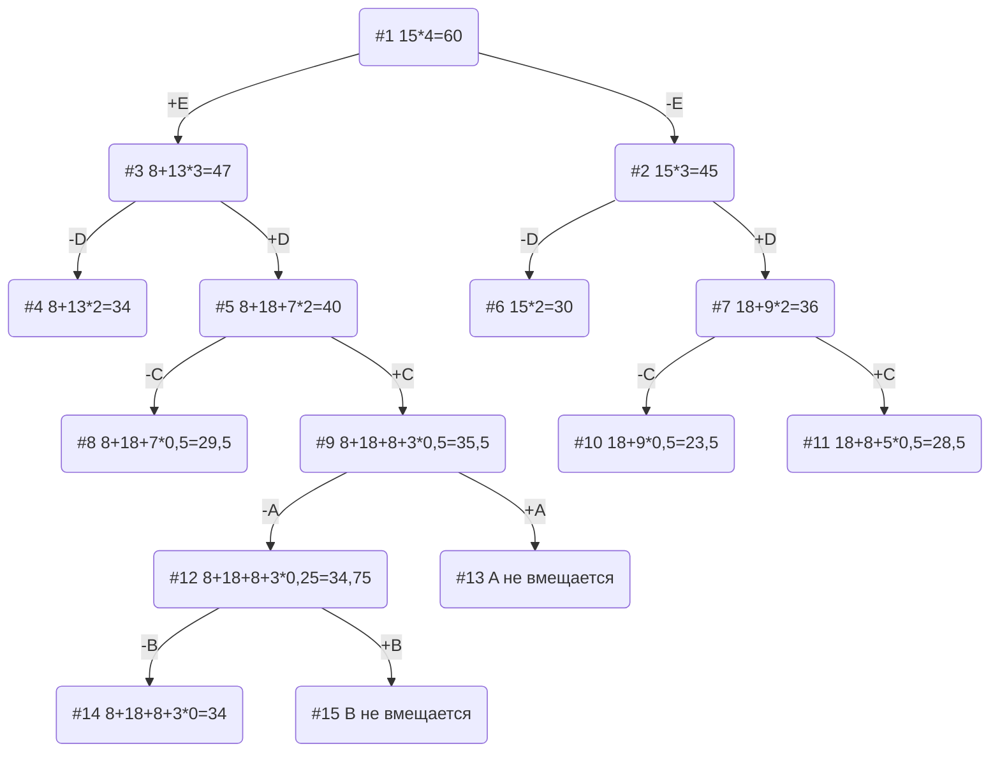

# Задание №11
# Задача о рюкзаке (Knapsack problem). Метод ветвей и границ. Вариант 2:

## Постановка задачи
Задача о рюкзаке (англ. Knapsack problem) — дано N предметов, ni предмет имеет массу wi > 0 и стоимость pi > 0. Необходимо выбрать из этих предметов такой набор, чтобы суммарная масса не превосходила заданной величины W (вместимость рюкзака), а суммарная стоимость была максимальна. 

## Условия задачи

| Предметы  |  A  | B  | C | D  | E |
|:----------|:---:|:--:|:-:|:--:|:-:|
| Стоимость |  5  | 3  | 8 | 18 | 8 |
| Вес       | 10  | 12 | 4 | 6  | 2 |

Ограничение вместимости: 15

## Решение
### 1. Рассчитаем ценность каждого предмета
| Предметы  |  A  | B  | C | D  | E  |
|:----------|:---:|:--:|:-:|:--:|:--:|
| Стоимость |  5  | 3  | 8 | 18 | 8  |
| Вес       | 10  | 12 | 4 | 6  | 2  |
| Ценность  | 1/2 | 1/4| 2 | 3  | 4  |

### 2. Отсортируем предметы по убыванию ценности
| Предметы  | E  | D  | C  |  A  |  B  |
|:----------|:--:|:--:|:--:|:---:|:---:|
| Стоимость | 8  | 18 | 8  |  5  |  3  |
| Вес       | 2  | 6  | 4  | 10  | 12  |
| Ценность  | 4  | 3  | 2  | 1/2 | 1/4 |

### 3. Рассчитаем оценку сверху для пустого рюкзака

Свободное место в рюкзаке: 15

Наибольшая ценность предмета: 4

Оценка сверху для пустого рюкзака: 15 * 4 = 60

### 4. Найдем решение задачи с использованием метода ветвей и границ

### Ответ
- Наибольшая стоимость предметов в рюкзаке 34.
- Набор предметов, обеспечивающих максимальную стоимость: E, D, C, - общим весом 12.
- Свободное место в рюкзаке 3.