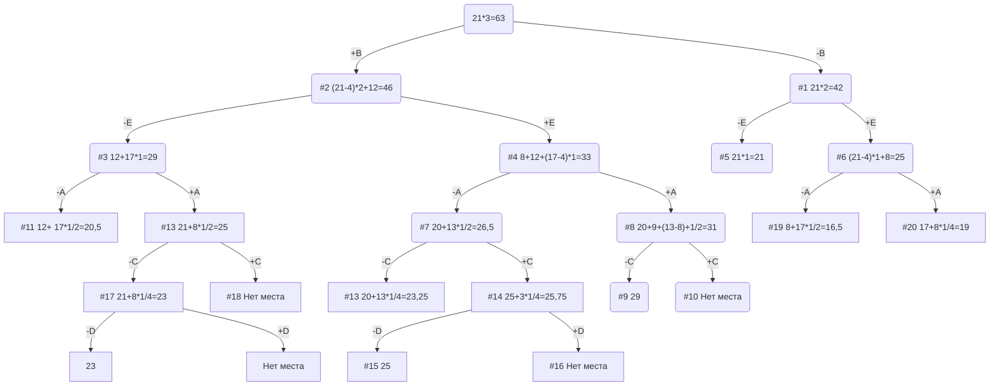

# Задание №11
# Задача о рюкзаке (Knapsack problem). Метод ветвей и границ.

## Вариант 8
## Условия задачи

| Предметы  |  A  | B  | C | D  | E |
|:----------|:---:|:--:|:-:|:--:|:-:|
| Стоимость |  9  | 12  | 5 | 3 | 8 |
| Вес       | 9 | 4 | 10 | 12  | 4 |

Ограничение вместимости: 21

## Решение
### 1. Найдем удельную стоимость предметов (стоимость / вес)
| Предметы  |  A  |  B  | C | D  | E  |
|:----------|:---:|:---:|:-:|:--:|:--:|
| c |  9  | 12  | 5 | 3 | 8 |
| w       | 9 | 4  | 10 | 12  | 4 |
| c/w  | 1 | 3 | 1/2 | 1/4  | 2  |

### 2. Отсортируем предметы по удельной стоимости
| Предметы  |  B  |  E  | A | C  | D  |
|:----------|:---:|:---:|:-:|:--:|:--:|
| c |  12  | 8  | 9 | 5 | 3 |
| w       | 4 | 4  | 9 | 10  | 12 |
| c/w  | 3 | 2 | 1 | 1/2 | 1/4  |

### 3. Оценка верха: w = 21 (вместимость рюкзака)

21 * 3 = 63

### 4. Используем метод ветвей и границ

### 5. Максимальное значение возможных сумм

- Максимальное значение возможных сумм = 29
- ПУТЬ: +B +E +A -C -D

### Ответ
- Берем предметы B, E, A.
- Стоимость = 12 + 8 + 9 = 29
- Осталось места в рюкзаке: 4