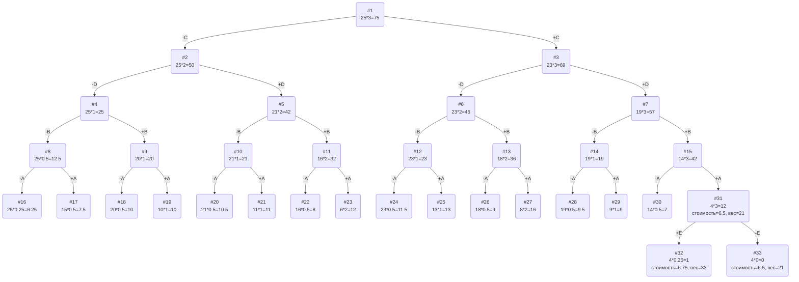

# Вариант 6

## Постановка задачи
Задача о рюкзаке (англ. Knapsack problem) — дано N предметов, ni предмет имеет массу wi > 0 и стоимость pi > 0. Необходимо выбрать из этих предметов такой набор, чтобы суммарная масса не превосходила заданной величины W (вместимость рюкзака), а суммарная стоимость была максимальна. 

## Пример решения задачи о рюкзаке
## Условия задачи

| Предметы  |  A  | B  | C | D  | E  |
|:----------|:---:|:--:|:-:|:--:|:--:|
| Стоимость |  5  | 5  | 6 | 8  | 3  |
| Вес       | 10  | 5  | 2 | 4  | 12 |

Ограничение вместимости: 25

## Решение
### 1. Рассчитаем ценность каждого предмета
| Предметы  |  A  | B | C | D  | E  |
|:----------|:---:|:-:|:-:|:--:|:--:|
| Стоимость |  5  | 5 | 6 | 8  | 3  |
| Вес       | 10  | 5 | 2 | 4  | 12 |
| Ценность  | 1/2 | 1 | 3 | 2  | 1/4|

### 2. Отсортируем предметы по убыванию ценности
| Предметы  |  C  | D | B |  A  | E  |
|:----------|:---:|:-:|:-:|:---:|:--:|
| Стоимость |  6  | 8 | 5 | 5   | 3  |
| Вес       |  2  | 4 | 5 | 10  | 12 |
| Ценность  |  3  | 2 | 1 | 1/2 | 1/4|

### 3. Рассчитаем оценку сверху для пустого рюкзака

Свободное место в рюкзаке: 25

Наибольшая ценность предмета: 3

Оценка сверху для пустого рюкзака: 25 * 3 = 75

### 4. Найдем решение задачи с использованием метода ветвей и границ

### Ответ
- Наибольшая стоимость предметов в рюкзаке 6,5.
- Набор предметов, обеспечивающих максимальную стоимость, C, D, B, A, общим весом 21.
- Свободное место в рюкзаке 4.
