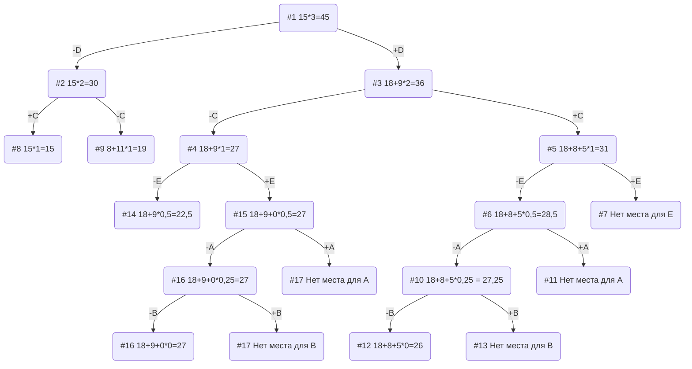

# Задание №11
# Задача о рюкзаке (Knapsack problem). Метод ветвей и границ
# Вариант 3

## Постановка задачи
Задача о рюкзаке (англ. Knapsack problem) — дано N предметов, ni предмет имеет массу wi > 0 и стоимость pi > 0. Необходимо выбрать из этих предметов такой набор, чтобы суммарная масса не превосходила заданной величины W (вместимость рюкзака), а суммарная стоимость была максимальна. 

| Предметы  |  A  | B  | C | D  | E |
|:----------|:---:|:--:|:-:|:--:|:-:|
| Стоимость |  5  | 3  | 8 | 18 | 9 |
| Вес       | 10  | 12 | 4 | 6  | 9 |

Ограничение вместимости: 15

## Решение
### 1. Рассчитаем ценность каждого предмета

| Предметы  |  A  | B  | C | D  | E |
|:----------|:---:|:--:|:-:|:--:|:-:|
| Стоимость |  5  | 3  | 8 | 18 | 9 |
| Вес       | 10  | 12 | 4 | 6  | 9 |
| Ценность  | 1/2 | 1/4| 2 | 3  | 1 |

### 2. Отсортируем предметы по убыванию ценности

| Предметы  | D  | C | E |  A  |  B  |
|:----------|:--:|:-:|:-:|:---:|:---:|
| Стоимость | 18 | 8 | 9 | 5   | 3   |
| Вес       | 6  | 4 | 9 | 10  | 12  |
| Ценность  | 3  | 2 | 1 | 1/2 | 1/4 |

### 3. Рассчитаем оценку сверху для пустого рюкзака

Свободное место в рюкзаке: 15
Наибольшая ценность предмета: 3
Оценка сверху для пустого рюкзака: 15 * 3 = 45

### 4. Найдем решение задачи с использованием метода ветвей и границ

### Ответ
- Наибольшая стоимость предметов в рюкзаке 27.
- Набор предметов, обеспечивающих максимальную стоимость: D, E, общим весом 15.
- Свободное место в рюкзаке: 0.
