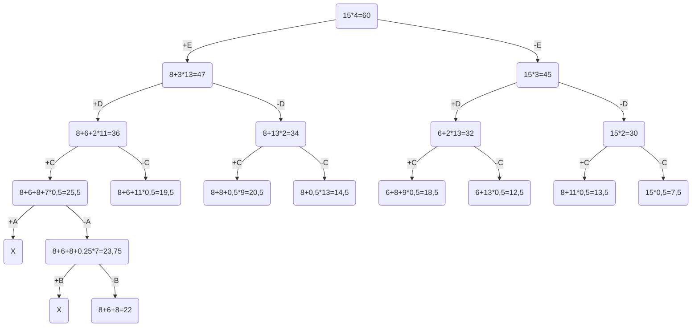

# Вариант 1

| Предметы  | A  | B  | C  | D  | E  |
|-----------|----|----|----|----|----|
| Стоимость | 5  | 3  | 8  | 6  | 8  |
| Вес       | 10 | 12 | 4  | 2  | 2  |

Ограничение вместимости: 15

# 1. Рассчитаем ценность каждого предмета

| Предметы  | A  | B  | C  | D  | E  |
|-----------|----|----|----|----|----|
| Стоимость | 5  | 3  | 8  | 6  | 8  |
| Вес       | 10 | 12 | 4  | 2  | 2  |
| Ценность  |0.5 |0.25| 2  | 3  | 4  |

# 2. Отсортируем предметы по убыванию ценности

| Предметы  | E  | D  | C  | A  | B  |
|-----------|----|----|----|----|----|
| Стоимость | 8  | 6  | 8  | 5  | 3  |
| Вес       | 2  | 2  | 4  | 10 | 12 |
| Ценность  | 4  | 3  | 2  |0.5 |0.25|

# 3. Рассчитаем оценку сверху для пустого рюкзака

Свободное место в рюкзаке: 15

Наибольшая ценность предмета: 4

Оценка сверху для пустого рюкзака: 15 * 4 = 60

# 4. Найдем решение задачи с использованием метода ветвей и границ

## Ответ

Наибольшая стоимость предметов в рюкзаке 22.

Набор предметов, обеспечивающих максимальную стоимость, E, D, C
