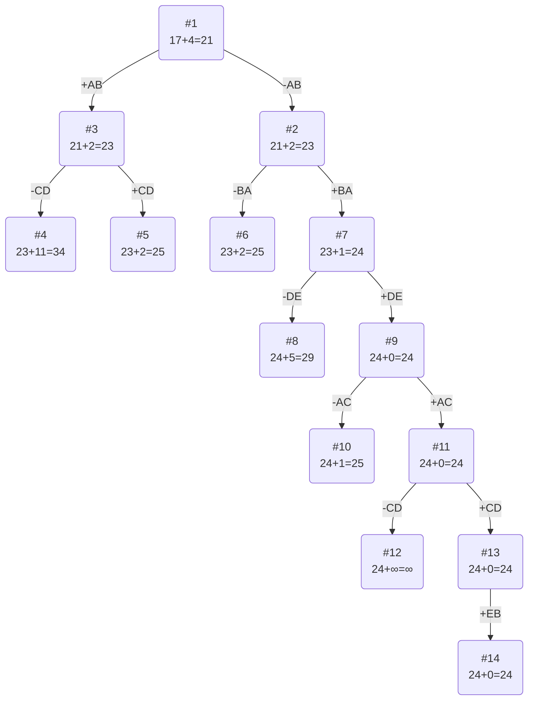

# Задание №12
# Задача коммивояжера (Traveling salesman problem). Метод ветвей и границ.

**Для выполнения задания рекомендуется установить [Плагин отображения диаграмм Markdown Preview Mermaid Support](https://marketplace.visualstudio.com/items?itemName=bierner.markdown-mermaid)**

## Задание
Для каждого варианта представлены условия задачи, в соответствии с которыми необходимо: 
1. Решить задачу коммивояжера с применением метода ветвей и границ.
2. Оформить решение задачи по шагам с подробными комментариями, таблицами и диаграммами.
3. В ответе указать:
   - найденный маршрут,
   - длину найденного маршрута.

Условия для каждого варианта расположены в файле task-12/task.md в ветке main репозитория manual-tasks. 

Решение задачи нужно оформить в формате Markdown в отдельном файле с названием <название_команды>.md, который добавить в каталог task-12 данного репозитория.

## Информация по Markdown разметке:
[Система верстки LaTeX, которую можно использовать для математических формул](https://grammarware.net/text/syutkin/MathInLaTeX.pdf)

[Рисуем диаграммы Mermaid.js в README-файлах GitHub](https://habr.com/ru/articles/652867/)

## Для выполнения задания необходимо:
1. Обновить ветку main в локальном репозитории (git pull).
2. От ветки main создать ветвь с названием <название_команды>-task-12.
3. В созданной ветке в каталог task-12 добавить файл с решением задачи с названием <название_команды>.md.
4. Зафиксировать изменения на ветке (git commit).
5. Отравить ветку с изменениями в репозиторий на Github (git push).
6. Создать на Github запрос на слияние (pull request), указав в качестве base-ветки main, в качестве compare-ветки <название_команды>-task-12.

## Постановка задачи
Имеется N городов, связанных дорогами. Расстояния между городами известны. Коммивояжер (бродячий торговец) должен выйти из первого города, посетить по одному разу в некотором порядке города 2,3..n и вернуться в первый город. В каком порядке следует посещать города, чтобы замкнутый путь коммивояжера имел кратчайшее расстояние?

## Математическая модель
Для моделирования задачи можно использовать теорию графов. Города можно перенумеровать и представить в виде вершин графа, а рёбра (*i*, *j*) между вершинами *i* и *j* будут соответствовать пути между этими городами. Каждому ребру (*i*, *j*) можно сопоставить расстояние между городами Сij ⩾ 0. Таким образом, задачу можно сформулировать так: 

Дан полный граф с n вершинами, длина ребра (i,j)= Сij. Найти гамильтонов цикл минимальной длины.

Гамильтоновым циклом называется маршрут, включающий ровно по одному разу каждую вершину графа.

## Пример решения задачи коммивояжера
## Условия задачи

Матрица расстояний:

|       | **A** | **B** | **C** | **D** | **E** |
|:------|:-----:|:-----:|:-----:|:-----:|:-----:|
| **A** | **∞** |   5   |   8   |  10   |  12   |
| **B** |   3   | **∞** |   8   |  16   |   5   |
| **C** |   9   |   4   | **∞** |   7   |   9   |
| **D** |   8   |   5   |   4   | **∞** |   3   |
| **E** |   2   |   3   |   5   |  11   | **∞** |

## Решение
### 1. Проведем редукцию строк матрицы

|       | **A** | **B** | **C** | **D** | **E** | Min |
|:------|:-----:|:-----:|:-----:|:-----:|:-----:|:---:|
| **A** | **∞** |   5   |   8   |  10   |  12   |  5  |
| **B** |   3   | **∞** |   8   |  16   |   5   |  3  |
| **C** |   9   |   4   | **∞** |   7   |   9   |  4  |
| **D** |   8   |   5   |   4   | **∞** |   3   |  3  |
| **E** |   2   |   3   |   5   |  11   | **∞** |  2  |
| Sum   |       |       |       |       |       | 17  |

Сумма констант редукции по строкам 17

Марица после редукции строк:

|       | **A** | **B** | **C** | **D** | **E** |
|:------|:-----:|:-----:|:-----:|:-----:|:-----:|
| **A** | **∞** |   0   |   3   |   5   |   7   |
| **B** |   0   | **∞** |   5   |  13   |   2   |
| **C** |   5   |   0   | **∞** |   3   |   5   |
| **D** |   5   |   2   |   1   | **∞** |   0   |
| **E** |   0   |   1   |   3   |   9   | **∞** |

### 2. Проведем редукцию столбцов матрицы

|       | **A** | **B** | **C** | **D** | **E** | Sum |
|:------|:-----:|:-----:|:-----:|:-----:|:-----:|:---:|
| **A** | **∞** |   0   |   3   |   5   |   7   |     |
| **B** |   0   | **∞** |   5   |  13   |   2   |     |
| **C** |   5   |   0   | **∞** |   3   |   5   |     |
| **D** |   5   |   2   |   1   | **∞** |   0   |     |
| **E** |   0   |   1   |   3   |   9   | **∞** |     |
| Min   |   0   |   0   |   1   |   3   |   0   |  4  |

Сумма констант редукции по столбцам 4

Марица после редукции столбцов:

|       | **A** | **B** | **C** | **D** | **E** |
|:------|:-----:|:-----:|:-----:|:-----:|:-----:|
| **A** | **∞** |   0   |   2   |   2   |   7   |
| **B** |   0   | **∞** |   4   |  10   |   2   |
| **C** |   5   |   0   | **∞** |   0   |   5   |
| **D** |   5   |   2   |   0   | **∞** |   0   |
| **E** |   0   |   1   |   2   |   6   | **∞** |

### 3. Оценка длины маршрута

Оценка длины маршрута снизу соответствует сумме констант редукции по строкам и по столбцам

17 + 4 = 21

### 4. Найдем решение задачи с использованием метода ветвей и границ

Чтобы определить ребро, по которому будет произведено ветвление из корневого узла рассчитаем штрафы для ребер с нулевой оценкой:

|        | **Штраф** |
|:-------|:---------:|
| **AB** |     2     |
| **BA** |     2     |
| **CB** |     0     |
| **CD** |     2     |
| **DC** |     2     |
| **DE** |     2     |
| **EA** |     1     |

Максимальный штраф 2, выберем ребро AB, как одно из ребер с максимальным штрафом.

#### Узел №2
Узел №2 с исключением ребра AB имеет оценку 21 + 2 (штраф) = 23

#### Узел №3
Для получения оценки узла 3 необходимо рассчитать сумму констант редукции для матрицы с учетом включения ребра AB, для этого в матрице:
- удалим строку A,
- удалим столбец B,
- Заменим на бесконечность значение BA.

|       | **A** | **C** | **D** | **E** | Min |
|:------|:-----:|:-----:|:-----:|:-----:|-----|
| **B** | **∞** |   4   |  10   |   2   | 2   |
| **C** |   5   | **∞** |   0   |   5   |     |
| **D** |   5   |   0   | **∞** |   0   |     |
| **E** |   0   |   2   |   6   | **∞** |     |
| Sum   |       |       |       |       | 2   |

Матрица после редукции:

|       | **A** | **C** | **D** | **E** |
|:------|:-----:|:-----:|:-----:|:-----:|
| **B** | **∞** |   2   |   8   |   0   |
| **C** |   5   | **∞** |   0   |   5   |
| **D** |   5   |   0   | **∞** |   0   |
| **E** |   0   |   2   |   6   | **∞** |

Сумма констант редукции 2

Оценка узла 3 = 21 + 2 (редукция) = 23

Продолжим поиск из узла 3

#### Выбор ребра
Чтобы определить ребро, по которому будет произведено ветвление из узла 3 рассчитаем штрафы для ребер с нулевой оценкой:

|        | **Штраф** |
|:-------|:---------:|
| **BE** |     2     |
| **CD** |    11     |
| **DC** |     2     |
| **DE** |     0     |
| **EA** |     7     |

Максимальный штраф 11, выберем ребро CD, как ребро с максимальным штрафом.

#### Узел №4
Узел №4 с исключением ребра CD имеет оценку 23 + 11 (штраф) = 34

#### Узел №5
Для получения оценки узла 5 необходимо рассчитать сумму констант редукции для матрицы с учетом включения ребра CD, для этого в матрице:
- удалим строку С,
- удалим столбец D,
- Заменим на бесконечность значение DC.

|       | **A** | **C** | **E** | Sum |
|:------|:-----:|:-----:|:-----:|-----|
| **B** | **∞** |   2   |   0   |     |
| **D** |   5   | **∞** |   0   |     |
| **E** |   0   |   2   | **∞** |     |
| Min   |       |   2   |       | 2   |

Матрица после редукции:

|       | **A** | **C** | **E** |
|:------|:-----:|:-----:|:-----:|
| **B** | **∞** |   0   |   0   |
| **D** |   5   | **∞** |   0   |
| **E** |   0   |   0   | **∞** |

Сумма констант редукции 2

Оценка узла 5 = 23 + 2 (редукция) = 25

Продолжим поиск из узла 2

#### Выбор ребра
Для узла 2 необходимо преобразовать матрицу:
- Заменить значение AB на бесконечность,
- Провести редукцию матрицы (сумма констант уже учтена в штрафе).

|       | **A** | **B** | **C** | **D** | **E** | Min |
|:------|:-----:|:-----:|:-----:|:-----:|:-----:|:----|
| **A** | **∞** | **∞** |   2   |   2   |   7   | 2   |
| **B** |   0   | **∞** |   4   |  10   |   2   |     |
| **C** |   5   |   0   | **∞** |   0   |   5   |     |
| **D** |   5   |   2   |   0   | **∞** |   0   |     |
| **E** |   0   |   1   |   2   |   6   | **∞** |     |

Матрица после редукции:

|       | **A** | **B** | **C** | **D** | **E** |
|:------|:-----:|:-----:|:-----:|:-----:|:-----:|
| **A** | **∞** | **∞** |   0   |   0   |   5   |
| **B** |   0   | **∞** |   4   |  10   |   2   |
| **C** |   5   |   0   | **∞** |   0   |   5   |
| **D** |   5   |   2   |   0   | **∞** |   0   |
| **E** |   0   |   1   |   2   |   6   | **∞** |

Чтобы определить ребро, по которому будет произведено ветвление из узла 2 рассчитаем штрафы для ребер с нулевой оценкой:

|        | **Штраф** |
|:-------|:---------:|
| **AC** |     0     |
| **AD** |     0     |
| **BA** |     2     |
| **CB** |     1     |
| **CD** |     0     |
| **DC** |     0     |
| **DE** |     2     |
| **EA** |     1     |

Максимальный штраф 2, выберем ребро BA, как одно из ребер с максимальным штрафом.

#### Узел №6
Узел №6 с исключением ребра BA имеет оценку 23 + 2 (штраф) = 25

#### Узел №7
Для получения оценки узла 7 необходимо рассчитать сумму констант редукции для матрицы с учетом включения ребра BA, для этого в матрице:
- удалим строку B,
- удалим столбец A,
- Заменим на бесконечность значение AB.

|       | **B** | **C** | **D** | **E** | Min |
|:------|:-----:|:-----:|:-----:|:-----:|:----|
| **A** | **∞** |   0   |   0   |   5   |     |
| **C** |   0   | **∞** |   0   |   5   |     |
| **D** |   2   |   0   | **∞** |   0   |     |
| **E** |   1   |   2   |   6   | **∞** | 1   |
| Sum   |       |       |       |       | 1   |

Матрица после редукции:

|       | **B** | **C** | **D** | **E** |
|:------|:-----:|:-----:|:-----:|:-----:|
| **A** | **∞** |   0   |   0   |   5   |
| **C** |   0   | **∞** |   0   |   5   |
| **D** |   2   |   0   | **∞** |   0   |
| **E** |   0   |   1   |   5   | **∞** |

Сумма констант редукции 1

Оценка узла 7 = 23 + 1 (редукция) = 24

Продолжим поиск из узла 7

#### Выбор ребра
Чтобы определить ребро, по которому будет произведено ветвление из узла 7 рассчитаем штрафы для ребер с нулевой оценкой:

|        | **Штраф** |
|:-------|:---------:|
| **AC** |     0     |
| **AD** |     0     |
| **CB** |     0     |
| **CD** |     0     |
| **DC** |     0     |
| **DE** |     5     |
| **EB** |     1     |

Максимальный штраф 5, выберем ребро DE, как ребро с максимальным штрафом.

#### Узел №8
Узел №8 с исключением ребра DE имеет оценку 24 + 5 (штраф) = 29

#### Узел №9
Для получения оценки узла 9 необходимо рассчитать сумму констант редукции для матрицы с учетом включения ребра DE, для этого в матрице:
- удалим строку D,
- удалим столбец E,
- Заменим на бесконечность значение ED.

|       | **B** | **C** | **D** |
|:------|:-----:|:-----:|:-----:|
| **A** | **∞** |   0   |   0   |
| **C** |   0   | **∞** |   0   |
| **E** |   0   |   1   | **∞** |

Сумма констант редукции 0, следовательно, оценка узла 9 = 24 + 0 = 24

Продолжим поиск из узла 9

#### Выбор ребра
Чтобы определить ребро, по которому будет произведено ветвление из узла 9 рассчитаем штрафы для ребер с нулевой оценкой:

|        | **Штраф** |
|:-------|:---------:|
| **AC** |     1     |
| **AD** |     0     |
| **CB** |     0     |
| **CD** |     0     |
| **EB** |     1     |

Максимальный штраф 1, выберем ребро AC, как одно из ребер с максимальным штрафом.

#### Узел №10
Узел №10 с исключением ребра AC имеет оценку 24 + 1 (штраф) = 25

#### Узел №11
Для получения оценки узла 11 необходимо рассчитать сумму констант редукции для матрицы с учетом включения ребра AC, для этого в матрице:
- удалим строку A,
- удалим столбец C,
- Заменим на бесконечность значение CA,
- **Ребро AC исходит из ранее задействованной вершины A, то есть у нас есть часть маршрута BAC, чтобы избежать преждевременного замыкания цикла, ребро CB (при наличии) также следует заменить на бесконечность.**

|       | **B** | **D** |
|:------|:-----:|:-----:|
| **C** | **∞** |   0   |
| **E** |   0   | **∞** |

Сумма констант редукции 0, следовательно, оценка узла 11 = 24 + 0 = 24

Продолжим поиск из узла 11

#### Выбор ребра
Чтобы определить ребро, по которому будет произведено ветвление из узла 11 рассчитаем штрафы для ребер с нулевой оценкой:

|        | **Штраф** |
|:-------|:---------:|
| **CD** |   **∞**   |
| **EB** |   **∞**   |

Максимальный штраф бесконечность, выберем ребро CD, как одно из ребер с максимальным штрафом.

#### Узел №12
Узел №12 с исключением ребра CD имеет оценку 24 + **∞** (штраф) = **∞**

#### Узел №13
Для получения оценки узла 13 необходимо рассчитать сумму констант редукции для матрицы с учетом включения ребра CD, для этого в матрице:
- удалим строку C,
- удалим столбец D,
- Заменим на бесконечность значение DC,
- **Ребро CD исходит из ранее задействованной вершины C, то есть у нас есть часть маршрута BACD, чтобы избежать преждевременного замыкания цикла, ребро DB (при наличии) также следует заменить на бесконечность.**

|       | **B** |
|:------|:-----:|
| **E** |   0   |

Сумма констант редукции 0, следовательно, оценка узла 13 = 24 + 0 = 24

Продолжим поиск из узла 13

#### Выбор ребра
Альтернатив у ребра EB нет

#### Узел №14
Ребро EB включается в маршрут, длина которого составляет 24

### Ответ
- Кратчайший маршрут ACDEBA.
- Длина маршрута 24.
