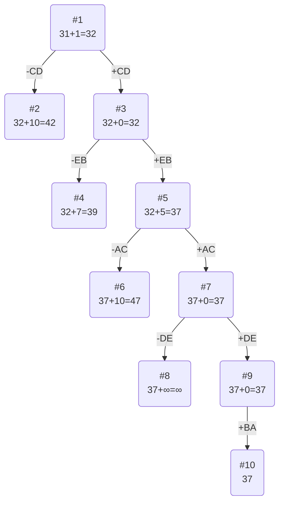

# Задача о Коммивояжере. Метод ветвей и границ

## Вариант 10:
Матрица расстояний:

|       | **A** | **B** | **C** | **D** | **E** |
|-------|:-----:|:-----:|:-----:|:-----:|:-----:|
| **A** | **∞** |  15   |   7   |  12   |  13   |
| **B** |  11   | **∞** |  13   |  11   |   6   |
| **C** |  11   |  11   | **∞** |   5   |  12   |
| **D** |   7   |  13   |  13   | **∞** |   5   |
| **E** |   8   |   9   |   9   |  15   | **∞** |

## Постановка задачи
Имеется N городов, связанных дорогами. Расстояния между городами известны. Коммивояжер (бродячий торговец) должен выйти из первого города, посетить по одному разу в некотором порядке города 2,3..n и вернуться в первый город. В каком порядке следует посещать города, чтобы замкнутый путь коммивояжера имел кратчайшее расстояние?

## Решение

### 1. Проведем редукцию строк матрицы

|       | **A** | **B** | **C** | **D** | **E** | Min |
|-------|:-----:|:-----:|:-----:|:-----:|:-----:|:---:|
| **A** | **∞** |  15   |   7   |  12   |  13   |  7  |
| **B** |  11   | **∞** |  13   |  11   |   6   |  6  |
| **C** |  11   |  11   | **∞** |   5   |  12   |  5  | 
| **D** |   7   |  13   |  13   | **∞** |   5   |  5  |
| **E** |   8   |   9   |   9   |  15   | **∞** |  8  |
| Sum   |       |       |       |       |       |  31 |

Сумма констант редукции по строкам равна 31

Матрица после редукции строк:

|       | **A** | **B** | **C** | **D** | **E** |
|-------|:-----:|:-----:|:-----:|:-----:|:-----:|
| **A** | **∞** |   8   |   0   |   5   |   6   |
| **B** |   5   | **∞** |   7   |   5   |   0   |
| **C** |   6   |   6   | **∞** |   0   |   7   |
| **D** |   2   |   8   |   8   | **∞** |   0   |
| **E** |   0   |   1   |   1   |   7   | **∞** |

### 2. Проведем редукцию столбцов матрицы

|       | **A** | **B** | **C** | **D** | **E** | Sum |
|-------|:-----:|:-----:|:-----:|:-----:|:-----:|:---:|
| **A** | **∞** |   8   |   0   |   5   |   6   |     |
| **B** |   5   | **∞** |   7   |   5   |   0   |     |
| **C** |   6   |   6   | **∞** |   0   |   7   |     |
| **D** |   2   |   8   |   8   | **∞** |   0   |     |
| **E** |   0   |   1   |   1   |   7   | **∞** |     |
|  Min  |   0   |   1   |   0   |   0   |   0   |  1  |

Сумма констант редукции по столбцам 1

Матрица после редукции столбцов:

|       | **A** | **B** | **C** | **D** | **E** |
|-------|:-----:|:-----:|:-----:|:-----:|:-----:|
| **A** | **∞** |   7   |   0   |   5   |   6   |
| **B** |   5   | **∞** |   7   |   5   |   0   |
| **C** |   6   |   5   | **∞** |   0   |   7   |
| **D** |   2   |   7   |   8   | **∞** |   0   |
| **E** |   0   |   0   |   1   |   7   | **∞** |

### 3. Оценка длины маршрута

Оценка длины маршрута снизу соответствует сумме констант редукции по строкам и по столбцам

31 + 1 = 32

### 4. Найдем решение задачи с помощью метода ветвей и границ

Чтобы определить ребро, по которому будет произведено ветвление из корневого узла рассчитаем штрафы для ребер с нулевой оценкой:

|        | **Штраф** |
|:-------|:---------:|
| **AC** |   5+1=6   |
| **BE** |   5+0=5   |
| **CD** |   5+5=10  |
| **DE** |   2+0=2   |
| **EA** |   2+0=2   |
| **EB** |   5+0=5   |

Максимальный штраф 10, берем ребро CD, как ребро с максимальным штрафом.

#### Узел №2
Узел №2 с исключением ребра CD имеет оценку 32 + 10 (штраф) = 42

#### Узел №3
Для получения оценки узла 3 необходимо рассчитать сумму констант редукции для матрицы с учетом включения ребра CD.
Для этого в матрице:
- удалим строку C,
- удалим столбец D,
- Заменим на бесконечность значение DC.

|       | **A** | **B** | **C** | **E** |
|-------|:-----:|:-----:|:-----:|:-----:|
| **A** | **∞** |   7   |   0   |   6   |
| **B** |   5   | **∞** |   7   |   0   |
| **D** |   2   |   7   | **∞** |   0   |
| **E** |   0   |   0   |   1   | **∞** |

Редукция не проводится, т.к. каждый столбец и каждая строка имеет хотя бы один ноль. То есть сумма констант редукции равна **0**.

Оценка узла 3 = 32 + 0 (редукция) = 32

Продолжим поиск из узла 3

#### Выбор ребра
Чтобы определить ребро, по которому будет произведено ветвление из узла 3 рассчитаем штрафы для ребер с нулевой оценкой:

|        | **Штраф** |
|:-------|:---------:|
| **AC** |   1+6=7   |
| **BE** |   0+5=5   |
| **DE** |   0+2=2   |
| **EA** |   2+0=2   |
| **EB** |   7+0=7   |

Максимальный штраф 7, выберем ребро EB, как ребро с максимальным штрафом

#### Узел №4
Узел №4 с исключением ребра EB имеет оценку 32 + 7 (штраф) = 39

#### Узел №5
Для получения оценки узла 5 необходимо рассчитать сумму констант редукции для матрицы с учетом включения ребра EB, для этого в матрице:
- удалим строку E,
- удалим столбец B,
- Заменим на бесконечность значение BE.

|       | **A** | **C** | **E** |  Sum  |
|-------|:-----:|:-----:|:-----:|:-----:|
| **A** | **∞** |   0   |   6   |       |
| **B** |   5   |   7   | **∞** |       |
| **D** |   2   | **∞** |   0   |       |
| Min   |   2   |   0   |   0   |   2   |

Матрица после редукции по столбцам:

|       | **A** | **C** | **E** |
|-------|:-----:|:-----:|:-----:|
| **A** | **∞** |   0   |   6   |
| **B** |   3   |   7   | **∞** |
| **D** |   0   | **∞** |   0   |

|       | **A** | **C** | **E** |  Min  |
|-------|:-----:|:-----:|:-----:|:-----:|
| **A** | **∞** |   0   |   6   |   0   |
| **B** |   3   |   7   | **∞** |   3   |
| **D** |   0   | **∞** |   0   |   0   |
| Sum   |       |       |       |   3   |

Матрица после редукции по строкам:

|       | **A** | **C** | **E** |
|-------|:-----:|:-----:|:-----:|
| **A** | **∞** |   0   |   6   |
| **B** |   0   |   4   | **∞** |
| **D** |   0   | **∞** |   0   |

Сумма констант редукции 3 + 2 = 5 

Оценка узла 5 = 32 + 5 = 37

Продолжим поиск из узла 5

#### Выбор ребра
Чтобы определить ребро, по которому будет произведено ветвление из узла 5 рассчитаем штрафы для ребер с нулевой оценкой:

|        | **Штраф** |
|:-------|:---------:|
| **AC** |   6+4=10  |
| **BA** |   4+0=4   |
| **DA** |   0+0=0   |
| **DE** |   0+6=6   |

Максимальный штраф 10, берём ребро AC, как ребро с максимальным штрафом.

#### Узел №6
Узел №6 с исключением ребра AC имеет оценку 37 + 10 (штраф) = 47

#### Узел №7

Для получения оценки узла 7 необходимо рассчитать сумму констант редукции для матрицы с учетом включения ребра AC, для этого в матрице:
- удалим строку A,
- удалим столбец C,
- Заменим на бесконечность значение CA.

|       | **A** | **E** |
|-------|:-----:|:-----:|
| **B** |   0   | **∞** |
| **D** |   0   |   0   |

Сумма констант редукции 0, следовательно оценка узла 7 37 + 0 = 37

Продолжим поиск из узла 7

#### Выбор ребра
Чтобы определить ребро, по которому будет произведено ветвление из узла 7 рассчитаем штрафы для ребер с нулевой оценкой:

|        | **Штраф** |
|:-------|:---------:|
| **BA** |  0+∞=**∞**|
| **DA** |  0+0=0    |
| **DE** |  0+∞=**∞**|

Максимальный штраф бесконечность, выберем ребро DE, как одно из ребер с максимальным штрафом.

#### Узел №8
Узел №8 с исключением ребра DE имеет оценку 37 + **∞** (штраф) = **∞**

#### Узел №9
Для получения оценки узла 13 необходимо рассчитать сумму констант редукции для матрицы с учетом включения ребра CD, для этого в матрице:
- удалим строку D,
- удалим столбец E,
- Заменим на бесконечность значение ED,

|       | **A** |
|-------|:-----:|
| **B** |   0   |

Сумма констант редукции 0, следовательно, оценка узла 9 = 37 + 0 = 37

Продолжим поиск из узла 9

#### Выбор ребра
Альтернатив у ребра BA нет

#### Узел №14
Ребро BA включается в маршрут, длина которого составляет 37

## Ответ
- Кратчайший маршрут CDEBAC
- Длина маршрута 37
  