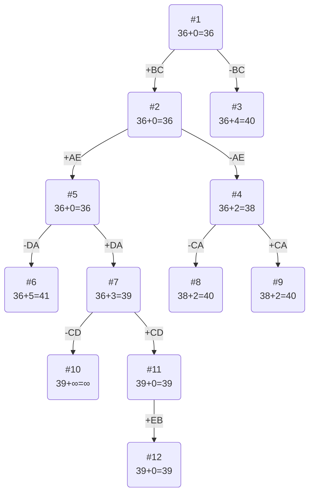

# Задание №12. Вариант №5.
# Задача коммивояжера (Traveling salesman problem). Метод ветвей и границ.

## Постановка задачи
Имеется N городов, связанных дорогами. Расстояния между городами известны. Коммивояжер (бродячий торговец) должен выйти из первого города, посетить по одному разу в некотором порядке города 2,3..n и вернуться в первый город. В каком порядке следует посещать города, чтобы замкнутый путь коммивояжера имел кратчайшее расстояние?

## Математическая модель
Для моделирования задачи можно использовать теорию графов. Города можно перенумеровать и представить в виде вершин графа, а рёбра (*i*, *j*) между вершинами *i* и *j* будут соответствовать пути между этими городами. Каждому ребру (*i*, *j*) можно сопоставить расстояние между городами Сij ⩾ 0. Таким образом, задачу можно сформулировать так: 

Дан полный граф с n вершинами, длина ребра (i,j)= Сij. Найти гамильтонов цикл минимальной длины.

Гамильтоновым циклом называется маршрут, включающий ровно по одному разу каждую вершину графа.

## Решения задачи коммивояжера 5 варианта
## Условия задачи

Матрица расстояний:

|       | **A** | **B** | **C** | **D** | **E** |
|-------|:-----:|:-----:|:-----:|:-----:|:-----:|
| **A** | **∞** |   8   |  14   |   8   |   6   |
| **B** |   9   | **∞** |   9   |  15   |  10   |
| **C** |   7   |  11   | **∞** |  10   |   9   |
| **D** |   9   |  14   |  13   | **∞** |   9   |
| **E** |   6   |   5   |  10   |   5   | **∞** |

## Решение
### 1. Проведем редукцию строк матрицы

|       | **A** | **B** | **C** | **D** | **E** | Min |
|:------|:-----:|:-----:|:-----:|:-----:|:-----:|:---:|
| **A** | **∞** |   8   |  14   |  8    |  6    |  6  |
| **B** |   9   | **∞** |   9   |  15   |   10  |  9  |
| **C** |   7   |  11   | **∞** |  10   |   9   |  7  |
| **D** |   9   |  14   |  13   | **∞** |   9   |  9  |
| **E** |   6   |   5   |  10   |  5    | **∞** |  5  |
| Sum   |       |       |       |       |       | 36  |

Сумма констант редукции по строкам 36

Марица после редукции строк:

|       | **A** | **B** | **C** | **D** | **E** |
|:------|:-----:|:-----:|:-----:|:-----:|:-----:|
| **A** | **∞** |   2   |  8    |  2    |  0    |
| **B** |   0   | **∞** |   0   |  6    |   1   |
| **C** |   0   |  4    | **∞** |  3    |   2   |
| **D** |   0   | 5     |  4    | **∞** |   0   | 
| **E** |   1   |   0   |  5    |  0    | **∞** |

### 2. Проведем редукцию столбцов матрицы

|       | **A** | **B** | **C** | **D** | **E** | Sum |
|:------|:-----:|:-----:|:-----:|:-----:|:-----:|:---:|
| **A** | **∞** |   2   |  8    |  2    |  0    |     |
| **B** |   0   | **∞** |   0   |  6    |   1   |     |
| **C** |   0   |   4   | **∞** |   3   |   2   |     |
| **D** |   0   |   5   |   4   | **∞** |   0   |     |
| **E** |   1   |   0   |   5   |    0  | **∞** |     |
| Min   |   0   |   0   |   0   |   0   |   0   |  0  |

Сумма констант редукции по столбцам 0

Марица после редукции столбцов:

|       | **A** | **B** | **C** | **D** | **E** |
|:------|:-----:|:-----:|:-----:|:-----:|:-----:|
| **A** | **∞** |   2   |  8    |  2    |  0    |
| **B** |   0   | **∞** |   0   |  6    |   1   |
| **C** |   0   |  4    | **∞** |  3    |   2   |
| **D** |   0   | 5     |  4    | **∞** |   0   | 
| **E** |   1   |   0   |  5    |  0    | **∞** |

### 3. Оценка длины маршрута

Оценка длины маршрута снизу соответствует сумме констант редукции по строкам и по столбцам

36 + 0 = 36

### 4. Найдем решение задачи с использованием метода ветвей и границ

Чтобы определить ребро, по которому будет произведено ветвление из корневого узла рассчитаем штрафы для ребер с нулевой оценкой:

|        | **Штраф** |
|:-------|:---------:|
| **AE** |     2     |
| **BA** |     0     |
| **BC** |     4     |
| **CA** |     2     |
| **DA** |     0     |
| **DE** |     0     |
| **EB** |     2     |
| **ED** |     2     |

Максимальный штраф 4, выберем ребро BC, как ребро с максимальным штрафом.

#### Узел №2
Узел №2 с исключением ребра BC имеет оценку 36 + 4 (штраф) = 40

#### Узел №3
Для получения оценки узла 3 необходимо рассчитать сумму констант редукции для матрицы с учетом включения ребра BC, для этого в матрице:
- удалим строку B,
- удалим столбец C,
- Заменим на бесконечность значение CB.

|       | **A** | **B** | **D** | **E** | Sum |
|:------|:-----:|:-----:|:-----:|:-----:|:---:|
| **A** | **∞** |   2   |  2    |  0    |     |
| **C** |   0   | **∞** |   3   |   2   |     |
| **D** |   0   |   5   | **∞** |   0   |     |
| **E** |   1   |   0   |   0   | **∞** |     |
| Min   |   0   |   0   |   0   |   0   |  0  |

Матрица после редукции:

|       | **A** | **B** | **D** | **E** | 
|:------|:-----:|:-----:|:-----:|:-----:|
| **A** | **∞** |   2   |  2    |  0    |     
| **C** |   0   | **∞** |   3   |   2   |     
| **D** |   0   |   5   | **∞** |   0   |     
| **E** |   1   |   0   |   0   | **∞** | 

Сумма констант редукции 0

Оценка узла 3 = 36 + 0 (редукция) = 36

Продолжим поиск из узла 3

#### Выбор ребра
Чтобы определить ребро, по которому будет произведено ветвление из узла 3 рассчитаем штрафы для ребер с нулевой оценкой:

|        | **Штраф** |
|:-------|:---------:|
| **AE** |     2     |
| **CA** |    2      |
| **DA** |     0     |
| **DE** |     0     |
| **EB** |     2     |
| **ED** |     2     |

Максимальный штраф 2, выберем ребро AE, как ребро с максимальным штрафом.

#### Узел №4
Узел №4 с исключением ребра AE имеет оценку 36 + 2 (штраф) = 38

#### Узел №5
Для получения оценки узла 5 необходимо рассчитать сумму констант редукции для матрицы с учетом включения ребра AE, для этого в матрице:
- удалим строку A,
- удалим столбец E,
- Заменим на бесконечность значение EA.

|       | **A** | **B** | **D** | Sum  |
|:------|:-----:|:-----:|:-----:|:----:|
| **C** |   0   | **∞** |   3   |      |
| **D** |   0   |   5   | **∞** |      |
| **E** | **∞** |   0   |   0   |      |
| Min   |   0   |   0   |   0   |   0  |

Матрица после редукции:

|       | **A** | **B** | **D** | 
|:------|:-----:|:-----:|:-----:|
| **C** |   0   | **∞** |   3   |      
| **D** |   0   |   5   | **∞** |      
| **E** | **∞** |   0   |   0   |     

Сумма констант редукции 0

Оценка узла 5 = 36 + 0 (редукция) = 36

Продолжим поиск из узла 5

#### Выбор ребра
Чтобы определить ребро, по которому будет произведено ветвление из узла 5 рассчитаем штрафы для ребер с нулевой оценкой:

|        | **Штраф** |
|:-------|:---------:|
| **CA** |    3      |
| **DA** |     5     |
| **EB** |     5     |
| **ED** |     3     |

Максимальный штраф 5, выберем ребро DA, как ребро с максимальным штрафом.

#### Узел №6
Узел №6 с исключением ребра DA имеет оценку 36 + 5 (штраф) = 41

#### Узел №7
Для получения оценки узла 7 необходимо рассчитать сумму констант редукции для матрицы с учетом включения ребра DA, для этого в матрице:
- удалим строку D,
- удалим столбец A,
- Заменим на бесконечность значение AD.

|       | **B** | **D** | Min  |
|:------|:-----:|:-----:|:----:|
| **C** | **∞** |   3   |  -3  |
| **E** |   0   |   0   |      |
| Sum   |   0   |   0   |   3  |

Матрица после редукции:

|       | **B** | **D** | 
|:------|:-----:|:-----:|
| **C** | **∞** |   0   | 
| **E** |   0   |   0   |        

Сумма констант редукции 3

Оценка узла 7 = 36 + 3 (редукция) = 39

Продолжим поиск из узла 4

#### Выбор ребра
Для узла 4 необходимо преобразовать матрицу:
- Заменить значение AE на бесконечность,
- Провести редукцию матрицы (сумма констант уже учтена в штрафе).

|       | **A** | **B** | **D** | **E** | Min |
|:------|:-----:|:-----:|:-----:|:-----:|:---:|
| **A** | **∞** |   2   |  2    | **∞** |  2  |
| **C** |   0   | **∞** |   3   |   2   |     |
| **D** |   0   |   5   | **∞** |   0   |     |
| **E** |   1   |   0   |   0   | **∞** |     |

Матрица после редукции:

|       | **A** | **B** | **D** | **E** |
|:------|:-----:|:-----:|:-----:|:-----:|
| **A** | **∞** |   2   |  2    | **∞** |  
| **C** |   0   | **∞** |   3   |   2   |     
| **D** |   0   |   5   | **∞** |   0   |     
| **E** |   1   |   0   |   0   | **∞** |  

Чтобы определить ребро, по которому будет произведено ветвление из узла 4 рассчитаем штрафы для ребер с нулевой оценкой:

|        | **Штраф** |
|:-------|:---------:|
| **CA** |     2     |
| **DA** |     0     |
| **DE** |     2     |
| **EB** |     2     |
| **ED** |     2     |

Максимальный штраф 2, выберем ребро CA, как одно из ребер с максимальным штрафом.

#### Узел №8
Узел №8 с исключением ребра CA имеет оценку 38 + 2 (штраф) = 40

#### Узел №9
Для получения оценки узла 9 необходимо рассчитать сумму констант редукции для матрицы с учетом включения ребра CA, для этого в матрице:
- удалим строку C,
- удалим столбец A,
- Заменим на бесконечность значение AC.

|       | **B** | **D** | **E** | Min |
|:------|:-----:|:-----:|:-----:|:---:|
| **A** |   2   |  2    | **∞** |  2  |
| **D** |   5   | **∞** |   0   |     |
| **E** |   0   |   0   | **∞** |     |

Матрица после редукции:

|       | **B** | **D** | **E** | 
|:------|:-----:|:-----:|:-----:|
| **A** |   0   |  0    | **∞** | 
| **D** |   5   | **∞** |   0   |     
| **E** |   0   |   0   | **∞** |     

Сумма констант редукции 2

Оценка узла 7 = 38 + 2 (редукция) = 40

Продолжим поиск из узла 7

#### Выбор ребра
Чтобы определить ребро, по которому будет произведено ветвление из узла 7 рассчитаем штрафы для ребер с нулевой оценкой:

|        | **Штраф** |
|:-------|:---------:|
| **CD** |   **∞**   |
| **EB** |   **∞**   |
| **ED** |     0     |

Максимальный штраф **∞**, выберем ребро CD, как ребро с максимальным штрафом.

#### Узел №10
Узел №10 с исключением ребра CD имеет оценку 39 + **∞** (штраф) = **∞**

#### Узел №11
Для получения оценки узла 11 необходимо рассчитать сумму констант редукции для матрицы с учетом включения ребра CD, для этого в матрице:
- удалим строку C,
- удалим столбец D,
- Заменим на бесконечность значение DC.

|       | **B** | 
|:------|:-----:|
| **E** |   0   |   

Сумма констант редукции 0, следовательно, оценка узла 11 = 39 + 0 = 39

Продолжим поиск из узла 11

#### Выбор ребра
Чтобы определить ребро, по которому будет произведено ветвление из узла 11 рассчитаем штрафы для ребер с нулевой оценкой:

|        | **Штраф** |
|:-------|:---------:|
| **EB** |     0     |

Максимальный штраф 0, выберем ребро EB, как одно из ребер с максимальным штрафом.

#### Выбор ребра
Альтернатив у ребра EB нет

#### Узел №12
Ребро EB включается в маршрут, длина которого составляет 39

### Ответ
- Кратчайший маршрут BCDAEB.
- Длина маршрута 39.