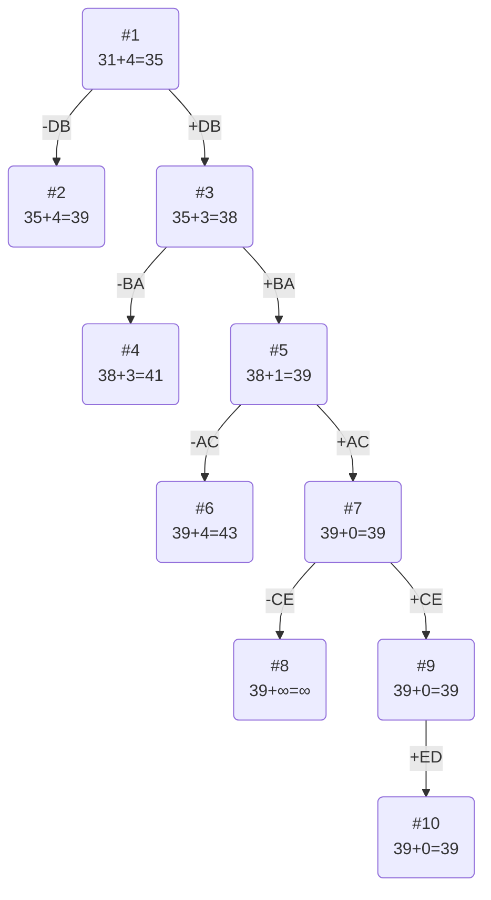

# Задание №12
# Задача коммивояжера (Traveling salesman problem). Метод ветвей и границ.

### Вариант 2:
Матрица расстояний:

|       | **A** | **B** | **C** | **D** | **E** |
|-------|:-----:|:-----:|:-----:|:-----:|:-----:|
| **A** | **∞** |  13   |  10   |   7   |  13   |
| **B** |   5   | **∞** |   7   |   5   |  11   |
| **C** |  10   |  13   | **∞** |   6   |   9   |
| **D** |  12   |  10   |   8   | **∞** |  10   |
| **E** |   8   |  13   |  12   |   5   | **∞** |

## Решение
### 1. Проведем редукцию строк матрицы

|       | **A** | **B** | **C** | **D** | **E** |**Min**|
|-------|:-----:|:-----:|:-----:|:-----:|:-----:|:-----:|
| **A** | **∞** |  13   |  10   |   7   |  13   |   7   |
| **B** |   5   | **∞** |   7   |   5   |  11   |   5   |
| **C** |  10   |  13   | **∞** |   6   |   9   |   6   |
| **D** |  12   |  10   |   8   | **∞** |  10   |   8   |
| **E** |   8   |  13   |  12   |   5   | **∞** |   5   |
|**Sum**|       |       |       |       |       |  31   |

Сумма констант редукции по строкам = 31

Марица после редукции строк:

|       | **A** | **B** | **C** | **D** | **E** |
|-------|:-----:|:-----:|:-----:|:-----:|:-----:|
| **A** | **∞** |   6   |   3   |   0   |   6   |
| **B** |   0   | **∞** |   2   |   0   |   6   |
| **C** |   4   |   7   | **∞** |   0   |   3   |
| **D** |   4   |   2   |   0   | **∞** |   2   |
| **E** |   3   |   8   |   7   |   0   | **∞** |

### 2. Проведем редукцию столбцов матрицы

|       | **A** | **B** | **C** | **D** | **E** |**Sum**|
|-------|:-----:|:-----:|:-----:|:-----:|:-----:|:-----:|
| **A** | **∞** |   6   |   3   |   0   |   6   |       |
| **B** |   0   | **∞** |   2   |   0   |   6   |       |
| **C** |   4   |   7   | **∞** |   0   |   3   |       |
| **D** |   4   |   2   |   0   | **∞** |   2   |       |
| **E** |   3   |   8   |   7   |   0   | **∞** |       |
|**Min**|   0   |   2   |   0   |   0   |   2   |   4   |

Сумма констант редукции по столбцам 4

Марица после редукции столбцов:
|       | **A** | **B** | **C** | **D** | **E** |
|-------|:-----:|:-----:|:-----:|:-----:|:-----:|
| **A** | **∞** |   4   |   3   |   0   |   4   |
| **B** |   0   | **∞** |   2   |   0   |   4   |
| **C** |   4   |   5   | **∞** |   0   |   1   |
| **D** |   4   |   0   |   0   | **∞** |   0   |
| **E** |   3   |   6   |   7   |   0   | **∞** |

### 3. Оценка длины маршрута

Оценка длины маршрута снизу соответствует сумме констант редукции по строкам и по столбцам

31 + 4 = 35

### 4. Найдем решение задачи с использованием метода ветвей и границ

Чтобы определить ребро, по которому будет произведено ветвление из корневого узла рассчитаем штрафы для ребер с нулевой оценкой:

|        | **Штраф** |
|:-------|:---------:|
| **AD** |     3     |
| **BA** |     3     |
| **BD** |     0     |
| **CD** |     1     |
| **DB** |     4     |
| **DC** |     2     |
| **DE** |     1     |
| **ED** |     3     |

Максимальный штраф 4, выберем ребро DB, как ребро с максимальным штрафом.

#### Узел №2
Узел №2 с исключением ребра DB имеет оценку 35 + 4 (штраф) = 39

#### Узел №3
Для получения оценки узла №3 необходимо рассчитать сумму констант редукции для матрицы с учетом включения ребра DB, для этого в матрице:
- удалим строку D,
- удалим столбец B,
- Заменим на бесконечность значение BD.

|       | **A** | **C** | **D** | **E** | Min |
|-------|:-----:|:-----:|:-----:|:-----:|:---:|
| **A** | **∞** |   3   |   0   |   4   |     |
| **B** |   0   |   2   | **∞** |   4   |     |
| **C** |   4   | **∞** |   0   |   1   |     |
| **E** |   3   |   7   |   0   | **∞** |     |
|  Min  |       |   2   |       |   1   |     |

Матрица после редукции:
|       | **A** | **C** | **D** | **E** |
|-------|:-----:|:-----:|:-----:|:-----:|
| **A** | **∞** |   1   |   0   |   3   |
| **B** |   0   |   0   | **∞** |   3   |
| **C** |   4   | **∞** |   0   |   0   |
| **E** |   3   |   5   |   0   | **∞** |
 
Сумма констант редукции 3

Оценка узла 3 = 35 + 3 (редукция) = 38

Продолжим поиск из узла 3

#### Выбор ребра
Чтобы определить ребро, по которому будет произведено ветвление из узла 3 рассчитаем штрафы для ребер с нулевой оценкой:

|        | **Штраф** |
|:-------|:---------:|
| **AD** |     1     |
| **BA** |     3     |
| **BC** |     1     |
| **CD** |     0     |
| **CE** |     3     |
| **ED** |     3     |

Максимальный штраф 3, выберем ребро BA, как одно из рёбер с максимальным штрафом.

#### Узел №4
Узел №4 с исключением ребра BA имеет оценку 38 + 3 (штраф) = 41

#### Узел №5
Для получения оценки узла №5 необходимо рассчитать сумму констант редукции для матрицы с учетом включения ребра BA, для этого в матрице:
- удалим строку B,
- удалим столбец A

|       | **C** | **D** | **E** |  Min  |
|-------|:-----:|:-----:|:-----:|:-----:|
| **A** |   1   |   0   |   3   |       |
| **C** | **∞** |   0   |   0   |       |
| **E** |   5   |   0   | **∞** |       |
|  Min  |   1   |       |       |       |

Матрица после редукции:

|       | **C** | **D** | **E** |
|-------|:-----:|:-----:|:-----:|
| **A** |   0   |   0   |   3   |
| **C** | **∞** |   0   |   0   |
| **E** |   4   |   0   | **∞** |

Сумма констант редукции 1

Оценка узла 5 = 38+1 (редукция) = 39

Продолжим поиск из узла 5

#### Выбор ребра
Чтобы определить ребро, по которому будет произведено ветвление из узла 5 рассчитаем штрафы для ребер с нулевой оценкой:

|        | **Штраф** |
|:-------|:---------:|
| **AC** |     4     |
| **AD** |     0     |
| **CD** |     0     |
| **CE** |     3     |
| **ED** |     4     |

Максимальный штраф 4, выберем ребро AC, как одно из рёбер с максимальным штрафом.

#### Узел №6
Узел №6 с исключением ребра AC имеет оценку 39 + 4 (штраф) = 43

#### Узел №7
Для получения оценки узла №7 необходимо рассчитать сумму констант редукции для матрицы с учетом включения ребра AC, для этого в матрице:
- удалим строку A,
- удалим столбец C

|       | **D** | **E** | Min |
|-------|:-----:|:-----:|:---:|
| **C** |   0   |   0   |     |
| **E** |   0   | **∞** |     |
|  Min  |       |       |     |

Сумма констант редукции 0, следовательно, оценка узла 7 = 39 + 0 = 39

Продолжим поиск из узла 7

#### Выбор ребра
Чтобы определить ребро, по которому будет произведено ветвление из узла 7 рассчитаем штрафы для ребер с нулевой оценкой:

|        | **Штраф** |
|:-------|:---------:|
| **CD** |     0     |
| **CE** |     ∞     |
| **ED** |     ∞     |

Максимальный штраф ∞, выберем ребро CE, как одно из рёбер с максимальным штрафом.

#### Узел №8
Узел №8 с исключением ребра CE имеет оценку 39 + ∞ (штраф) = ∞

#### Узел №9
Для получения оценки узла №9 необходимо рассчитать сумму констант редукции для матрицы с учетом включения ребра CE, для этого в матрице:
- удалим строку C,
- удалим столбец E

|       | **D** |
|-------|:-----:|
| **E** |   0   |

Сумма констант редукции 0, следовательно, оценка узла 9 = 39 + 0 = 39

Выбор ребра
Альтернатив у ребра ED нет

### Узел №10
Ребро ED включается в маршрут, длина которого составляет 39

### Ответ
- Кратчайший маршрут DBACED.
- Длина маршрута 39.