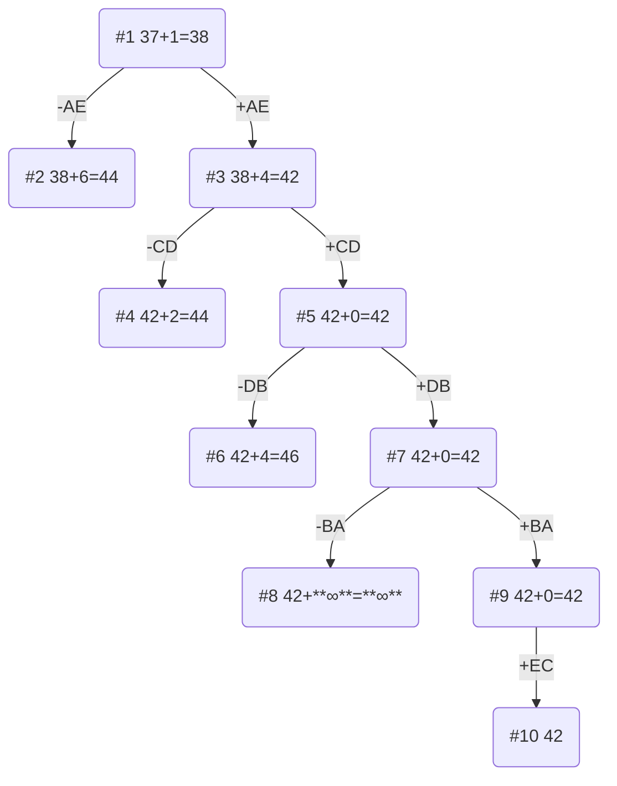

# Задание №12
# Задача коммивояжера (Traveling salesman problem). Метод ветвей и границ.
# Вариант 8

## Постановка задачи
Имеется N городов, связанных дорогами. Расстояния между городами известны. Коммивояжер (бродячий торговец) должен выйти из первого города, посетить по одному разу в некотором порядке города 2,3..n и вернуться в первый город. В каком порядке следует посещать города, чтобы замкнутый путь коммивояжера имел кратчайшее расстояние?

Матрица расстояний:

|       | **A** | **B** | **C** | **D** | **E** |
|-------|:-----:|:-----:|:-----:|:-----:|:-----:|
| **A** | **∞** |  15   |  14   |  11   |   7   |
| **B** |  13   | **∞** |  12   |  11   |  13   |
| **C** |   9   |   8   | **∞** |   5   |   8   |
| **D** |   9   |   7   |   6   | **∞** |  14   |
| **E** |   8   |  14   |  10   |  12   | **∞** |

## Решение
### 1. Проведем редукцию строк матрицы

|       | **A** | **B** | **C** | **D** | **E** | Min |
|-------|:-----:|:-----:|:-----:|:-----:|:-----:|:---:|
| **A** | **∞** |  15   |  14   |  11   |   7   | 7   |
| **B** |  13   | **∞** |  12   |  11   |  13   | 11  |
| **C** |   9   |   8   | **∞** |   5   |   8   | 5   |
| **D** |   9   |   7   |   6   | **∞** |  14   | 6   |
| **E** |   8   |  14   |  10   |  12   | **∞** | 8   |
| Sum   |       |       |       |       |       | 37  |

Сумма констант редукции по строкам 37.

Марица после редукции строк:

|       | **A** | **B** | **C** | **D** | **E** |
|-------|:-----:|:-----:|:-----:|:-----:|:-----:|
| **A** | **∞** |  8    |  7    |  4    |  0    |
| **B** |  2    | **∞** |  1    |  0    |  2    |
| **C** |  4    |  3    | **∞** |  0    |  3    |
| **D** |  3    |  1    |  0    | **∞** |  8    |
| **E** |  0    |  6    |  2    |  4    | **∞** |

### 2. Проведем редукцию столбцов матрицы

|       | **A** | **B** | **C** | **D** | **E** | Sum |
|-------|:-----:|:-----:|:-----:|:-----:|:-----:|:---:|
| **A** | **∞** |  8    |  7    |  4    |  0    |     |
| **B** |  2    | **∞** |  1    |  0    |  2    |     |
| **C** |  4    |  3    | **∞** |  0    |  3    |     |
| **D** |  3    |  1    |  0    | **∞** |  8    |     |
| **E** |  0    |  6    |  2    |  4    | **∞** |     |
| Min   |  0    |  1    |  0    |  0    |   0   |  1  |

Сумма констант редукции по столбцам 1.

Марица после редукции столбцов:

|       | **A** | **B** | **C** | **D** | **E** | 
|-------|:-----:|:-----:|:-----:|:-----:|:-----:|
| **A** | **∞** |  7    |  7    |  4    |  0    |     
| **B** |  2    | **∞** |  1    |  0    |  2    |     
| **C** |  4    |  2    | **∞** |  0    |  3    |    
| **D** |  3    |  0    |  0    | **∞** |  8    |     
| **E** |  0    |  5    |  2    |  4    | **∞** |     

### 3. Оценка длины маршрута

Оценка длины маршрута снизу соответствует сумме констант редукции по строкам и по столбцам: 37 + 1 = 38.

### 4. Найдем решение задачи с использованием метода ветвей и границ

Чтобы определить ребро, по которому будет произведено ветвление из корневого узла рассчитаем штрафы для ребер с нулевой оценкой:

|        | **Штраф** |
|:-------|:---------:|
| **AE** |     6     |
| **BD** |     1     |
| **CD** |     2     |
| **DB** |     2     |
| **DC** |     1     |
| **EA** |     4     |

Максимальный штраф 6, выберем ребро AE, как одно из ребер с максимальным штрафом.

#### Узел №2
Узел №2 с исключением ребра AE имеет оценку 38 + 6 (штраф) = 44.

#### Узел №3
Для получения оценки узла №3 необходимо рассчитать сумму констант редукции для матрицы с учетом включения ребра AE, для этого в матрице:
- удалим строку A,
- удалим столбец E,
- Заменим на бесконечность значение EA.

Проведем редукцию матрицы по строкам:

|       | **A** | **B** | **C** | **D** | Min |
|-------|:-----:|:-----:|:-----:|:-----:|-----|  
| **B** |  2    | **∞** |  1    |  0    |  0  |     
| **C** |  4    |  2    | **∞** |  0    |  0  | 
| **D** |  3    |  0    |  0    | **∞** |  0  | 
| **E** | **∞** |  5    |  2    |  4    |  2  |
| Sum   |       |       |       |       |  2  |

Матрица после редукции:

|       | **A** | **B** | **C** | **D** |  
|-------|:-----:|:-----:|:-----:|:-----:|  
| **B** |  2    | **∞** |  1    |  0    |       
| **C** |  4    |  2    | **∞** |  0    | 
| **D** |  3    |  0    |  0    | **∞** |  
| **E** | **∞** |  3    |  0    |  2    | 

Проведем редукцию матрицы по столбцам:

|       | **A** | **B** | **C** | **D** | Sum |
|-------|:-----:|:-----:|:-----:|:-----:|-----|  
| **B** |  2    | **∞** |  1    |  0    |     |     
| **C** |  4    |  2    | **∞** |  0    |     | 
| **D** |  3    |  0    |  0    | **∞** |     | 
| **E** | **∞** |  5    |  2    |  4    |     |
| Min   |  2    |  0    |  0    |  0    |  2  |

Матрица после редукции:

|       | **A** | **B** | **C** | **D** | 
|-------|:-----:|:-----:|:-----:|:-----:|  
| **B** |  0    | **∞** |  1    |  0    |      
| **C** |  2    |  2    | **∞** |  0    |  
| **D** |  1    |  0    |  0    | **∞** | 
| **E** | **∞** |  3    |  0    |  2    | 

Сумма констант редукции 4.

Оценка узла №3 = 38 + 4 (редукция) = 42.

Продолжим поиск из узла №3.

#### Выбор ребра
Чтобы определить ребро, по которому будет произведено ветвление из узла №3 рассчитаем штрафы для ребер с нулевой оценкой:

|        | **Штраф** |
|:-------|:---------:|
| **BA** |     1     |
| **BD** |     0     |
| **CD** |     2     |
| **DB** |     2     |
| **DC** |     0     |
| **EC** |     2     |

Максимальный штраф 2, выберем ребро CD, как ребро с максимальным штрафом.

#### Узел №4
Узел №4 с исключением ребра CD имеет оценку 42 + 2 (штраф) = 44.

#### Узел №5
Для получения оценки узла №5 необходимо рассчитать сумму констант редукции для матрицы с учетом включения ребра CD, для этого в матрице:
- удалим строку C,
- удалим столбец D,
- Заменим на бесконечность значение DC.

|       | **A** | **B** | **C** |
|-------|:-----:|:-----:|:-----:| 
| **B** |  0    | **∞** |  1    |   
| **D** |  1    |  0    | **∞** | 
| **E** | **∞** |  3    |  0    | 

Редукция матрицы не требуется, так как в каждом столбце и каждой строке есть хотя бы один ноль.

Сумма констант редукции 0.

Оценка узла №5 = 42 + 0 (редукция) = 42.

Продолжим поиск из узла №5.

#### Выбор ребра
Чтобы определить ребро, по которому будет произведено ветвление из узла №5 рассчитаем штрафы для ребер с нулевой оценкой:

|        | **Штраф** |
|:-------|:---------:|
| **BA** |     2     |
| **DB** |     4     |
| **EC** |     4     |

Максимальный штраф 4, выберем ребро DB, как ребро с максимальным штрафом.

#### Узел №6
Узел №6 с исключением ребра DB имеет оценку 42 + 4 (штраф) = 46.

#### Узел №7
Для получения оценки узла №7 необходимо рассчитать сумму констант редукции для матрицы с учетом включения ребра DB, для этого в матрице:
- удалим строку D,
- удалим столбец B,
- Заменим на бесконечность значение BC, чтобы цикл не замкнулся, не обойдя все вершины. 

|       | **A** | **C** |
|-------|:-----:|:-----:| 
| **B** |  0    | **∞** |   
| **E** | **∞** |  0    | 

Редукция матрицы не требуется, так как в каждом столбце и каждой строке есть хотя бы один ноль.

Сумма констант редукции 0.

Оценка узла №7 = 42 + 0 (редукция) = 42.

Продолжим поиск из узла №7.

#### Выбор ребра
Чтобы определить ребро, по которому будет произведено ветвление из узла №5 рассчитаем штрафы для ребер с нулевой оценкой:

|        | **Штраф** |
|:-------|:---------:|
| **BA** |   **∞**   |
| **EC** |   **∞**   |

Максимальный штраф **∞**, выберем ребро BA, как ребро с максимальным штрафом.

#### Узел №8
Узел №8 с исключением ребра BA имеет оценку 42 + **∞** (штраф) = **∞**.

#### Узел №9
Для получения оценки узла №9 необходимо рассчитать сумму констант редукции для матрицы с учетом включения ребра BA, для этого в матрице:
- удалим строку B,
- удалим столбец A.

|       | **C** |
|-------|:-----:| 
| **E** |  0    | 

Редукция матрицы не требуется, так как в каждом столбце и каждой строке есть хотя бы один ноль.

Сумма констант редукции 0.

Оценка узла №9 = 42 + 0 (редукция) = 42.

Продолжим поиск из узла №9.

#### Выбор ребра
Альтернатив у ребра EC нет.

#### Узел №10
Ребро EC включается в маршрут, длина которого составляет 42.

### Ответ
- Кратчайший маршрут AECDBA.
- Длина маршрута 42.

