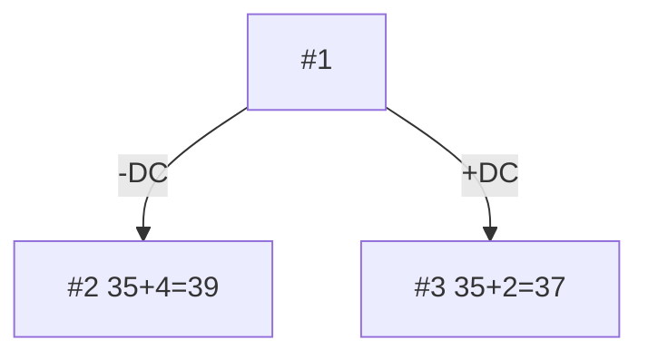
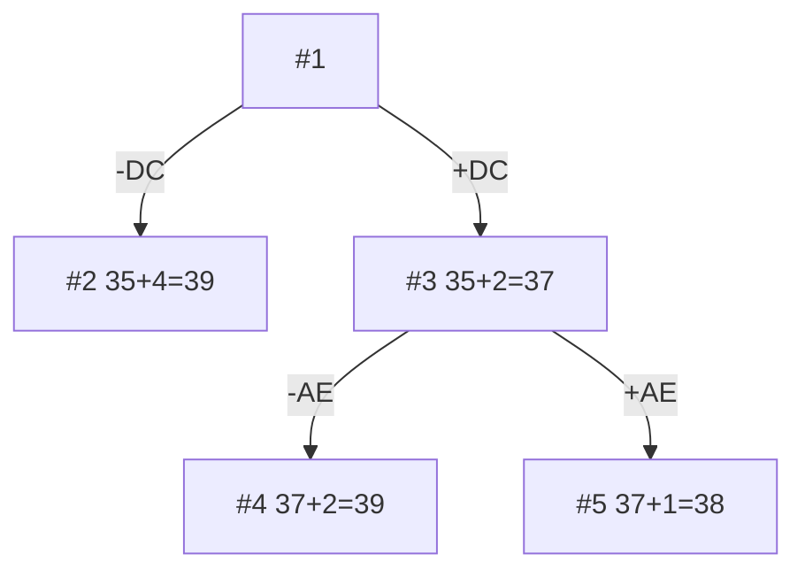
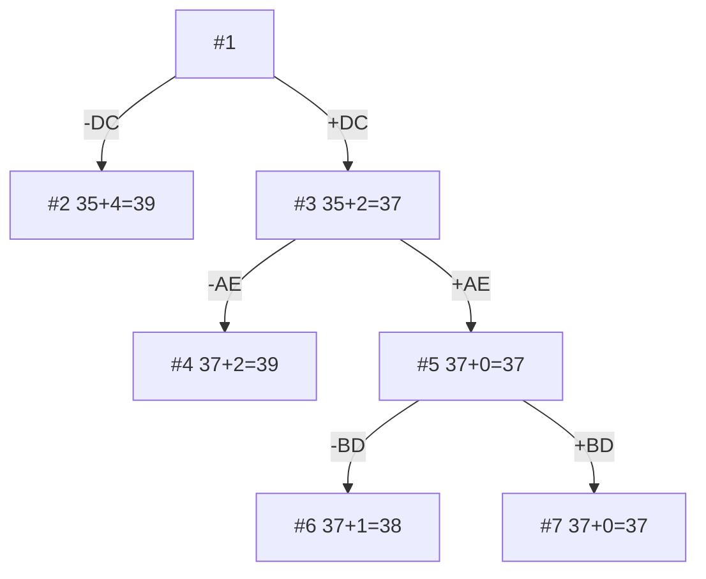
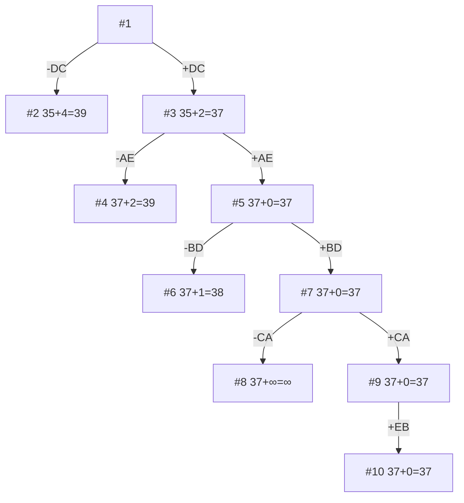

## Задача коммивояжера. Метод ветвей и границ.
### Вариант 4

Матрица расстояний:

|       | A | B | C | D | E |
|-------|:-----:|:-----:|:-----:|:-----:|:-----:|
| A | ∞ |  11   |  12   |  11   |   9   |
| B |   8   | ∞ |   5   |   9   |   8   |
| C |   9   |   7   | ∞ |   9   |  13   |
| D |  12   |  10   |   5   | ∞ |   9   |
| E |   8   |   6   |   5   |  10   | ∞ |
### 1. Проведем редукцию строк матрицы
|       | A | B | C | D | E | min |
| ----- | :---: | :---: | :---: | :---: | :---: | --- |
| A | ∞ |  11   |  12   |  11   |   9   | 9   |
| B |   8   | ∞ |   5   |   9   |   8   | 5   |
| C |   9   |   7   | ∞ |   9   |  13   | 7   |
| D |  12   |  10   |   5   | ∞ |   9   | 5   |
| E |   8   |   6   |   5   |  10   | ∞ | 5   |
| sum   |       |       |       |       |       | 31  |
Сумма констант редукции по строкам 17

Марица после редукции строк:

|       | A | B | C | D | E |
| ----- | :---: | :---: | :---: | :---: | :---: |
| A | ∞ |   2   |   3   |   2   |   0   |
| B |   3   | ∞ |   0   |   4   |   3   |
| C |   2   |   0   | ∞ |   2   |   6   |
| D |   7   |   5   |   0   | ∞ |   4   |
| E |   3   |   1   |   0   |   5   | ∞ |
### 2. Проведем редукцию столбцов матрицы
|       | A | B | C | D | E | sum |
| ----- | :---: | :---: | :---: | :---: | :---: | --- |
| A | ∞ |   2   |   3   |   2   |   0   |     |
| B |   3   | ∞ |   0   |   4   |   3   |     |
| C |   2   |   0   | ∞ |   2   |   6   |     |
| D |   7   |   5   |   0   | ∞ |   4   |     |
| E |   3   |   1   |   0   |   5   | ∞ |     |
| min   |   2   |       |       |   2   |       | 4   |
Сумма констант редукции по столбцам 4

Марица после редукции столбцов:

|       | A | B | C | D | E |
| ----- | :---: | :---: | :---: | :---: | :---: |
| A | ∞ |   2   |   3   |   0   |   0   |
| B |   1   | ∞ |   0   |   2   |   3   |
| C |   0   |   0   | ∞ |   0   |   6   |
| D |   5   |   5   |   0   | ∞ |   4   |
| E |   1   |   1   |   0   |   3   | ∞ |
### 3. Оценка длины маршрута

Оценка длины маршрута снизу соответствует сумме констант редукции по строкам и по столбцам

31 + 4 = 35
### 4. Найдем решение задачи с использованием метода ветвей и границ

Чтобы определить ребро, по которому будет произведено ветвление из корневого узла рассчитаем штрафы для ребер с нулевой оценкой:

|     | Штраф     |
| :--------: | --------- |
|   AD   | 0 + 0 = 0 |
|   AE   | 0 + 3 = 3 |
|   BC   | 1 + 0 = 1 |
|   CA   | 0 + 1 = 1 |
|   CB   | 0 + 1 = 1 |
|   CD   | 0 + 0 = 0 |
|   DC   | 4 + 0 = 4 |
|   EC   | 1 + 0 = 1 |
Максимальный штраф 4, выберем ребро DC

#### Узел №2
Узел №2 с исключением ребра DC имеет оценку 35 + 4 (штраф) = 39

#### Узел №3
Для получения оценки узла 3 необходимо рассчитать сумму констант редукции для матрицы с учетом включения ребра DC, для этого в матрице:

- удалим строку D,
- удалим столбец C,
- Заменим на бесконечность значение CD.

|         | A | B | D | E | min |
| ------- | :---: | :---: | :---: | :---: | --- |
| A   | ∞ |   2   |   0   |   0   |     |
| B   |   1   | ∞ |   2   |   3   | 1   |
| C   |   0   |   0   | ∞ |   6   |     |
| E   |   1   |   1   |   3   | ∞ | 1   |
| sum |       |       |       |       | 2   |
Матрица после редукции

|       | A | B | D | E |
| ----- | :---: | :---: | :---: | :---: |
| A | ∞ |   2   |   0   |   0   |
| B |   0   | ∞ |   1   |   2   |
| C |   0   |   0   | ∞ |   6   |
| E |   0   |   0   |   2   | ∞ |
Сумма констант редукции 2

Оценка узла 3 = 35 + 2 (редукция) = 37

Продолжим поиск из узла 3

#### Выбор ребра
Чтобы определить ребро, по которому будет произведено ветвление из узла 3 рассчитаем штрафы для ребер с нулевой оценкой:

|     | Штраф     |
| :--------: | --------- |
|   AD   | 1 + 0 = 1 |
|   AE   | 0 + 2 = 2 |
|   BA   | 0 + 1 = 1 |
|   CA   | 0 + 0 = 0 |
|   CB   | 0 + 0 = 0 |
|   EA   | 0 + 0 = 0 |
|   EB   | 0 + 0 = 0 |
Максимальный штраф 2, выберем ребро AE, как ребро с максимальным штрафом.
#### Узел №4
Узел №4 с исключением ребра AE имеет оценку 37 + 2 (штраф) = 39

#### Узел №5
Для получения оценки узла 5 необходимо рассчитать сумму констант редукции для матрицы с учетом включения ребра AE, для этого в матрице:

- удалим строку A,
- удалим столбец E,
- заменим на бесконечность значение EA.

|       | A | B | D | sum |
| ----- | :---: | :---: | :---: | --- |
| B |   0   | ∞ |   1   |     |
| C |   0   |   0   | ∞ |     |
| E | ∞ |   0   |   2   |     |
| min   |       |       |   1   | 1   |
Матрица после редукции

|       | A | B | D |
| ----- | :---: | :---: | :---: |
| B |   0   | ∞ |   0   |
| C |   0   |   0   | ∞ |
| E | ∞ |   0   |   1   |
Сумма констант редукции 1

Оценка узла 5 = 37 + 1 = 38

Продолжим поиск из узла 5

#### Выбор ребра

Чтобы определить ребро, по которому будет произведено ветвление из узла 3 рассчитаем штрафы для ребер с нулевой оценкой:

|     | Штраф     |
| :--------: | --------- |
|   BA   | 0 + 0 = 0 |
|   BD   | 0 + 1 = 1 |
|   CA   | 0 + 0 = 0 |
|   CB   | 0 + 0 = 0 |
|   EB   | 1 + 0 = 1 |
Максимальный штраф 1, выберем ребро BD, как одно из ребер с максимальным штрафом.
#### Узел №6
Узел №6 с исключением ребра BD имеет оценку 37 + 1 (штраф) = 38

#### Узел №7
Для получения оценки узла 7 необходимо рассчитать сумму констант редукции для матрицы с учетом включения ребра BD, для этого в матрице:

- удалим строку B,
- удалим столбец D,
- заменим на бесконечность значение DB.
- Ребро BD исходит из ранее задействованной вершины D, то есть у нас есть часть маршрута CBD, чтобы избежать преждевременного замыкания цикла, ребро CB (при наличии) также следует заменить на бесконечность.

|       | A | B |
| ----- | :---: | :---: |
| C |   0   | ∞ |
| E | ∞ |   0   |
Сумма констант редукции 0, следовательно, оценка узла 7 = 37 + 0 = 37

Продолжим поиск из узла 7

#### Выбор ребра
Чтобы определить ребро, по которому будет произведено ветвление из узла 7 рассчитаем штрафы для ребер с нулевой оценкой:

|     | Штраф |
| :--------: | ----- |
|   CA   | ∞ |
|   EB   | ∞ |
Максимальный штраф бесконечность, выберем ребро CA, как одно из ребер с максимальным штрафом.
#### Узел №8
Узел №8 с исключением ребра CA имеет оценку 37 + **∞** (штраф) = **∞**

#### Узел №9
Для получения оценки узла 9 необходимо рассчитать сумму констант редукции для матрицы с учетом включения ребра CA, для этого в матрице:

- удалим строку C,
- удалим столбец A,
- заменим на бесконечность значение AC.

|       | B |
| ----- | :---: |
| E |   0   |
Сумма констант редукции 0, следовательно, оценка узла 9 = 37 + 0 = 37

Продолжим поиск из узла 9

#### Выбор ребра
Альтернатив у ребра EB нет

#### Узел №14
Ребро EB включается в маршрут, длина которого составляет 37

### Ответ
- Кратчайший маршрут DCAEBD.
- Длина маршрута 37.
