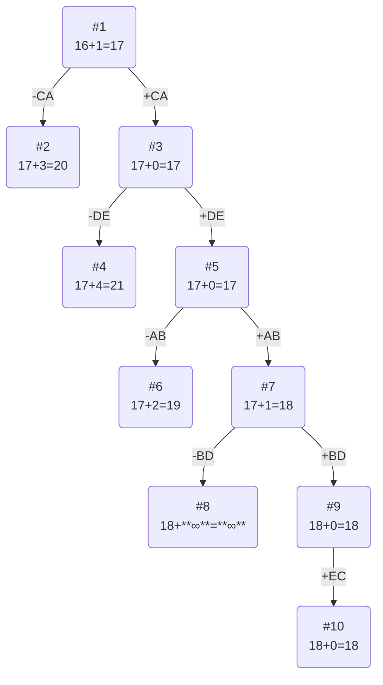

# Задача о коммивояжера. Метод ветвей и границ.

## Вариант 6:

### Постановка задачи
Имеется N городов, связанных дорогами. Расстояния между городами известны. Коммивояжер (бродячий торговец) должен выйти из первого города, посетить по одному разу в некотором порядке города 2,3..n и вернуться в первый город. В каком порядке следует посещать города, чтобы замкнутый путь коммивояжера имел кратчайшее расстояние?

Матрица расстояний:

|       | **A** | **B** | **C** | **D** | **E** |
|:------|:-----:|:-----:|:-----:|:-----:|:-----:|
| **A** | **∞** |   4   |   5   |   7   |   5   |
| **B** |   8   | **∞** |   5   |   6   |   6   |
| **C** |   3   |   5   | **∞** |   9   |   6   |
| **D** |   3   |   5   |   6   | **∞** |   2   |
| **E** |   6   |   2   |   3   |   8   | **∞** | 

### Математическая модель
Для моделирования задачи можно использовать теорию графов. Города можно перенумеровать и представить в виде вершин графа, а рёбра (*i*, *j*) между вершинами *i* и *j* будут соответствовать пути между этими городами. Каждому ребру (*i*, *j*) можно сопоставить расстояние между городами Сij ⩾ 0. Таким образом, задачу можно сформулировать так: 

Дан полный граф с n вершинами, длина ребра (i,j)= Сij. Найти гамильтонов цикл минимальной длины.

Гамильтоновым циклом называется маршрут, включающий ровно по одному разу каждую вершину графа.

## Решение
### 1. Проведем редукцию строк матрицы

|       | **A** | **B** | **C** | **D** | **E** | Min |
|:------|:-----:|:-----:|:-----:|:-----:|:-----:|:---:|
| **A** | **∞** |   4   |   5   |  7   |  5   |  4  |
| **B** |   8   | **∞** |   5   |  6   |   6   |  5  |
| **C** |   3   |   5   | **∞** |   9   |   6   |  3  |
| **D** |   3   |   5   |   6   | **∞** |   2   |  2  |
| **E** |   6   |   2   |   3   |  8   | **∞** |  2  |
| Sum   |       |       |       |       |       | 16 |

Сумма констант редукции по строкам 16

Марица после редукции строк:

|       | **A** | **B** | **C** | **D** | **E** |
|:------|:-----:|:-----:|:-----:|:-----:|:-----:|
| **A** | **∞** |   0   |   1   |   3   |   1   |
| **B** |   3   | **∞** |   0   |   1   |   1   |
| **C** |   0   |   2   | **∞** |   6   |   3   |
| **D** |   1   |   3   |   4   | **∞** |   0   |
| **E** |   4   |   0   |   1   |   6   | **∞** |

### 2. Проведем редукцию столбцов матрицы

|       | **A** | **B** | **C** | **D** | **E** | Sum |
|:------|:-----:|:-----:|:-----:|:-----:|:-----:|:---:|
| **A** | **∞** |   0   |   1   |   3   |   1   |     |
| **B** |   3   | **∞** |   0   |   1   |   1   |     |
| **C** |   0   |   2   | **∞** |   6   |   3   |     |
| **D** |   1   |   3   |   4   | **∞** |   0   |     |
| **E** |   4   |   0   |   1   |   6   | **∞** |     |
| Min   |   0   |   0   |   0   |   1   |   0   |  1  |

Сумма констант редукции по столбцам 1

Марица после редукции столбцов:

|       | **A** | **B** | **C** | **D** | **E** |
|:------|:-----:|:-----:|:-----:|:-----:|:-----:|
| **A** | **∞** |   0   |   1   |   2   |   1   |
| **B** |   3   | **∞** |   0   |   0   |   1   |
| **C** |   0   |   2   | **∞** |   5   |   3   |
| **D** |   1   |   3   |   4   | **∞** |   0   |
| **E** |   4   |   0   |   1   |   5   | **∞** |

### 3. Оценка длины маршрута

Оценка длины маршрута снизу соответствует сумме констант редукции по строкам и по столбцам

16 + 1 = 17

### 4. Найдем решение задачи с использованием метода ветвей и границ

Чтобы определить ребро, по которому будет произведено ветвление из корневого узла рассчитаем штрафы для ребер с нулевой оценкой:

|        | **Штраф** |
|:-------|:---------:|
| **AB** |     1     |
| **BC** |     1     |
| **BD** |     2     |
| **CA** |     3     |
| **DE** |     2     |
| **EB** |     1     |

Максимальный штраф 3, выберем ребро CA, как ребро с максимальным штрафом.

#### Узел №2
Узел №2 с исключением ребра CA имеет оценку 17 + 3 (штраф) = 20

#### Узел №3
Для получения оценки узла 3 необходимо рассчитать сумму констант редукции для матрицы с учетом включения ребра CA, для этого в матрице:
- удалим строку C,
- удалим столбец A,
- Заменим на бесконечность значение AC.

|       | **B** | **C** | **D** | **E** |
|:------|:-----:|:-----:|:-----:|:-----:|
| **A** |   0   | **∞** |   2   |   1   |
| **B** | **∞** |   0   |   0   |   1   |
| **D** |   3   |   4   | **∞** |   0   |
| **E** |   0   |   1   |   5   | **∞** |

Сумма констант редукции 0.

Оценка узла 3 = 17 + 0 (редукция) = 17

Продолжим поиск из узла 3

#### Выбор ребра
Чтобы определить ребро, по которому будет произведено ветвление из узла 3 рассчитаем штрафы для ребер с нулевой оценкой:

|        | **Штраф** |
|:-------|:---------:|
| **AB** |     1     |
| **BC** |     1     |
| **BD** |     2     |
| **DE** |     4     |
| **EA** |     1     |

Максимальный штраф 4, выберем ребро DE, как ребро с максимальным штрафом.

#### Узел №4
Узел №4 с исключением ребра DE имеет оценку 17 + 4 (штраф) = 21

#### Узел №5
Для получения оценки узла 5 необходимо рассчитать сумму констант редукции для матрицы с учетом включения ребра CD, для этого в матрице:
- удалим строку D,
- удалим столбец E,
- Заменим на бесконечность значение ED.

|       | **B** | **C** | **D** |
|:------|:-----:|:-----:|:-----:|
| **A** |   0   | **∞** |   2   |
| **B** | **∞** |   0   |   0   |
| **E** |   0   |   1   | **∞** |

Сумма констант редукции 0.

Оценка узла 5 = 17 + 0 (редукция) = 17

Продолжим поиск из узла 5

#### Выбор ребра
Чтобы определить ребро, по которому будет произведено ветвление из узла 5 рассчитаем штрафы для ребер с нулевой оценкой:

|        | **Штраф** |
|:-------|:---------:|
| **AB** |     2     |
| **BC** |     1     |
| **BD** |     2     |
| **EB** |     1     |

Максимальный штраф 2, выберем ребро AB, как одно из ребер с максимальным штрафом.

#### Узел №6
Узел №6 с исключением ребра AB имеет оценку 17 + 2 (штраф) = 19

#### Узел №7
Для получения оценки узла 7 необходимо рассчитать сумму констант редукции для матрицы с учетом включения ребра AB, для этого в матрице:
- удалим строку A,
- удалим столбец B,
- Необходимо обратить внимание на то, что были взяты рёбра DE, CA, AB. Образуется участок C-A-B, который не должен замкнуться, а следовательно необходимо заменить на бесконечность значение BC.

|       | **C** | **D** |  Sum  |
|:------|:-----:|:-----:|:-----:|
| **B** | **∞** |   0   |       |
| **E** |   1   | **∞** |       |
| Min   |   1   |   0   |   1   |

Матрица после редукции:

|       | **C** | **D** |
|:------|:-----:|:-----:|
| **B** | **∞** |   0   |
| **E** |   0   | **∞** |

Сумма констант редукции 1

Оценка узла 7 = 17 + 1 (редукция) = 18

Продолжим поиск из узла 7

#### Выбор ребра
Чтобы определить ребро, по которому будет произведено ветвление из узла 7 рассчитаем штрафы для ребер с нулевой оценкой:

|        | **Штраф** |
|:-------|:---------:|
| **BD** |   **∞**   |
| **EC** |   **∞**   |

Максимальный штраф бесконечность, выберем ребро BD, как одно из ребер с максимальным штрафом.

#### Узел №8
Узел №8 с исключением ребра BD имеет оценку 18 + **∞** (штраф) = **∞**

#### Узел №9
Для получения оценки узла 9 необходимо рассчитать сумму констант редукции для матрицы с учетом включения ребра BD, для этого в матрице:
- удалим строку B,
- удалим столбец D,
- Заменим на бесконечность значение ED.

|       | **C** |
|:------|:-----:|
| **E** |   0   |

Сумма констант редукции 0, следовательно, оценка узла 9 = 18 + 0 = 18

Продолжим поиск из узла 9

#### Выбор ребра
Альтернатив у ребра EC нет.

#### Узел №10
Ребро EС включается в маршрут, длина которого составляет 18

### Ответ
- Кратчайший маршрут CABDEC.
- Длина маршрута 18.
