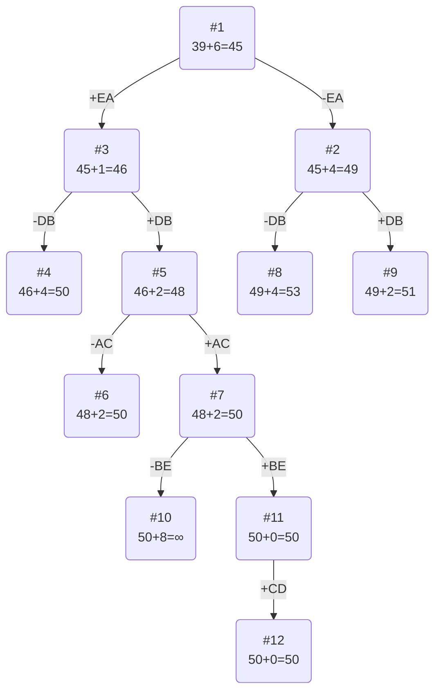

# Вариант 1

Матрица расстояний:

|   | A  | B  | C  | D  | E  |
|---|----|----|----|----|----|
| A | ∞  | 14 | 14 | 14 | 10 |
| B | 14 | ∞  | 13 | 12 | 7  |
| C | 7  | 12 | ∞  | 14 | 8  |
| D | 13 | 10 | 12 | ∞  | 13 |
| E | 5  | 9  | 11 | 13 | ∞  |

# 1. Проведем редукцию строк матрицы

|   | A  | B  | C  | D  | E  |Min |
|---|----|----|----|----|----|----|
| A | ∞  | 14 | 14 | 14 | 10 | 10 |
| B | 14 | ∞  | 13 | 12 | 7  | 7  |
| C | 7  | 12 | ∞  | 14 | 8  | 7  |
| D | 13 | 10 | 12 | ∞  | 13 | 10 |
| E | 5  | 9  | 11 | 13 | ∞  | 5  |
|Sum|    |    |    |    |    | 39 |

Сумма констант редукции по строкам 39

Марица после редукции строк:

|   | A  | B  | C  | D  | E  |
|---|----|----|----|----|----|
| A | ∞  | 4  | 4  | 4  | 0  |
| B | 7  | ∞  | 6  | 5  | 0  |
| C | 0  | 5  | ∞  | 7  | 1  |
| D | 3  | 0  | 2  | ∞  | 3  |
| E | 0  | 4  | 6  | 8  | ∞  |

# 2. Проведем редукцию столбцов матрицы

|   | A  | B  | C  | D  | E  |Sum |
|---|----|----|----|----|----|----|
| A | ∞  | 4  | 4  | 4  | 0  |    |
| B | 7  | ∞  | 6  | 5  | 0  |    |
| C | 0  | 5  | ∞  | 7  | 1  |    |
| D | 3  | 0  | 2  | ∞  | 3  |    |
| E | 0  | 4  | 6  | 8  | ∞  |    |
|Min| 0  | 0  | 2  | 4  | 0  | 6  |

Сумма констант редукции по столбцам 6

Марица после редукции столбцов:

|   | A  | B  | C  | D  | E  |
|---|----|----|----|----|----|
| A | ∞  | 4  | 2  | 0  | 0  |
| B | 7  | ∞  | 4  | 1  | 0  |
| C | 0  | 5  | ∞  | 3  | 1  |
| D | 3  | 0  | 0  | ∞  | 3  |
| E | 0  | 4  | 4  | 4  | ∞  |

# 3. Оценка длины маршрута

Оценка длины маршрута снизу соответствует сумме констант редукции по строкам и по столбцам

39 + 6 = 45

# 4. Найдем решение задачи с использованием метода ветвей и границ

Чтобы определить ребро, по которому будет произведено ветвление из корневого узла рассчитаем штрафы для ребер с нулевой оценкой:

|     |Штраф|
|-----|-----|
| AD  | 1   |
| AE  | 0   |
| BE  | 2   |
| CA  | 1   |
| DB  | 4   |
| DC  | 2   |
| EA  | 4   |

Максимальный штраф 4, выберем ребро EA, как оно из ребер с максимальным штрафом.

Узел 2

Узел №2 с исключением ребра EA имеет оценку 45 + 4 (штраф) = 49

Узел №3

Для получения оценки узла 3 удалим строку E и столбец A и заменим на бесконечность значение AE:

Матрица при редукции:

|   | B  | C  | D  | E  |
|---|----|----|----|----|
| A | 4  | 2  | 0  | ∞  |
| B | ∞  | 4  | 1  | 0  |
| C | 5  | ∞  | 3  | 1  |
| D | 0  | 0  | ∞  | 3  |

Марица после редукции:

|   | A  | C  | D  | E  |
|---|----|----|----|----|
| B | ∞  | 4  | 10 | 2  |
| C | 5  | ∞  | 0  | 5  |
| D | 5  | 0  | ∞  | 0  |
| E | 0  | 2  | 6  | ∞  |

Сумма констант редукции 1

Оценка узла 3 = 45 + 1 (редукция) = 46

Продолжим поиск из узла 3

Чтобы определить ребро, по которому будет произведено ветвление из узла 3 рассчитаем штрафы для ребер с нулевой оценкой:

|    | Штраф |
|----|-------|
| AD | 3     |
| BE | 1     |
| CE | 2     |
| DB | 4     |
| DC | 2     |

Максимальный штраф 4, выберем ребро DB, как ребро с максимальным штрафом.

Узел №4

Узел №4 с исключением ребра DB имеет оценку 46 + 4 (штраф) = 50

Узел №5

Для получения оценки узла 5 удалим строку D и столбец B и заменим BD на ∞:

Матрица при редукции:

|   | C  | D  | E  |
|---|----|----|----|
| A | 2  | 0  | ∞  |
| B | 4  | ∞  | 0  |
| C | ∞  | 2  | 0  |

Марица после редукции:

|   | C  | D  | E  |
|---|----|----|----|
| A | 0  | 0  | ∞  |
| B | 2  | ∞  | 0  |
| C | ∞  | 2  | 0  |

Сумма констант редукции 2

Оценка узла 5 = 46 + 2 (редукция) = 48

Продолжим поиск из узла 5

|    | Штраф |
|----|-------|
| AC | 2     |
| AD | 2     |
| BE | 0     |
| CE | 2     |

Максимальный штраф 2, выберем ребро AC, как одно из ребер с максимальным штрафом.

Узел №6

Узел №6 с исключением ребра AC имеет оценку 48 + 2 (штраф) = 50

Узел №7

Для получения оценки узла 7 удалим строку D и столбец B и заменим BD на ∞:

Матрица при редукции:

|   | D  | E  |
|---|----|----|
| B | ∞  | 0  |
| C | 2  | 0  |

Марица после редукции:

|   | D  | E  |
|---|----|----|
| B | ∞  | 0  |
| C | 0  | 0  |

Сумма констант редукции 2

Оценка узла 7 = 48 + 2 (редукция) = 50

Продолжим поиск из узла 2

Выбор ребра

Для узла 2 необходимо преобразовать матрицу:

Заменить значение AE на бесконечность,

Провести редукцию матрицы (сумма констант уже учтена в штрафе).

|   | A  | B  | C  | D  | E  |
|---|----|----|----|----|----|
| A | ∞  | 4  | 2  | 0  | ∞  |
| B | 7  | ∞  | 4  | 1  | 0  |
| C | 0  | 5  | ∞  | 3  | 1  |
| D | 3  | 0  | 0  | ∞  | 3  |
| E | 0  | 4  | 4  | 4  | ∞  |

Редукция не нужна!

|    | Штраф |
|----|-------|
| AD | 3     |
| BE | 2     |
| CA | 1     |
| DB | 4     |
| DC | 2     |
| EA | 4     |

Максимальный штраф 4, выберем ребро DB, как одно из ребер с максимальным штрафом.

Узел №8

Узел №8 с исключением ребра DB имеет оценку 49 + 4 (штраф) = 53

Узел №9

Для получения оценки узла 9 удалим строку D и столбец B и заменим на бесконечность значение BD:

Матрица при редукции:

|   | A  | C  | D  | E  |
|---|----|----|----|----|
| A | ∞  | 2  | 0  | ∞  |
| B | 7  | 4  | ∞  | 0  |
| C | 0  | ∞  | 3  | 1  |
| D | 0  | 4  | 4  | ∞  |

Марица после редукции:

|   | A  | C  | D  | E  |
|---|----|----|----|----|
| A | ∞  | 0  | 0  | ∞  |
| B | 7  | 2  | ∞  | 0  |
| C | 0  | ∞  | 1  | 1  |
| D | 0  | 2  | 2  | ∞  |

Сумма констант редукции 2

Оценка узла 9 = 49 + 2 (редукция) = 51

Продолжим поиск из узла 7

|    | Штраф |
|----|-------|
| BE | ∞     |
| CD | ∞     |
| CE | 0     |

Выберем ребро BE, как одно из ребер с максимальным штрафом.

Узел №10

Узел №10 с исключением ребра DB имеет оценку 50 + ∞ (штраф) = ∞

Узел №11

Для получения оценки узла 11 удалим строку B и столбец E и заменим EB на ∞:

Матрица при редукции:

|   | D  |
|---|----|
| C | 0  |

Редукция не нужна

Сумма констант 0

Оценка узла 11 = 50 + 0 = 50

Продолжим поиск из узла 11

Выбор: у CD нет альтернатив

Узел №12

Ребро CD включается в маршрут, длина которого составляет 50

# Ответ

Кратчайший маршрут ACDBEA.

Длина маршрута 50

Проверим по исходной матрице:

|Ребро|Длина|
|-----|-----|
| AC  | 14  |
| CD  | 14  |
| DB  | 10  |
| BE  | 7   |
| EA  | 5   |

14 + 14 + 10 + 7 + 5 = 50

задание решено верно!
