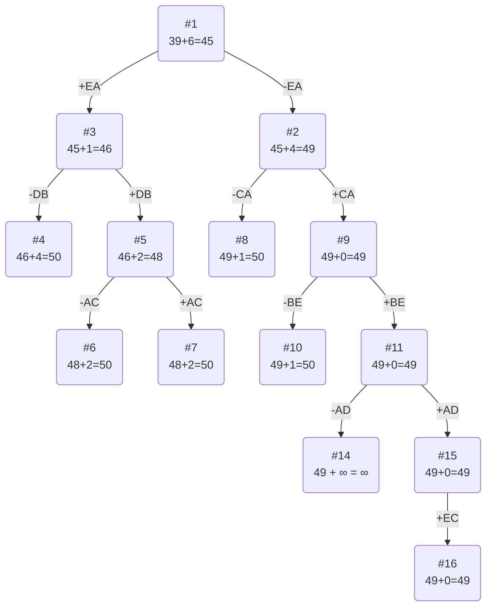

# Вариант 1

Матрица расстояний:

|   | A  | B  | C  | D  | E  |
|---|----|----|----|----|----|
| A | ∞  | 14 | 14 | 14 | 10 |
| B | 14 | ∞  | 13 | 12 | 7  |
| C | 7  | 12 | ∞  | 14 | 8  |
| D | 13 | 10 | 12 | ∞  | 13 |
| E | 5  | 9  | 11 | 13 | ∞  |

# 1. Проведем редукцию строк матрицы

|   | A  | B  | C  | D  | E  |Min |
|---|----|----|----|----|----|----|
| A | ∞  | 14 | 14 | 14 | 10 | 10 |
| B | 14 | ∞  | 13 | 12 | 7  | 7  |
| C | 7  | 12 | ∞  | 14 | 8  | 7  |
| D | 13 | 10 | 12 | ∞  | 13 | 10 |
| E | 5  | 9  | 11 | 13 | ∞  | 5  |
|Sum|    |    |    |    |    | 39 |

Сумма констант редукции по строкам 39

Марица после редукции строк:

|   | A  | B  | C  | D  | E  |
|---|----|----|----|----|----|
| A | ∞  | 4  | 4  | 4  | 0  |
| B | 7  | ∞  | 6  | 5  | 0  |
| C | 0  | 5  | ∞  | 7  | 1  |
| D | 3  | 0  | 2  | ∞  | 3  |
| E | 0  | 4  | 6  | 8  | ∞  |

# 2. Проведем редукцию столбцов матрицы

|   | A  | B  | C  | D  | E  |Sum |
|---|----|----|----|----|----|----|
| A | ∞  | 4  | 4  | 4  | 0  |    |
| B | 7  | ∞  | 6  | 5  | 0  |    |
| C | 0  | 5  | ∞  | 7  | 1  |    |
| D | 3  | 0  | 2  | ∞  | 3  |    |
| E | 0  | 4  | 6  | 8  | ∞  |    |
|Min| 0  | 0  | 2  | 4  | 0  | 6  |

Сумма констант редукции по столбцам 6

Марица после редукции столбцов:

|   | A  | B  | C  | D  | E  |
|---|----|----|----|----|----|
| A | ∞  | 4  | 2  | 0  | 0  |
| B | 7  | ∞  | 4  | 1  | 0  |
| C | 0  | 5  | ∞  | 3  | 1  |
| D | 3  | 0  | 0  | ∞  | 3  |
| E | 0  | 4  | 4  | 4  | ∞  |

# 3. Оценка длины маршрута

Оценка длины маршрута снизу соответствует сумме констант редукции по строкам и по столбцам

39 + 6 = 45

# 4. Найдем решение задачи с использованием метода ветвей и границ

Чтобы определить ребро, по которому будет произведено ветвление из корневого узла рассчитаем штрафы для ребер с нулевой оценкой:

|     |Штраф|
|-----|-----|
| AD  | 1   |
| AE  | 0   |
| BE  | 1   |
| CA  | 1   |
| DB  | 4   |
| DC  | 2   |
| EA  | 4   |

Максимальный штраф 4, выберем ребро EA, как оно из ребер с максимальным штрафом.

**Узел 2**

Узел №2 с исключением ребра EA имеет оценку 45 + 4 (штраф) = 49

**Узел №3**

Для получения оценки узла 3 удалим строку E и столбец A и заменим на бесконечность значение AE:

Матрица при редукции:

|   | B  | C  | D  | E  |
|---|----|----|----|----|
| A | 4  | 2  | 0  | ∞  |
| B | ∞  | 4  | 1  | 0  |
| C | 5  | ∞  | 3  | 1  |
| D | 0  | 0  | ∞  | 3  |

Марица после редукции:

|   | B  | C  | D  | E  |
|---|----|----|----|----|
| A | 4  | 2  | 0  | ∞  |
| B | ∞  | 4  | 1  | 0  |
| C | 4  | ∞  | 2  | 0  |
| D | 0  | 0  | ∞  | 3  |

Сумма констант редукции 1

Оценка узла 3 = 45 + 1 (редукция) = 46

Продолжим поиск из узла 3

Чтобы определить ребро, по которому будет произведено ветвление из узла 3 рассчитаем штрафы для ребер с нулевой оценкой:

|    | Штраф |
|----|-------|
| AD | 3     |
| BE | 1     |
| CE | 2     |
| DB | 4     |
| DC | 2     |

Максимальный штраф 4, выберем ребро DB, как ребро с максимальным штрафом.

**Узел №4**

Узел №4 с исключением ребра DB имеет оценку 46 + 4 (штраф) = 50

**Узел №5**

Для получения оценки узла 5 удалим строку D и столбец B и заменим BD на ∞:

Матрица при редукции:

|   | C  | D  | E  |
|---|----|----|----|
| A | 2  | 0  | ∞  |
| B | 4  | ∞  | 0  |
| C | ∞  | 2  | 0  |

Марица после редукции:

|   | C  | D  | E  |
|---|----|----|----|
| A | 0  | 0  | ∞  |
| B | 2  | ∞  | 0  |
| C | ∞  | 2  | 0  |

Сумма констант редукции 2

Оценка узла 5 = 46 + 2 (редукция) = 48

Продолжим поиск из узла 5

|    | Штраф |
|----|-------|
| AC | 2     |
| AD | 2     |
| BE | 0     |
| CE | 2     |

Максимальный штраф 2, выберем ребро AC, как одно из ребер с максимальным штрафом.

**Узел №6**

Узел №6 с исключением ребра AC имеет оценку 48 + 2 (штраф) = 50

**Узел №7**

Для получения оценки узла 7 удалим строку A и столбец C и заменим CA на ∞:

Матрица при редукции:

|   | D  | E  |
|---|----|----|
| B | ∞  | 0  |
| C | 2  | 0  |

Марица после редукции:

|   | D  | E  |
|---|----|----|
| B | ∞  | 0  |
| C | 0  | 0  |

Сумма констант редукции 2

Оценка узла 7 = 48 + 2 (редукция) = 50

Продолжим поиск из узла 2

Выбор ребра

Для узла 2 необходимо преобразовать матрицу:

Заменить значение EA на бесконечность,

Провести редукцию матрицы (сумма констант уже учтена в штрафе).

|   | A  | B  | C  | D  | E  |
|---|----|----|----|----|----|
| A | ∞  | 4  | 2  | 0  | 0  |
| B | 7  | ∞  | 4  | 1  | 0  |
| C | 0  | 5  | ∞  | 3  | 1  |
| D | 3  | 0  | 0  | ∞  | 3  |
| E | ∞  | 4  | 4  | 4  | ∞  |

После редукции:

|   | A  | B  | C  | D  | E  |
|---|----|----|----|----|----|
| A | ∞  | 4  | 2  | 0  | 0  |
| B | 7  | ∞  | 4  | 1  | 0  |
| C | 0  | 5  | ∞  | 3  | 1  |
| D | 3  | 0  | 0  | ∞  | 3  |
| E | ∞  | 0  | 0  | 0  | ∞  |

|    | Штраф |
|----|-------|
| AD | 2     |
| AE | 0     |
| BE | 1     |
| CA | 4     |
| DB | 0     |
| DC | 0     |
| EB | 0     |
| EC | 0     |
| ED | 0     |

Максимальный штраф 4, выберем ребро CA, как одно из ребер с максимальным штрафом.

Узел №8

Узел №8 с исключением ребра CA имеет оценку 49 + 4 (штраф) = 53

Узел №9

Для получения оценки узла 9 удалим строку C и столбец A и заменим на бесконечность значение AC:

Матрица при редукции:

|   | B  | C  | D  | E  |
|---|----|----|----|----|
| A | 4  | ∞  | 0  | 0  |
| B | ∞  | 4  | 1  | 0  |
| D | 0  | 0  | ∞  | 3  |
| E | 0  | 0  | 0  | ∞  |

Редукция не нужна!

Сумма констант редукции 0

Оценка узла 9 = 49 + 0 (редукция) = 49

Продолжим поиск из узла 9

|    | Штраф |
|----|-------|
| AD | 0     |
| AE | 0     |
| BE | 1     |
| DB | 0     |
| DC | 0     |
| EB | 0     |
| EC | 0     |
| ED | 0     |

Выберем ребро BE, как одно из ребер с максимальным штрафом.

Узел №10

Узел №10 с исключением ребра BE имеет оценку 49 + 1 = 50

Узел №11

Для получения оценки узла 11 удалим строку B и столбец E и заменим EB на ∞:

Матрица при редукции:

|   | B  |C  | D |
|---|----|---|---|
| A | 4  | ∞ | 0 |
| D | 0  | 0 | ∞ |
| E | ∞  | 0 | 0 |

Редукция не нужна

Сумма констант 0

Оценка узла 11 = 49 + 0 = 49

Продолжим поиск из узла 11
--------------------------

|    | Штраф |
|----|-------|
| AD | 4     |
| DB | 4     |
| DC | 0     |
| EC | 0     |
| ED | 0     |

Выбор: DB (так как штраф максимальный 4)

**Узел №12**

Ребро DB не включается в маршрут, оценка вершины 50 + 4 = 54

**Узел №13**

Удалим строку D и столбец B, BD на бесконечность заменим

|   | C  |D  | 
|---|----|---|
| A | ∞  | 0 |
| E | 0  | 0 |

Редукция не нужна

Оценка: 49 + 0 = 49

Продолжим из узла 13

Выбор ребра:
|    | Штраф |
|----|-------|
| AD | ∞     |
| EC | ∞     |
| ED | 0     |

Берём AD как ребро с максимальным штрафом (∞)

**Узел №14**

Не включаем AD, оценка 49 + ∞ = ∞

**Узел №15**

Удаляем строку A и столбец D, меняем DA на ∞

|   | C  | 
|---|----|
| E | 0  |

Редукция не нужна

У EC нет альтернатив:

**Узел №16**
У EC штраф 0, оценка узла 49 + 0 = 49

# Ответ

Кратчайший маршрут ADBECA.

Длина маршрута 49

Проверим по исходной матрице:

|Ребро|Длина|
|-----|-----|
| CA  | 7   |
| BE  | 7   |
| DB  | 10  |
| AD  | 14  |
| EC  | 11  |

7 + 7 + 10 + 14 + 14 + 11 = 49

Задание решено верно!
