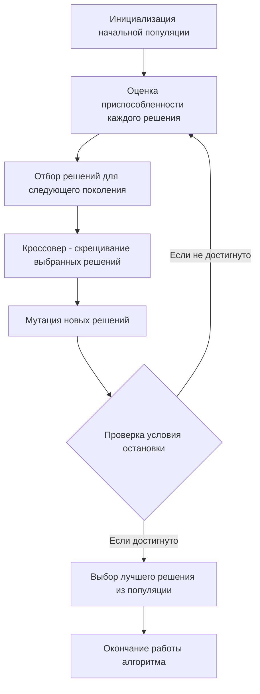

# Задание №13
# Задача о рюкзаке (Knapsack problem). Генетический алгоритм.

**Для выполнения задания рекомендуется установить [Плагин отображения диаграмм Markdown Preview Mermaid Support](https://marketplace.visualstudio.com/items?itemName=bierner.markdown-mermaid)**

## Задание
Для каждого варианта представлены условия задачи, в соответствии с которыми необходимо: 
1. Решить задачу о рюкзаке с применением генетического алгоритма.
2. Оформить решение задачи по шагам с подробными комментариями, таблицами и диаграммами.
3. В ответе указать:
   - максимально возможную стоимость предметов в рюкзаке,
   - набор предметов, обеспечивающих максимальную стоимость,
   - общий вес предметов в рюкзаке,
   - свободное место в рюкзаке.

**Генетический алгоритм не гарантирует получение точного решения, при выполнении задания важно продемонстрировать понимание работы алгоритма, а не получение точного решения.**

Условия для каждого варианта расположены в файле task-13/task.md в ветке main репозитория manual-tasks. 

Решение задачи нужно оформить в формате Markdown в отдельном файле с названием <название_команды>.md, который добавить в каталог task-13 данного репозитория.

## Информация по Markdown разметке:
[Система верстки LaTeX, которую можно использовать для математических формул](https://grammarware.net/text/syutkin/MathInLaTeX.pdf)

[Рисуем диаграммы Mermaid.js в README-файлах GitHub](https://habr.com/ru/articles/652867/)

## Для выполнения задания необходимо:
1. Обновить ветку main в локальном репозитории (git pull).
2. От ветки main создать ветвь с названием <название_команды>-task-13.
3. В созданной ветке в каталог task-13 добавить файл с решением задачи с названием <название_команды>.md.
4. Зафиксировать изменения на ветке (git commit).
5. Отравить ветку с изменениями в репозиторий на Github (git push).
6. Создать на Github запрос на слияние (pull request), указав в качестве base-ветки main, в качестве compare-ветки <название_команды>-task-13.

## Постановка задачи
Задача о рюкзаке (англ. Knapsack problem) — дано N предметов, ni предмет имеет массу wi > 0 и стоимость pi > 0. Необходимо выбрать из этих предметов такой набор, чтобы суммарная масса не превосходила заданной величины W (вместимость рюкзака), а суммарная стоимость была максимальна. 

### Оценка сложности задачи о рюкзаке
Задача о рюкзаке является NP-полной задачей. Это означает, что не существует известного алгоритма, который мог бы решить эту задачу за полиномиальное время.

Полный перебор для решения задачи о рюкзаке имеет экспоненциальную сложность. Это связано с тем, что для каждого предмета есть два варианта - включить его в рюкзак или нет. Таким образом, для n предметов количество возможных комбинаций будет 2n, что делает полный перебор непрактичным для больших значений n.

Метод ветвей и границ может значительно сократить количество рассматриваемых решений по сравнению с полным перебором, он все равно может быть довольно затратным в плане времени и памяти, особенно для больших задач. В худшем случае метод ветвей и границ может привести к полному перебору всех возможных комбинаций, что дает экспоненциальную сложность O(2n), где n - количество предметов. Это происходит, когда невозможно отсечь ни одну ветвь и приходится исследовать все возможные подмножества предметов.

# Генетический алгоритм
Генетический алгоритм — это метод оптимизации и поиска решений, который использует принципы генетики и естественного отбора. Он может быть использован для нахождения приближенного решения задач, для которых нет эффективного алгоритма, в том числе для задачи о рюкзаке и задачи коммивояжера.

Основные шаги генетического алгоритма:
- Инициализация: Создается начальная популяция случайных решений (особей).
- Оценка: Каждое решение оценивается с помощью функции приспособленности (фитнес функция), которая измеряет качество решения.
- Отбор: На основе оценки приспособленности выбираются решения, которые будут использоваться для создания нового поколения. Чем выше приспособленность, тем больше шансов у решения быть выбранным.
- Кроссовер (скрещивание): Выбранные решения комбинируются для создания новых решений. Это может происходить различными способами, но обычно включает в себя обмен частями двух решений.
- Мутация: С небольшой вероятностью некоторые части новых решений случайным образом изменяются для добавления вариативности.
- Новое поколение: Новые решения заменяют старые, и процесс повторяется с шага оценки.

Этот процесс продолжается до тех пор, пока не будет достигнут критерий остановки, например, максимальное количество поколений или достижение достаточно хорошего решения.

