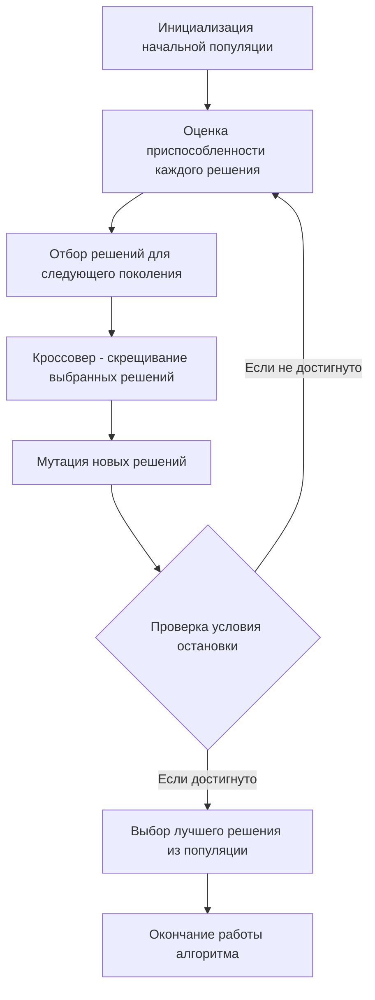

# Задание №14
# Задача о коммивояжере (Генетический алгоритм) / Транспортная задача (Максимальный поток минимальной стоимости).

**Для выполнения задания рекомендуется установить [Плагин отображения диаграмм Markdown Preview Mermaid Support](https://marketplace.visualstudio.com/items?itemName=bierner.markdown-mermaid)**

## Задание
Для каждого варианта представлены условия одной из задач, в соответствии с которыми необходимо: 
1. Решить поставленную задачу.
2. Оформить решение задачи по шагам с подробными комментариями, таблицами и диаграммами.

Условия для каждого варианта расположены в файле task-14/task.md в ветке main репозитория manual-tasks. 

Решение задачи нужно оформить в формате Markdown в отдельном файле с названием <название_команды>.md, который добавить в каталог task-14 данного репозитория.

## Информация по Markdown разметке:
[Система верстки LaTeX, которую можно использовать для математических формул](https://grammarware.net/text/syutkin/MathInLaTeX.pdf)

[Рисуем диаграммы Mermaid.js в README-файлах GitHub](https://habr.com/ru/articles/652867/)

## Для выполнения задания необходимо:
1. Обновить ветку main в локальном репозитории (git pull).
2. От ветки main создать ветвь с названием <название_команды>-task-14.
3. В созданной ветке в каталог task-14 добавить файл с решением задачи с названием <название_команды>.md.
4. Зафиксировать изменения на ветке (git commit).
5. Отравить ветку с изменениями в репозиторий на Github (git push).
6. Создать на Github запрос на слияние (pull request), указав в качестве base-ветки main, в качестве compare-ветки <название_команды>-task-14.

## Постановка задачи
Задача о рюкзаке (англ. Knapsack problem) — дано N предметов, ni предмет имеет массу wi > 0 и стоимость pi > 0. Необходимо выбрать из этих предметов такой набор, чтобы суммарная масса не превосходила заданной величины W (вместимость рюкзака), а суммарная стоимость была максимальна. 

### Оценка сложности задачи о рюкзаке
Задача о рюкзаке является NP-полной задачей. Это означает, что не существует известного алгоритма, который мог бы решить эту задачу за полиномиальное время.

Полный перебор для решения задачи о рюкзаке имеет экспоненциальную сложность. Это связано с тем, что для каждого предмета есть два варианта - включить его в рюкзак или нет. Таким образом, для n предметов количество возможных комбинаций будет 2n, что делает полный перебор непрактичным для больших значений n.

Метод ветвей и границ может значительно сократить количество рассматриваемых решений по сравнению с полным перебором, он все равно может быть довольно затратным в плане времени и памяти, особенно для больших задач. В худшем случае метод ветвей и границ может привести к полному перебору всех возможных комбинаций, что дает экспоненциальную сложность O(2n), где n - количество предметов. Это происходит, когда невозможно отсечь ни одну ветвь и приходится исследовать все возможные подмножества предметов.

# Генетический алгоритм
Генетический алгоритм — это метод оптимизации и поиска решений, который использует принципы генетики и естественного отбора. Он может быть использован для нахождения приближенного решения задач, для которых нет эффективного алгоритма, в том числе для задачи о рюкзаке и задачи коммивояжера.

Основные шаги генетического алгоритма:
- Инициализация: Создается начальная популяция случайных решений (особей).
- Оценка: Каждое решение оценивается с помощью функции приспособленности (фитнес функция), которая измеряет качество решения.
- Отбор: На основе оценки приспособленности выбираются решения, которые будут использоваться для создания нового поколения. Чем выше приспособленность, тем больше шансов у решения быть выбранным.
- Кроссовер (скрещивание): Выбранные решения комбинируются для создания новых решений. Это может происходить различными способами, но обычно включает в себя обмен частями двух решений.
- Мутация: С небольшой вероятностью некоторые части новых решений случайным образом изменяются для добавления вариативности.
- Новое поколение: Новые решения заменяют старые, и процесс повторяется с шага оценки.

Этот процесс продолжается до тех пор, пока не будет достигнут критерий остановки, например, максимальное количество поколений или достижение достаточно хорошего решения.

## Задача коммивояжера

### Постановка задачи
Есть N городов, связанных дорогами. Расстояния между городами известны. Коммивояжер (бродячий торговец) должен выйти из первого города, посетить по одному разу в некотором порядке города 2,3..n и вернуться в первый город. В каком порядке следует посещать города, чтобы замкнутый путь коммивояжера имел кратчайшее расстояние?

### Математическая модель
Для моделирования задачи можно использовать теорию графов. Города можно перенумеровать и представить в виде вершин графа, а рёбра (*i*, *j*) между вершинами *i* и *j* будут соответствовать пути между этими городами. Каждому ребру (*i*, *j*) можно сопоставить расстояние между городами Сij ⩾ 0. Таким образом, задачу можно сформулировать так: 

Дан полный граф с n вершинами, длина ребра (i,j)= Сij. Найти Гамильтонов цикл минимальной длины.

Гамильтоновым циклом называется маршрут, включающий ровно по одному разу каждую вершину графа.

### Генетический алгоритм

Для нахождения приближенного решения задачи коммивояжера можно использовать генетический алгоритм. Однако натуральная кодировка, в виде перестановки индексов вершин графа, не позволяет осуществлять скрещивание закодированных особей, т.к. в результате скрещивания не получается перестановки индексов. Альтернативная кодировка позволяет решить данную проблему.

### Пример альтернативного кодирования
Натуральный код особи x1: 14352

| x1                               |   |   |   |   |   |
|----------------------------------|---|---|---|---|---|
| натуральный код                  | 1 | 4 | 3 | 5 | 2 |
| возрастающая перестановка        | 1 | 2 | 3 | 4 | 5 |
| номера возрастающей перестановки | 1 | 2 | 3 | 4 | 5 |

Альтернативный код: 1

| x1                               |   |   |   |   |  
|----------------------------------|---|---|---|---|
| натуральный код                  | 4 | 3 | 5 | 2 |
| возрастающая перестановка        | 2 | 3 | 4 | 5 |
| номера возрастающей перестановки | 1 | 2 | 3 | 4 |

Альтернативный код: 13

| x1                               |   |   |   |  
|----------------------------------|---|---|---|
| натуральный код                  | 3 | 5 | 2 |
| возрастающая перестановка        | 2 | 3 | 5 |
| номера возрастающей перестановки | 1 | 2 | 3 |

Альтернативный код: 132

| x1                               |   |   |    
|----------------------------------|---|---|
| натуральный код                  | 5 | 2 |
| возрастающая перестановка        | 2 | 5 |
| номера возрастающей перестановки | 1 | 2 |

Альтернативный код: 1322

| x1                               |    |  
|----------------------------------|----|
| натуральный код                  | 2  |
| возрастающая перестановка        | 2  |
| номера возрастающей перестановки | 1  |

Альтернативный код особи x1: 13221

### Пример восстановления натурального кода
Альтернативный код: 13221

| x1                               |   |   |   |   |   |
|----------------------------------|---|---|---|---|---|
| альтернативный код               | 1 | 3 | 2 | 2 | 1 |
| возрастающая перестановка        | 1 | 2 | 3 | 4 | 5 |
| номера возрастающей перестановки | 1 | 2 | 3 | 4 | 5 |

Натуральный код: 1

| x1                               |   |   |   |   |
|----------------------------------|---|---|---|---|
| альтернативный код               | 3 | 2 | 2 | 1 |
| возрастающая перестановка        | 2 | 3 | 4 | 5 |
| номера возрастающей перестановки | 1 | 2 | 3 | 4 |

Натуральный код: 14

| x1                               |   |   |    | 
|----------------------------------|---|---|----|
| альтернативный код               | 2 | 2 | 1  |
| возрастающая перестановка        | 2 | 3 | 5  |
| номера возрастающей перестановки | 1 | 2 | 3  |

Натуральный код: 143

| x1                               |     |   |
|----------------------------------|-----|---|
| альтернативный код               | 2   | 1 |
| возрастающая перестановка        | 2   | 5 |
| номера возрастающей перестановки | 1   | 2 |
Натуральный код: 1435

| x1                               |    | 
|----------------------------------|----|
| альтернативный код               | 1  |
| возрастающая перестановка        | 2  |
| номера возрастающей перестановки | 1  |
Натуральный код: 14352

## Транспортная задача
**Транспортная задача** — это классическая оптимизационная задача, в которой необходимо **минимизировать стоимость перевозки товаров** из нескольких источников (поставщиков) в несколько пунктов назначения (потребителей) при соблюдении ограничений на **объем поставок и потребностей**.

### **Формальная постановка**

**Дано:**  
- $m$ поставщиков, каждый из которых имеет определенный запас товара.  
- $n$ потребителей, каждый из которых требует определенное количество товара.  
- Матрица стоимостей $C_{ij}$ — стоимость перевозки единицы товара от поставщика i к потребителю j.  

**Необходимо:**  
- Определить, сколько единиц товара нужно отправить от каждого поставщика к каждому потребителю, **чтобы минимизировать общую стоимость перевозки**.  

#### **Ограничения**
- Суммарный объем отправленных товаров от каждого поставщика **не превышает** его запаса.  
- Суммарный объем полученных товаров каждым потребителем **должен удовлетворять его спросу**.  

---

### Связь с задачей максимального потока минимальной стоимости

Алгоритм поиска максимального потока минимальной стоимости можно использовать для решения транспортной задачи. Для этого необходимо провести следующие преобразования:
1. Представление поставщиков и потребителей в виде вершин графа.
2. Добавление вспомогательного источника и стока для моделирования поставок и спроса.
3. Определение пропускных способностей рёбер как ограничений на перевозки.
4. Использование стоимости перевозки $C_{ij}$ как весов рёбер.