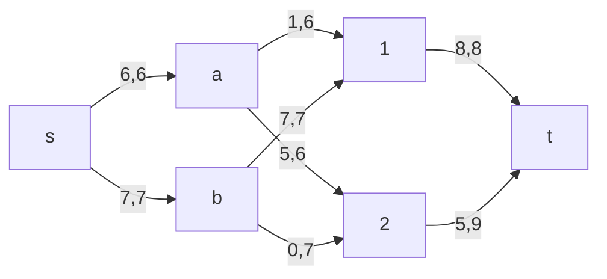
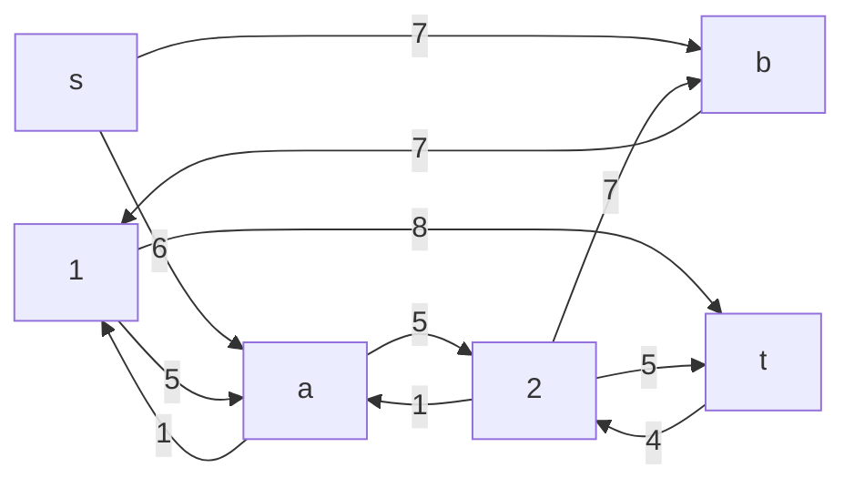
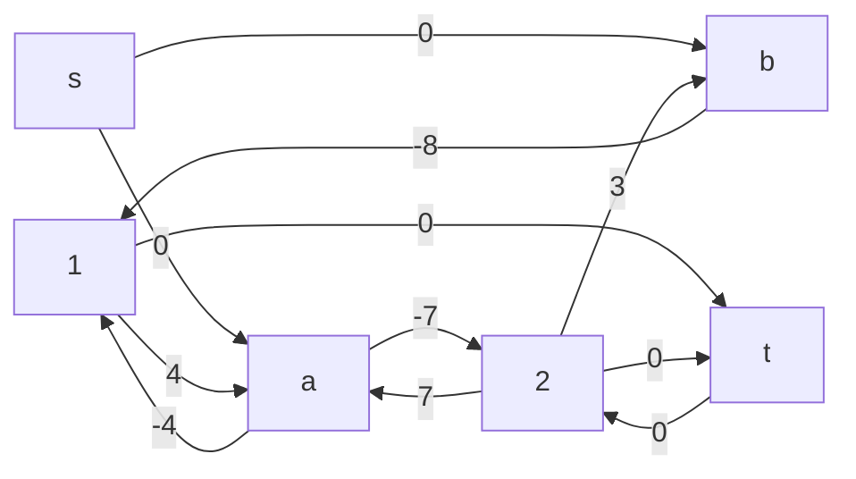
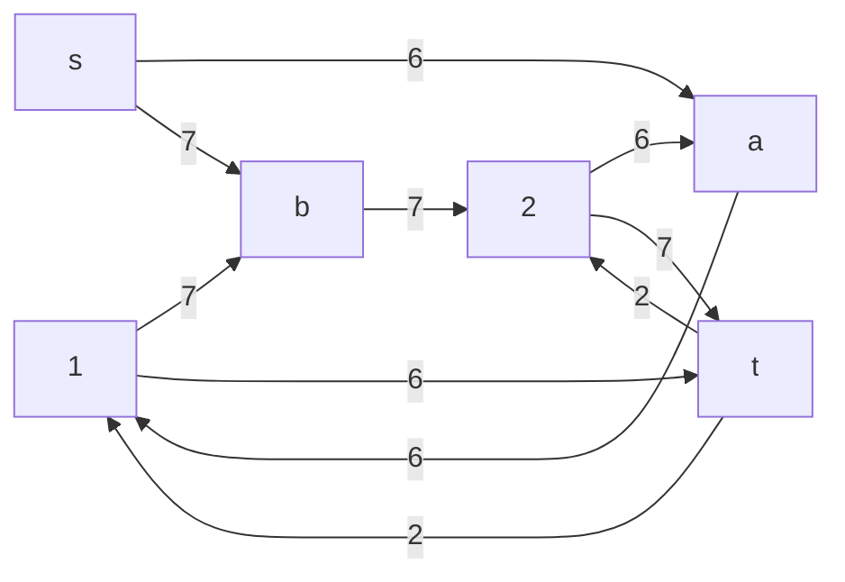
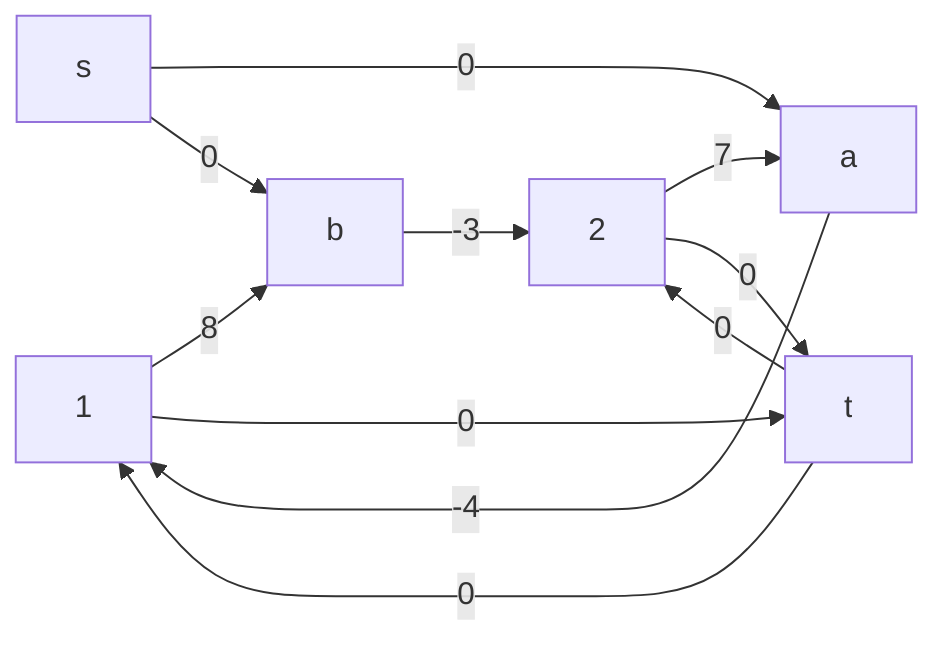

# Задание №14
# Транспортная задача (Максимальный поток при минимальной стоимости). Вариант №4

## Постановка задачи
Транспортная задача

Два завода имеют производительность 6 и 7, а два складских помещения имеют вместимость 8 и 9. Матрица затрат на перевозку одной единицы товара (строки – это заводы, столбцы – это склады) имеет вид:

$$
 \begin{pmatrix}    
  4 & 7 \\ 
  8 & 3 \\ 
 \end{pmatrix}    
$$

Требуется:
1. Найти стоимость перевозки с первого завода на второй склад 5 единиц товара, на первый склад 1 единицы, а со второго завода на первый склад 7 единиц товара;
2. Используя алгоритм поиска максимального потока минимальной стоимости, скорректировать указанный выше вариант перевозки товаров, так чтобы объём перевозимых товаров не изменился, а стоимость их перевозки стала минимальной.

## Решение транспортной задачи 

### 1. Построим сеть с источником **s**, стоком **t** и указанными пропускными способностями дуг для поиска максимального потока.

Посчитаем стоимость перевозки с условиями первой части:
1. Завод 1(А) - Склад №1 = 1 * 4 = 4
2. Завод 1(А) - Склад №2 = 5 * 7 = 35
3. Завод 2(В) - Склад №1 = 7 * 8 = 56
   
Итоговая стоимость транспортировки выходит 95 за 13 единиц товара.

### 2. Используя алгоритм поиска максимального потока минимальной стоимости, скорректируем указанный выше вариант перевозки товаров, так чтобы объём перевозимых товаров не изменился, а стоимость их перевозки стала минимальной

Попробуем уменьшить стоимость потока и построим соответствующую остаточную сеть.

Для каждого ребра остаточной сети укажем стоимость транспортировки единицы потока.

В остаточной сети найден ориентированный цикл отрицательной стоимости b -> 1 -> a -> 2 -> b (- 8 + 4 - 7 + 3 = -8). 

Минимальный вес ребра в цикле 5 - ребро a2.

Удалим найденный цикл - уменьшим на 5 вес всех ребер, входящих в цикл.

Скорректируем остаточную сеть с указанием стоимости транспортировки единицы потока.

В остаточной сети найден ориентированный цикл отрицательной стоимости t -> 2 -> b -> 1 -> t (0 + 3 - 8 + 0 = -5). 

Минимальный вес ребра в цикле 2 - ребра 2b и b1.  

Удалим найденный цикл - уменьшим на 2 вес всех ребер, входящих в цикл.

Скорректируем остаточную сеть с указанием стоимости транспортировки единицы потока.

В остаточной сети отсутствуют циклы отрицательной стоимости, следовательно, стоимость потока минимальна.

### Ответ:
Посчитаем стоимость перевозки по найденным значениям в потоке:
1. Завод 1(А) - Склад №1 = 6 * 4 = 24
2. Завод 2(В) - Склад №2 = 7 * 3 = 21

Итоговая стоимость транспортировки выходит 45 за 13 единиц товара.