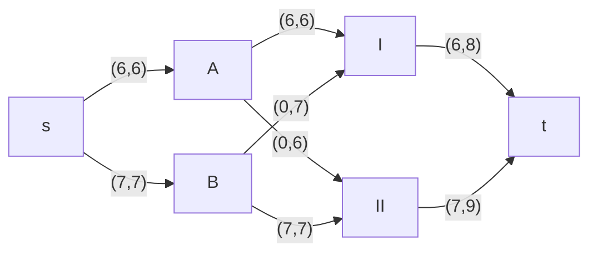
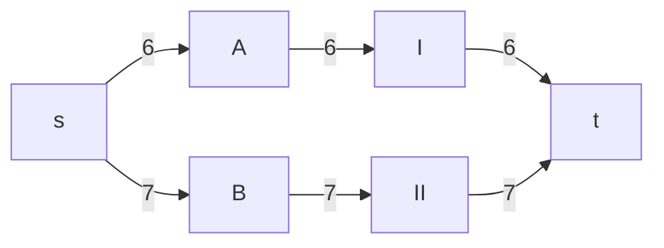
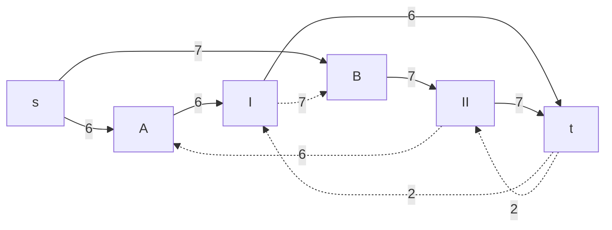
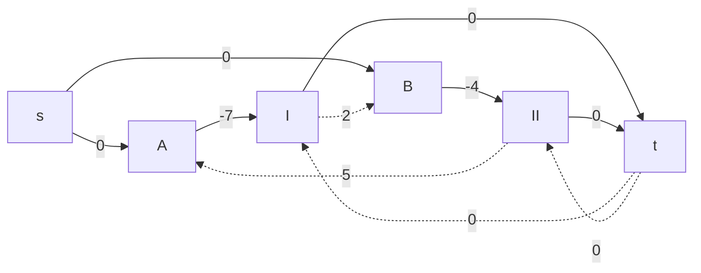
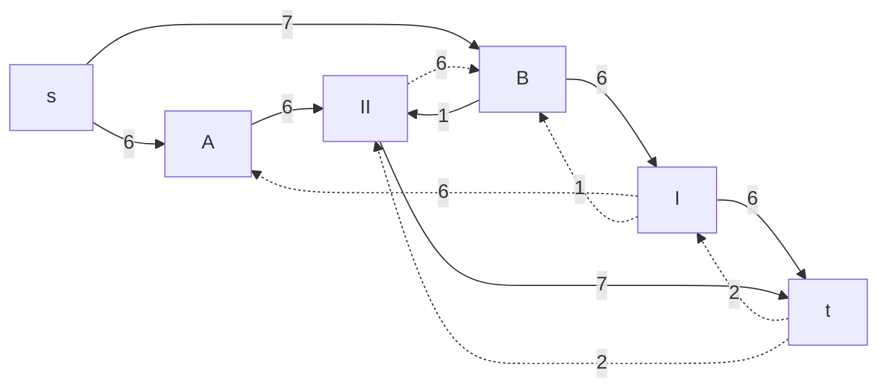
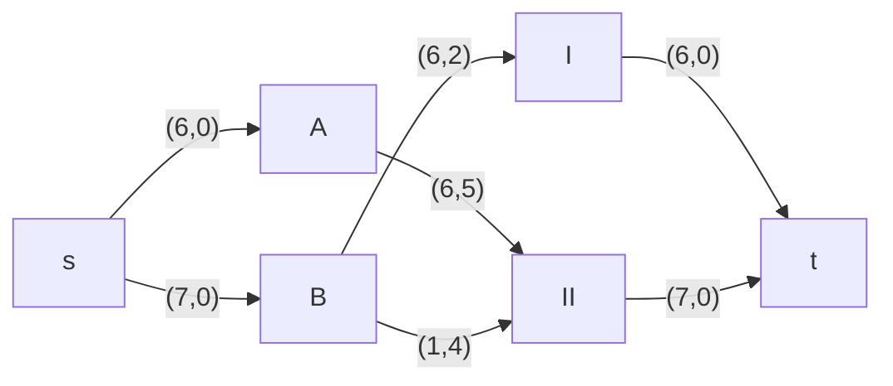
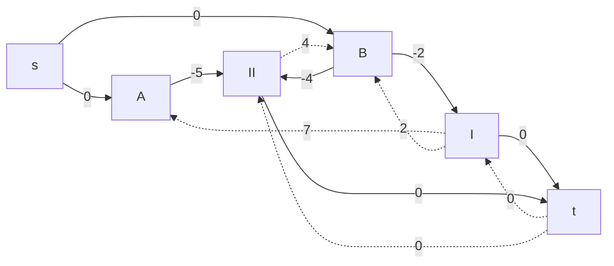
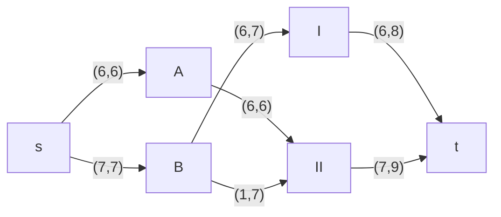

# Задание №11+
# Транспортная задача. Решение с использованием алгоритма поиска максимального потока минимальной стоимости.
## Вариант 5:

Два завода имеют производительность 6 и 7, а два складских помещения имеют вместимость 8 и 9. Матрица затрат на перевозку одной единицы товара (строки – это заводы, столбцы – это склады) имеет вид:

$$
 \begin{pmatrix}    
  7 & 5 \\ 
  2 & 4 \\ 
 \end{pmatrix}    
$$

Требуется:
1. Найти стоимость перевозки с первого завода на первый склад 6 единиц товара, а со второго завода на второй склад 7 единиц товара;
2. Используя алгоритм поиска максимального потока минимальной стоимости, скорректировать указанный выше вариант перевозки товаров, так чтобы объём перевозимых товаров не изменился, а стоимость их перевозки стала минимальной.

## Пункт 1. 
(Завод А в 1 склад перевозит 6 единиц по стоимости 7) 6 * 7 + (Завод B в 2 склад перевозит 7 единиц по стоимости 4 )7 * 4 = 70

## Шаг 1
Построим сеть с источником s, стоком t и указанными пропускными способностями дуг для поиска максимального потока.

Получаем сеть при отправке 6 у.е. с завода А на 1 склад, 7 у.е. с завода B на 2 склад:

Посчитаем стоимость такой транспортировки: 6 * 7 + 7 * 4 = 70.
## Шаг 2
Построим остаточные сети для пропускной способности и стоимости транспортировки. В случае со стоимостями прямые дуги будут со знаком "-", а обратные со знаком "+".

Выполним поиск цикла отрицательной стоимости. Найден следующий цикл:
B --> II --> A --> I --> B (-4 + 5 - 7 + 2 = -4). Минимальное значение = 6. Уменьшим вес дуг на найденном пути на величину равную минимуму.

## Шаг 3
Выполним поиск цикла отрицательной стоимости. 

Нет отрицательного цикла. Тогда итоговый граф будет иметь следующий вид:

Выполним расчёты итоговой стоимости перевозки:
A -6-> II равно 6 * 5 = 30. B -6-> I и B -1-> II равно 6 * 2 + 1 * 4 = 12 + 4 = 16. В сумме 46.
## Ответ:
Наибольший объём товаров можно доставить на склады с минимальной стоимостью транспортировки равной 46 у.е.