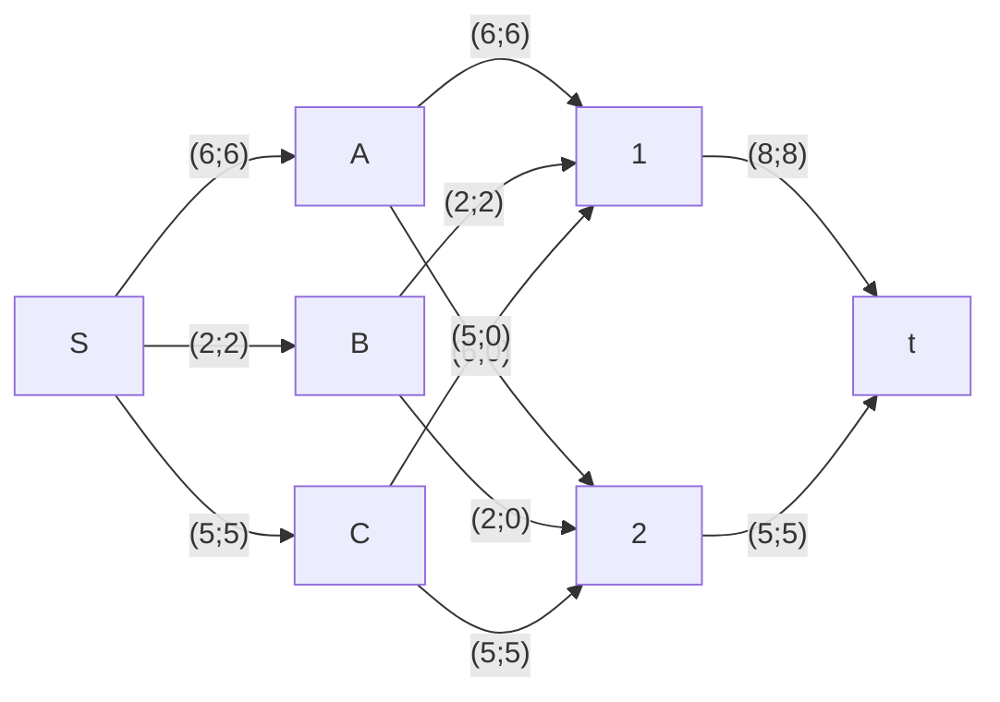

### Вариант 2:
Транспортная задача

Три завода имеют производительность 6, 2 и 5, а два складских помещения имеют вместимость 8 и 5. Матрица затрат на перевозку одной единицы товара (строки – это заводы, столбцы – это склады) имеет вид:

$$
 \begin{pmatrix}    
  20 & 30 \\ 
  10 & 8 \\ 
  12 & 11 \\ 
 \end{pmatrix}    
$$

Требуется:
1. Найти стоимость перевозки с первого завода на первый склад 6 единиц товара, со второго завода на первый склад 2 единиц товара, с третьего завода на второй склад 5 единиц товара;
2. Используя алгоритм поиска максимального потока минимальной стоимости, скорректировать указанный выше вариант перевозки товаров, так чтобы объём перевозимых товаров не изменился, а стоимость их перевозки стала минимальной.

### Решение:
Обозначим заводы буквами A, B и C, а два склада цифрами 1 и 2. 
Построим матрицу затрат:
|     |  1  |  2  |
|:---:|:---:|:---:|
|**A**|  20  |  30  |
|**B**|  10  |  8  |
|**C**|  12  |  11  |

A -> 1 6 ед.
B -> 1 2 ед.
C -> 2 5 ед.
S = 20 * 6 + 10 * 2 + 11 * 5 = 195

