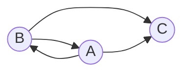

# Задача на взаимную рекурсию (маршруты в треугольнике). Вариант 1.

В условиях задачи дан граф с тремя вершинами следующего вида:

Допустимые маршруты:
- B --> A
- B --> C
- A --> B
- A --> C

Необходимо найти формулу расчета количества маршрутов, начинающихся в вершине A и заканчивающихся в вершине C. 

## Решение

Введем обозначения:
* $a_n$ - количество маршрутов длины *n* начинающихся и заканчивающихся в A,
* $b_n$ - количество маршрутов длины *n* начинающихся в A и 
заканчивающихся в B,
* $c_n$ - количество маршрутов длины *n* начинающихся в A и 
заканчивающихся в C.

Тогда справедливы равенства:

$$
\begin{cases}
a_n = b_{n-1}  & (1)
\\
b_n = a_{n-1}  & (2)
\\
c_n = a_{n-1} + b_{n-1}  & (3)
\end{cases}
$$

Из уравнения *(1)* следует, что $a_{n-1} = b_{n-2}$. Подставим полученное выражение в уравнение *(2)*:

$$
b_n = b_{n-2}
$$

Таким образом система сводится к одному рекуррентному соотношению. 

Далее необходимо вывести и решить характеристическое уравнение.

$$
\lambda^n = \lambda^{n-2} \quad |:\lambda^{n-2}
\\
\lambda^2 = 1
\\
\lambda_{1,2} = \pm1
$$

Так как $\lambda_1 \neq \lambda_2$, подставляем корни в формулу следующего вида: 

$$
b_n = C_1 \cdot \lambda_1^n + C_2 \cdot \lambda_2^n
$$

Получим:

$$
b_n = C_1 \cdot 1^n + C_2 \cdot (-1)^n
$$

$1^n = 1$ при любом $n$, следовательно выражение можно упростить:  

$$
b_n = C_1 + C_2 \cdot (-1)^n \quad (4)
$$

Для нахождения $C_1$ и $C_2$ необходимо составить систему:

$$
\begin{cases}
b_1 = C_1 + C_2 \cdot (-1)^1  
\\
b_2 = C_1 + C_2 \cdot (-1)^2  
\end{cases}
$$

Для данного графа $b_1=1$ и $b_2=0$. Тогда система примет вид:

$$
\begin{cases}
1 = C_1 + C_2 \cdot (-1)^1  
\\
0 = C_1 + C_2 \cdot (-1)^2  
\end{cases}
\Rightarrow 
\quad 
+
\begin{cases}
1 = C_1 - C_2 & (5)
\\
0 = C_1 + C_2 & (6)
\end{cases}
$$

Сложим уравнения *(5)* и *(6)*:

$$
1 = 2 \cdot C_1 \quad \Rightarrow \quad C_1 = \frac{1}{2} 
$$

Поставим $C_1$ в уравнение *(6)* и выразим $C_2$:

$$
0 = \frac{1}{2} + C_2 \quad \Rightarrow \quad C_2 = -\frac{1}{2}
$$

Полученные значения $C_1$ и $C_2$ подставим в выражение *(4)*. Таким образом, общая формула $b_n$ имеет вид:

$$
b_n = \frac{1}{2} - \frac{1}{2} \cdot (-1)^n \quad (7)
$$

Или: 

$$
b_n = \begin{cases}
0, & \text{при четных n}
\\
1, & \text{при нечетных n}
\end{cases}
$$

По условию задачи необходимо найти $c_n$. Из системы рекуррентных соотношений известно, что $c_n = a_{n-1} + b_{n-1}$, где $a_{n-1} = b_{n-2}$. Следовательно, общая формула для $c_n$ выглядит следующим образом:

$$
c_n = b_{n-1} + b_{n-2} \quad (8)
$$

Отсюда можно заметить, что $c_n = 1$, при любых значениях $n$, так как:

$$
c_3 = b_2 + b_1 = 0 + 1 = 1
\\
c_4 = b_3 + b_2 = 1 + 0 = 1
\\
c_5 = b_4 + b_3 = 0 + 1 = 1
\\
\cdots
$$

|n|1|2|3|4|5|. . .|             
|-|-|-|-|-|-|-----|
|b|1|0|1|0|1|. . .|     
|c|1|1|1|1|1|. . .|   

Проверим это утверждение, подставив уравнение *(7)* в уравнение *(8)*:

$$
c_n = \frac{1}{2} - \frac{1}{2} \cdot (-1)^{n-1} + \frac{1}{2} - \frac{1}{2} \cdot (-1)^{n-2}
\\
c_n = 1 - \frac{1}{2} \cdot((-1)^{n-1} + (-1)^{n-2})
\\
(-1)^{n-1} + (-1)^{n-2} = 0, \quad n\in \mathbb{R}
\\
c_n = 1 - \frac{1}{2} \cdot 0
\\
c_n = 1
$$

