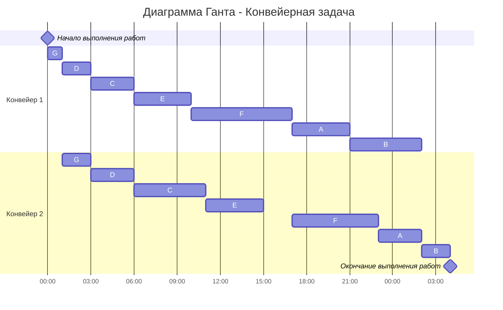
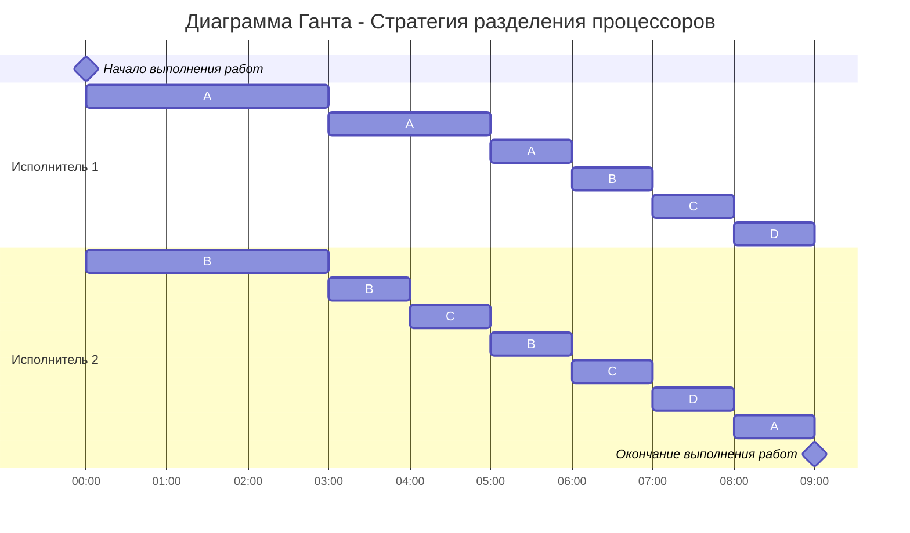

# Задание №5

## Оптимальное расписание. Конвейерная задача / Стратегия разделения процессоров

**Для выполнения задания рекомендуется установить [Плагин отображения диаграмм Markdown Preview Mermaid Support](https://marketplace.visualstudio.com/items?itemName=bierner.markdown-mermaid)**

В задании часть вариантов представляют конвейерную задачу, другая задачу о разделении процессоров. Для каждой задачи необходимо: 
1. Выбрать алгоритм решения задачи и обосновать свой выбор.
2. Применить выбранный алгоритм, в решении отобразить ход выполнения алгоритма с подробными комментариями.
3. В ответе указать длительность полученного расписания.
4. В ответе вывести полученное расписание **в виде диаграммы Ганта**.

**Решение должно содержать номер варианта и подробное пошаговое описание.**

Условия задачи расположены в файле task-5/task.md в ветке main репозитория для ручных задач.
Решение задачи нужно оформить в формате Markdown в отдельном файле с названием <название_команды>.md, который добавить в каталог task-5 данного репозитория.

## Информация по Markdown разметке:

Для создания таблиц в формате Markdown можно использовать следующую конструкцию:

```
| col_1 | col_2 | col_3 |
| ----- | ----- | ----- |
| a1    | a2    | a3    |
| b1    | b2    | b3    |
| с1    | с2    | с3    |
```

[Система верстки LaTeX, которую можно использовать для математических формул](https://grammarware.net/text/syutkin/MathInLaTeX.pdf)

[Рисуем диаграммы Mermaid.js в README-файлах GitHub](https://habr.com/ru/articles/652867/)

## Для выполнения задания необходимо:

1. Обновить ветку main в локальном репозитории (git pull).
2. От ветки main создать ветвь с названием <название*команды>-task-5, заменив <название*команды> на название команды.
3. В созданной ветке в каталог task-5 добавить файл с решением задачи с названием <название_команды>.md.
4. Зафиксировать изменения на ветке (git commit).
5. Отравить ветку с изменениями в репозиторий на Github (git push).
6. Создать на Github запрос на слияние (pull request), указав в качестве base ветки main, в качестве compare ветки <название_команды>-task-5.

## Конвейерная задача
### Постановка конвейерной задачи:
1. Количество заданий произвольно;
2. Каждое задание состоит из двух последовательных этапов, длительность которых произвольна;
3. Задания независимы;
4. Запрещены прерывания при выполнении заданий;
5. Количество работников строго 2;
6. Первый работник выполняет только первый этап каждого задания, второй работник — только второй этап каждого задания;
7. Производительность работников, размеры оплаты из труда и т.д. не учитываются;
8. Требуется построить расписание выполнения всех заданий в кратчайшие сроки.

### Алгоритм Джонсона
Пусть а<sub>i</sub> и b<sub>i</sub>, — это длительности первого и второго 
этапов i-го задания. 

Разобьём список всех заданий на две группы. В первую группу попадают задания, у которых а<sub>i</sub> <= b<sub>i</sub>. Во вторую группу - все остальные задания. 

Задания из первой группы отсортируем в порядке возрастания величин а<sub>i</sub>. Задания из второй группы отсортируем в порядке убывания величин b<sub>i</sub>.

Согласно алгоритму Джонсона, расписание получается кратчайшим, если сначала выполнить все задания из первой группы в отсортированном порядке, а затем — все задания из второй группы также в отсортированном порядке.



## Задача о разделении процессоров
### Постановка задачи:
1. Количество заданий произвольно;
2. Каждое задание имеет свою длительность;
3. Задания независимы и могут выполняться параллельно;
4. Разрешены прерывания при выполнении заданий;
5. Количество работников произвольно и не превышает количество заданий;
6. Работники универсальны в плане выполнения задач - каждый работник может выполнять любую из задач;
7. Производительность работников отличается;
8. Требуется построить расписание выполнения всех заданий в кратчайшие сроки.

### Стратегия разделения процессоров

Длительность оптимального расписания для $k$ исполнителей и $n$ заданий можно рассчитать по формуле:

$$  
T_{min} = \frac {V_1 + V_2 + ... + V_n}{p_1 + p_2 + ... + p_k}  
$$  

где $V_i$ - объем i-го задания, а $p_j$ - производительность j-го исполнителя. Минимальное время расписания предполагает, что в течении всего времени $T_{min}$ все исполнители будут работать непрерывно (без простоев).

Так как время оптимального расписания рассчитано, необходимо определить над какой задачей и в какое время каждый работник будет работать.

Для описания алгоритма построения оптимального расписания введем понятие **приоритета задания** в определенный момент времени - объем оставшейся части задания, которая в данный момент еще не выполнена. В начальный момент времени приоритет задания соответствует его объему. 

**Основная идея алгоритма**: задания с высоким приоритетом выполняет работник с высокой производительностью.

Шаги алгоритма:
1. Выбрать задания с самым высоким приоритетом (может быть одно задание или несколько заданий с одинаковым приоритетом), назначить на эти задания одного или несколько самых производительных работников. Если остались свободные работники назначить их на задания со следующим приоритетом.
2. Работники выполняют задания до тех пор, пока не наступит одно из событий:
- какое-либо задание будет завершено и освободится исполнитель,
- сравняются приоритеты у каких-то заданий, если до того эти приоритеты были разные, то есть с изменением приоритетов необходимо переназначить работников на задания согласно шагу 1.

Пример условий задачи

| Задания      |  A  |  B  |  C  |  D  |
|:-------------|:---:|:---:|:---:|:---:|
| Длительность |  33 |  20 |  11 |   8 |


| Исполнители        |  1  |  2  |
|:-------------------|:---:|:---:|
| Производительность |  5  |  3  |

Оптимальное расписание:


