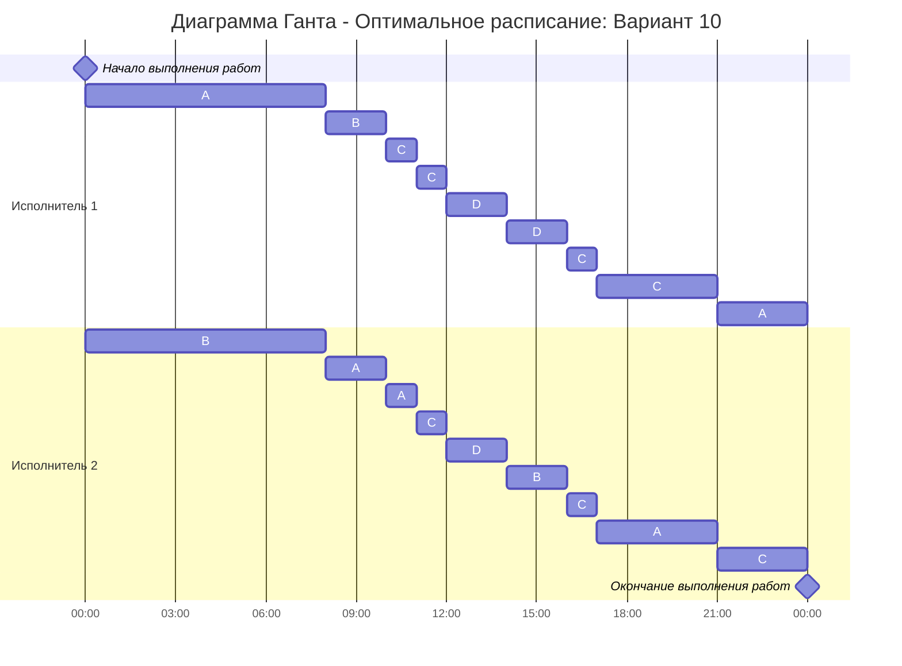

# Вариант 10: Оптимальное расписание
Имеется 4 независимых задания и 2 исполнителя, исполнитель 1 с производительностью 3 и исполнитель 2 производительностью 1. Длительность заданий составляет 40, 28, 14, 14
## Запишем, что нам дано

P<sub>1</sub> = 3<br>
P<sub>2</sub> = 1

| Задание | Длительность |
|---------|--------------|
| A       | 40           |
| B       | 28           |
| C       | 14           |
| D       | 14           |

## Найдём минимальное время, за которое можно выполнить все задания

### t<sub>min</sub> = $\frac{A + B + C + D}{P_1 + P_2}$ = $\frac{40 + 28 + 14 + 14}{3 + 1}$ = 24 минуты
<br>


## Расчёт и распределение задач

### Этап 1: Распределение задач A и B

На начальном этапе берём два самых крупных задания (A и B). Рассчитаем время \(t\), при котором их оставшиеся объёмы сравняются:

```javascript
40 - 3 * t = 28 - t
12 = 2 * t
12 / 2 = t
6 = t
```

Обновляем оставшиеся объёмы:
- A<sub>новое</sub> = 40 - 3 × 6 = 22
- B<sub>новое</sub> = 28 - 1 × 6 = 22

Время работы на этом этапе: T = 6.

```
Время   |  0   1   2   3   4   5   6
-----------------------------------
ℕ1 (P1) |  A   A   A   A   A   A
ℕ2 (P2) |  B   B   B   B   B   B
```


### Этап 2: Выравнивание A, B с C, D

Теперь добавляем меньшие задачи C и D. Рассчитаем момент времени \(t\), при котором A и C сравняются:

```javascript
22 - 2 * t = 14
8 = 2 * t
8 / 2 = t
4 = t
```

Обновляем оставшиеся объёмы:
- A<sub>новое</sub> = 22 - 2 × 4 = 14
- B<sub>новое</sub> = 22 - 2 × 4 = 14
- C<sub>новое</sub> = 14
- D<sub>новое</sub> = 14

Время работы на этом этапе: T = 4.

```
Время   |  6   7   8   9  10
-----------------------------------
ℕ1 (P1) |  A   A   A   A
ℕ2 (P2) |  B   B   B   B
```


### Этап 3: Завершаем задачи

Все задачи (A, B, C, D) теперь имеют одинаковую длительность (14). Завершаем их выполнение равномерно за оставшиеся \(14\) минут.

```javascript
14 / 4 = 3.5
14 - 3.5 * t = 0
14 / 3.5 = t
4 = t
```

```
Время   |  10  11  12  13  14  15  16  17  18  19  20  21  22  23  24
---------------------------------------------------------------------
ℕ1 (P1) |  A   C   C   D   D   D   C   C   C   A   A   A
ℕ2 (P2) |  B   A   C   D   B   B   C   A   A   C   C
```


## Итоговая таблица расписания

| Время  | Исполнитель 1 (P<sub>1</sub>)           | Исполнитель 2 (P<sub>2</sub>)           |
|--------|-----------------------------------------|-----------------------------------------|
| 0-8    | A                                       | B                                       |
| 8-10   | B                                       | A                                       |
| 10-11  | C                                       | A                                       |
| 11-12  | C                                       | C                                       |
| 12-14  | D                                       | D                                       |
| 14-16  | D                                       | B                                       |
| 16-17  | C                                       | C                                       |
| 17-21  | C                                       | A                                       |
| 21-24  | A                                       | C                                       |


## Итоговая диаграмма Ганта



