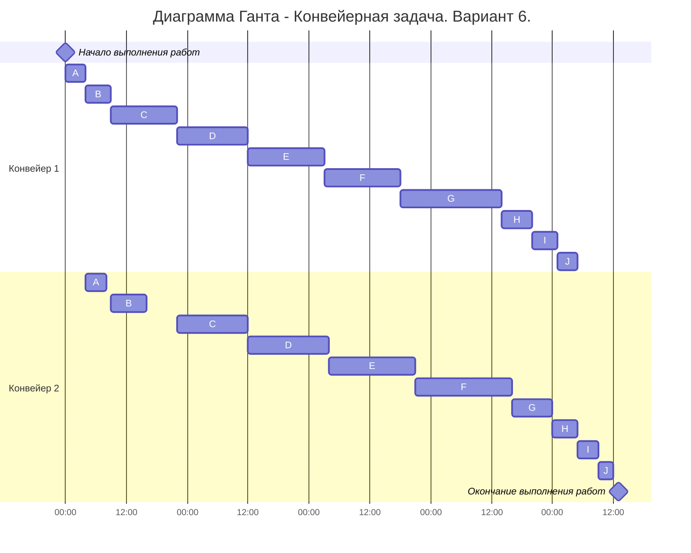

# Конвейерная задача. Вариант 6
## Постановка конвейерной задачи:
1. Количество заданий произвольно;
2. Каждое задание состоит из двух последовательных этапов, длительность которых произвольна;
3. Задания независимы;
4. Запрещены прерывания при выполнении заданий;
5. Количество работников строго 2;
6. Первый работник выполняет только первый этап каждого задания, второй работник — только второй этап каждого задания;
7. Производительность работников, размеры оплаты из труда и т.д. не учитываются;
8. Требуется построить расписание выполнения всех заданий в кратчайшие сроки.
## Длительность заданий 6 варианта: (5, 7), (20, 8), (4, 4), (15, 17), (4, 3), (13, 14), (14, 16), (6, 5), (15, 19), (5, 4).

### Алгоритм Джонсона
Пусть аi и bi, — это длительности первого и второго 
этапов i-го задания. 

Разобьём список всех заданий на две группы. В первую группу попадают задания, у которых аi <= bi. Во вторую группу - все остальные задания. 

Задания из первой группы отсортируем в порядке возрастания величин аi. Задания из второй группы отсортируем в порядке убывания величин bi.

Согласно алгоритму Джонсона, расписание получается кратчайшим, если сначала выполнить все задания из первой группы в отсортированном порядке, а затем — все задания из второй группы также в отсортированном порядке.
Получившиеся группы после сортировки: 
| аi <= bi | аi > bi | 
| ------------------------------ | ----------------------------- | 
|             A(4, 4)            |            G(20, 8)           | 
|             B(5, 7)            |            H(6, 5)            | 
|             C(13, 14)          |            I(5, 4)            | 
|             D(14, 16)          |            J(4, 3)            | 
|             E(15, 17)          |                               | 
|             F(15, 19)          |                               | 

# Ответ
Длительность расписания составит 109 часов
