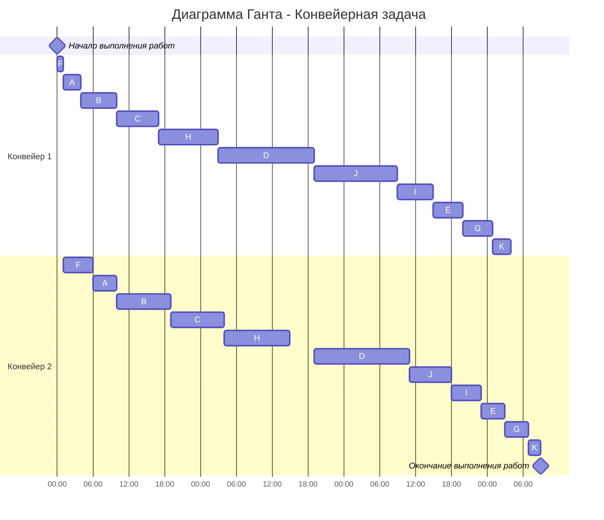

## Оптимальное расписание. Конвейерная задача / Стратегия разделения процессоров. Вариант 11
Имеется 11 независимых заданий, каждое из которых состоит из двух последовательных этапов, и 2 исполнителя, исполнитель 1 выполняет только первый этап задания, исполнитель 2 - только второй. Длительность заданий (по этапам): (3, 4), (6, 9), (7, 9), (16, 16), (5, 4), (1, 5), (5, 4), (10, 11), (6, 5), (14, 7), (3, 2).

### Выбор алгоритма 
Для решения данного задания необходимо использовать **алгоритм Джонсона**, так как в условии сказано про двух исполнителей, каждый из которых выполняет только первый и только второй этап, то есть имеется в виду конвейерная задача.

### Предварительный этап
Обозначим каждый этап буквой:  
A (3, 4)  
B (6, 9)  
C (7, 9)  
D (16, 16)  
E (5, 4)  
F (1, 5)  
G (5, 4)  
H (10, 11)  
I (6, 5)  
J (14, 7)  
K (3, 2)

### Первый этап
В качестве первого этапа разделим все задания на две группы. Обозначим длительность выполнения первого этапа за *a*, а второго за *b*. Тогда в первую группу попадут все те задания, у которых a <= b, остальные же, у которых a > b попадут во вторую группу.  
  
**Группа 1:**  
A(3, 4) B(6, 9) C(7, 9) D(16, 16) F(1, 5) H(10, 11)  
  
**Группа 2:**  
E(5, 4) G(5, 4) I(6, 5) J(14, 7) K(3, 2)

### Второй этап
Второй этап - сортировка внутри данных группах. В первой группе сортировка производится возрастанию по длительности первого этапа *a*. Во второй - по убыванию длительности второго этапа *b*.  
  
**Группа 1:**  
F(1, 5) A(3, 4) B(6, 9) C(7, 9) H(10, 11) D(16, 16)  
  
**Группа 2:**  
J(14, 7) I(6, 5) E(5, 4) G(5, 4) K(3, 2)

### Третий этап
Третий этап - объединить первую и вторую группу последовательно.  
Итоговое объединение:  
F(1, 5) A(3, 4) B(6, 9) C(7, 9) H(10, 11) D(16, 16) J(14, 7) I(6, 5) E(5, 4) G(5, 4) K(3, 2)  
  
Остаётся посчитать итоговое время и составить диаграмму Ганта.

### Подсчёт времени
Всегда начинает первый исполнитель. 
   
**Обработка F:**  
К концу обработки F на первом этапе t = 1. Сразу же поставим на второй этап. К концу обработки F на втором этапе t = 6.  
**Обработка A:**  
Стартуем с конца первого этапа F и получаем t = 1+3 = 4. Поставить сразу на второй этап нельзя, т.к. с 4 до 6 ещё делается F. Тогда ставим обработку второго этапа A начиная с t = 6, тогда закончится она в t = 6+4 = 10.  
**Обработка B:**  
Конец этапа 1 для B: t = 4+6 = 10  
Конец этапа 2 для B: t = 10+9 = 19  
**Обработка C:**  
Конец этапа 1 для C: t = 10+7 = 17  
Конец этапа 2 для C: t = 19+9 = 28  
**Обработка H:**  
Конец этапа 1 для H: t = 17+10 = 27  
Конец этапа 2 для H: t = 28+11 = 39  
**Обработка D:**  
Конец этапа 1 для D: t = 27+16 = 43  
Конец этапа 2 для D: t = 43+16 = 59  
**Обработка J:**  
Конец этапа 1 для J: t = 43+14 = 57  
Конец этапа 2 для J: t = 59+7 = 66  
**Обработка I:**  
Конец этапа 1 для I: t = 57+6 = 63  
Конец этапа 2 для I: t = 66+5 = 71  
**Обработка E:**  
Конец этапа 1 для E: t = 63+5 = 68  
Конец этапа 2 для E: t = 71+4 = 75  
**Обработка G:**  
Конец этапа 1 для G: t = 68+5 = 73  
Конец этапа 2 для G: t = 75+4 = 79  
**Обработка K:**  
Конец этапа 1 для K: t = 73+3 = 76  
Конец этапа 2 для K: t = 79+2 = 81

### Ответ
Всего будет затрачено 81 единица времени.

