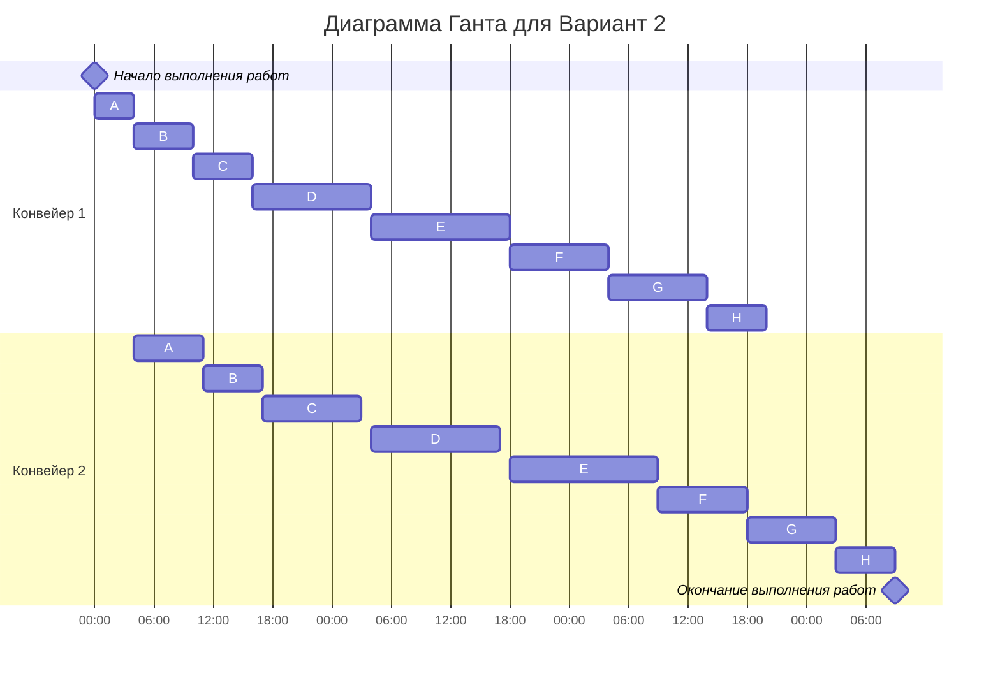

## Конвейерная задача Green

**Вариант 2:**

Имеется 8 независимых заданий, каждое из которых состоит из двух последовательных этапов, и 2 исполнителя, исполнитель 1 выполняет только первый этап задания, исполнитель 2 - только второй. Длительность заданий (по этапам): 
(4, 7), (12, 13), (6, 10), (14, 15), (10, 9), (6, 6), (6, 5), (10, 9).

Так как этапы идут последовательно, то можно сделать вывод, что это конвейерная задача, поэтому будем решать ее при помощи Алгоритма Джонсона.

Разобьём список всех заданий на две группы. В первую группу попадают задания, у которых аi <= bi, отсортируем их в порядке возрастания величин аi, а во вторую ai > bi, которые отсортируем в порядке убывания величин bi.

|     | аi <= bi | аi > bi |     |
|-----|----------|---------|-----|
| A   | (4, 7)   | (10, 9) | F   |
| B   | (6, 6)   | (10, 9) | G   |
| C   | (6, 10)  |  (6, 5) | H   |
| D   | (12, 13) |         |     |
| E   | (14, 15) |         |     |

Конвейер 1 работает без пауз, поэтому достататочно выписать все значения ai в порядке, в котором они представлены выше (сверху вниз) сначала для стобца аi <= bi, потом для аi > bi. 
Конвейер 2 должен ждать, когда конвейер 1 закончит выполнение ai, а только затем приступает к выполнению bi.

В связи в этим таблицу заполняем следующим образом: сначала выписываем время начала работы процесса для ai, затем время окончания работы равное "начало работы" + "длительность работы", 
а потом сравниваем: что больше? ai или b(i-1) - это будет начало работы для bi. 

| Начало/конец 1 | 0/4   | 4/10 | 10/16 | 16/28 | 28/42 | 42/52 | 52/62 | 62/68 |       |
|----------------|-------|------|-------|-------|-------|-------|-------|-------|-------|
| Конвейер 1     | A4    | B6   | C6    | D12   | E14   | F10   | G10   | H6    |       |
| Конвейер 2     |       | A7   | B6    | C10   | D13   | E15   | F9    | G9    | H5    |
| Начало/конец 2 |       | 4/11 | 11/17 | 17/27 | 28/41 | 42/57 | 57/66 | 66/75 | 75/80 |

Получаем ответ: 80 
