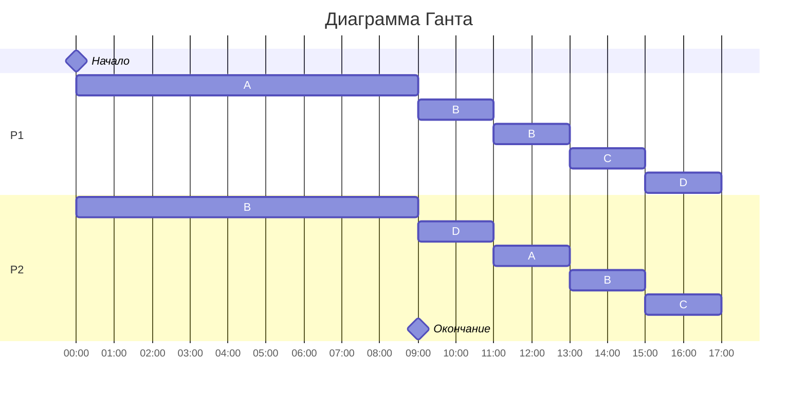

# Оптимизация расписания работ для исполнителей (ВАРИАНТ 7)

4 НЕЗАВИСИМЫХ ЗАДАЧИ:
| A  | B  | C  | D  | 
|----|----|----|----|
| 54 | 45 | 18 | 18 |

2 ПРОИЗВОДИТЕЛЯ:
| P1 | P2 |
|----|----|
| 4  | 3  |

ОБЩЕЕ ВРЕМЯ РАБОТ:
t_min = 54 + 45 + 18 + 18 / 4 + 3 = 20

Чтобы составить оптимальное расписание работ, воспользуемся алгоритмом Джонсона с приоритетами задач.

1. Расставить приоритеты на задачи и назначить исполнителя:

| Задача | Длительность | Приоритет | Исполнитель |
|--------|--------------|-----------|-------------|
| A      | 54           | I         | P1          |
| B      | 45           | II        | P1          |
| C      | 18           | III       | P2          |
| D      | 18           | III       | P2          |


2. Определить, какое событие наступит раньше, и сколько времени это займет:

| AB | ``` 54 - 4t = 45 - 3t => t = 9```
| BCD | ```45 - 9t = 18 => t = 9```

Через 9 сек задача A станет равна B, C и D = 18.

3. Расчитать работы через 9 сек:

| Задача | Длительность | Приоритет | Исполнитель |
|--------|--------------|-----------|-------------|
| A      | 18           | I         | P1 + P2     |
| B      | 18           | I         | P1 + P2     |
| C      | 18           | I         | P1 + P2     |
| D      | 18           | I         | P1 + P2     |

ЗАДАЧА СВОДИТСЯ К РАВНОМЕРНОМУ РАСПРЕДЕЛЕНИЮ.

РАБОТЫ МЕЖДУ ИСПОЛЬНИТЕЛЯМИ:

| P1 | P2 |
|----|----|
| A  | D  | 
| B  | A  | 
| C  | B  | 
| D  | C  | 

4. Ищем необходимое время:

```markdown
18 + 18 + 18 + 18 / 4 + 3 = 72  /7 ≈ 10.2 ≈ 11
```
ИТОГОВОЕ ВРЕМЯ: 
```markdown
11 + 9 = 20 (t_min)
```

ОТВЕТ: Длительность оптимального расписания составляет 20 сек. 

Расписание в диаграмме Ганта: 



