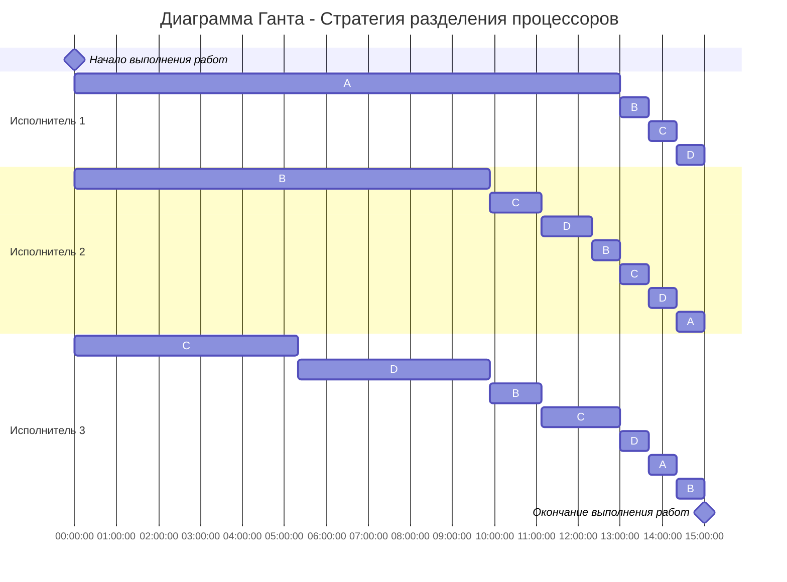

# Вариант 1
Вариант 1:
Имеется 4 независимых задания и 3 исполнителя, исполнитель 1 с производительностью 3, исполнитель 2 с производительностью 2 и исполнитель 3 с производительностью 1. Длительность заданий составляет 41, 25, 13, 11.

## Алгоритм

Для решения задачи выбрана стратегия разделения процессов

## Дано

P<sub>1</sub>  = 3\
P<sub>2</sub> = 2\
P<sub>3</sub> = 1

|A|B|C|D|
|:-|:---:|:----:|---:|
|41|25|13|11|

## Минимальное время
### t<sub>min</sab> = $\frac{A + B + C + D}{P_1 + P_2 + P_3}$ = $\frac{41 + 25 + 13 + 11}{3 + 2 + 1}$ = 15

## Расставим приоритеты

|A|B|C|D|
|:-|:---:|:----:|---:| 
|41|25|13|11|
|I|II|III|IV|

Процессам присвоим по одному исполнителю в соответствие  с приоритетами и производительностью

|A|B|C|D|
|:-|:---:|:----:|---:| 
|41|25|13|11|
|I|II|III|IV|
|P<sub>1</sub>|P<sub>2</sub>|P<sub>3</sub>|| 


### Находим время между приоритетами А и В:

```
41 - 3 * t = 25 - 2 * t
t = 16 
```

### Находим время между приоритетами B и C:

```
25 - 2 * t = 13 - 1 * t
t = 12
```

### Находим время между приоритетами C и D:

```
13 - 1 * t = 11 
t = 2
```


Минимальное время = 2

## Через 2 часа длительность заданий будет составлять

|A|B|C|D|
|:-|:---:|:----:|---:|
|35|21|11|11|


Так как длительность заданий C и D сравнялась, разделим производительность ответственного исполнителя пополам
|A|B|C|D|
|:-|:---:|:----:|---:| 
|35|21|11|11|
|I|II|III|III|
|P<sub>1</sub>|P<sub>2</sub>|P<sub>3</sub>|P<sub>3</sub>| 

Повторим вычисления минимального времени

### Находим время между приоритетами А и В:

```
35 - 3 * t = 21 - 2 * t
t=14
```

### Находим время между приоритетами B и CD:

```
21 - 2 * t = 11 - 0.5 * t
t=6.67
```
Минимальное время = 6 часов 40 минут

## Через 6 часов 40 минут длительность заданий будет составлять

|A|B|C|D|
|:-|:---:|:----:|---:|
|15|7.66|7.66|7.66|

Так как длительность заданий B, C и D сравнялась, направим на них 2 и 3 исполнителей, 1 на задание A
|A|B|C|D|
|:-|:---:|:----:|---:| 
|15|7.66|7.66|7.66|
|I|II|II|II|
|P<sub>1</sub>|P<sub>2</sub> + P<sub>3</sub>|P<sub>2</sub> + P<sub>3</sub>|P<sub>2</sub> + P<sub>3</sub>| 

Повторим вычисления минимального времени

### Находим время между приоритетами А и ВCD:

```
15 - 3 * t = 7.66 - t
t=3.67
```

Минимальное время = 3 часов 40 минут

## Через 3 часов 40 минут длительность заданий будет составлять

|A|B|C|D|
|:-|:---:|:----:|---:|
|4|4|4|4|

Длительности всех задач сравнялись, объединим их их назначим исполнители равномерно на каждое из заданий

```
16 - 6 * t = 0
t = 2.67
```
Минимальное время = 2 часа 40 минут

## Через 2 часа 40 минут длительность заданий будет составлять

|A|B|C|D|
|:-|:---:|:----:|---:|
|0|0|0|0|

Оптимальное расписание:


