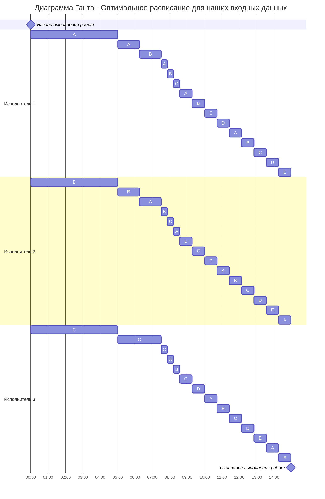

# 6. Придумать условия задачи разделения процессоров (исполнителей 3+, заданий 5+) и решить соответствующую задачу.

## Входные данные(придуманные условия)

P<sub>1</sub> = 4<br>
P<sub>2</sub> = 2<br>
P<sub>3</sub> = 1

| Задание | Длительность |
|---------|--------------|
| A       | 40           |
| B       | 30           |
| C       | 20           |
| D       | 10           |
| E       | 5            |


## Найдём минимальное время, за которое можно выполнить все задания

### t<sub>min</sub> = $\frac{A + B + C + D + E}{P_1 + P_2 + P_3}$ = $\frac{40 + 30 + 20 + 10 + 5}{4 + 2 + 1}$ = 15 минут
<br>


## Расчёт и распределение задач

### Этап 1: Распределение задач A, B и C 

На начальном этапе берём 3 самых крупных задания (A, B, C) и распределяем между ними процессоры по убыванию производительности. Рассчитаем время \(t\), при котором их оставшиеся объёмы сравняются:

```javascript
А и В: 40 - 4t = 30 - 2t => t = 5
В и С: 30 - 2t = 20 - t => t = 10
С и D: 20 - t = 10 => t = 10
```

Обновляем оставшиеся объёмы:
- A<sub>новое</sub> = 40 - 4 × 5 = 20
- B<sub>новое</sub> = 30 - 2 × 5 = 20
- C<sub>новое</sub> = 20 - 1 × 5 = 15

Время работы на этом этапе: T = 5.

Состояние заданий на конец этапа 1:

| Задание | Остаток      | Назначенный исполнитель |
|---------|--------------|-------------------------|
| A       | 20           | P<sub>1                 |
| B       | 20           | P<sub>2                 |
| C       | 15           | P<sub>3                 |
| D       | 10           |                         |
| E       | 5            |                         |


### Этап 2: Продолжение распределения

Теперь расставляем приоритеты выполнения первого и второго процесса на задачи А и В, а третьего на С. Рассчитаем момент времени \(t\), при котором задачи сравняются:

```javascript
AB и С: 20 - 3t = 15-t => t = 5/2 = 2.5
С и D: 15 - t = 10 => t = 5
```

Обновляем оставшиеся объёмы:
- A<sub>новое</sub> = 20 - 3 × 2.5 = 12.5
- B<sub>новое</sub> = 20 - 3 × 2.5 = 12.5
- C<sub>новое</sub> = 15 - 1 × 5 = 10

Время работы на этом этапе: T = 5/2.

Состояние заданий на конец этапа 2:

| Задание | Остаток      | Назначенный исполнитель |
|---------|--------------|-------------------------|
| A       | 12.5         | P<sub>1 + P<sub>2       |
| B       | 12.5         | P<sub>1 + P<sub>2       |
| C       | 12.5         | P<sub>1 + P<sub>2       |
| D       | 10           | P<sub>3                 |
| E       | 5            |                         |

### Этап 3: Дальше распределяем

Задачи (A, B и C) теперь имеют одинаковую длительность (12.5), назначим все исполнители на эти задачи. Рассчитаем момент времени \(t\), при котором задачи сравняются с задачей D:

```javascript
12.5 - 7/3t = 10 => t = 15/14
```
Время работы на этом этапе: T = 15/14.

Состояние заданий на конец этапа 3:

| Задание | Остаток    | Назначенный исполнитель     |
|---------|------------|-----------------------------|
| A       | 10         | P<sub>1 + P<sub>2 + P<sub>3 |
| B       | 10         | P<sub>1 + P<sub>2 + P<sub>3 |
| C       | 10         | P<sub>1 + P<sub>2 + P<sub>3 |
| D       | 10         |                             |
| E       | 5          |                             |

### Этап 4: Еще распределяем

Задачи (A, B, C и D) теперь имеют одинаковую длительность (10), назначим все исполнители на эти задачи. Рассчитаем момент времени \(t\), при котором задачи сравняются с задачей Е:

```javascript
10 - 7/4t = 5 => t = 20/7
```
Время работы на этом этапе: T = 20/7.

Состояние заданий на конец этапа 4:

| Задание | Остаток  | Назначенный исполнитель     |
|---------|----------|-----------------------------|
| A       | 5        | P<sub>1 + P<sub>2 + P<sub>3 |
| B       | 5        | P<sub>1 + P<sub>2 + P<sub>3 |
| C       | 5        | P<sub>1 + P<sub>2 + P<sub>3 |
| D       | 5        | P<sub>1 + P<sub>2 + P<sub>3 |
| E       | 5        |                             |

### Этап 5: Завершение распределения

Задачи (A, B, C, D и Е) теперь имеют одинаковую длительность (5), назначим все исполнители на эти задачи. Рассчитаем момент времени \(t\), при котором задачи сравняются с 0(закончится выполнение):

```javascript
5 - 7/5t = 0 => t = 25/7
```
Время работы на этом этапе: T = 25/7.

Состояние заданий на конец этапа 5:

| Задание | Остаток  | Назначенный исполнитель     |
|---------|----------|-----------------------------|
| A       | 0        | P<sub>1 + P<sub>2 + P<sub>3 |
| B       | 0        | P<sub>1 + P<sub>2 + P<sub>3 |
| C       | 0        | P<sub>1 + P<sub>2 + P<sub>3 |
| D       | 0        | P<sub>1 + P<sub>2 + P<sub>3 |
| E       | 0        | P<sub>1 + P<sub>2 + P<sub>3 |

## Итоговая диаграмма Ганта

