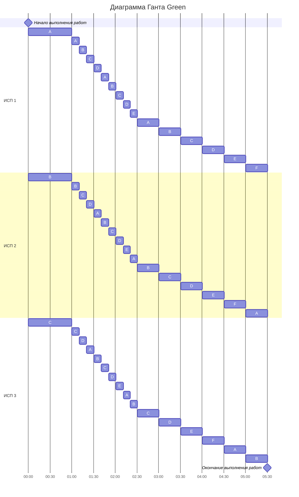

## Оптимальное расписание. Стратегия разделения процессоров Green

**Вариант от команды Green**

Имеется 6 независимых задания и 3 исполнителя, исполнитель 1 с производительностью 6, 
исполнитель 2 с производительностью 4 и исполнитель 3 с производительностью 2. 
Длительность заданий составляет 16, 14, 12, 10, 8, 6. 

Так как задания независимы, а исполнители имеют разную производительность, то для решения задачи подходит **Стратегия разделения процессоров**.

Задания с высоким приоритетом выполняет работник с высокой производительностью.


| 16   | 14   | 12   | 10    | 8     | 6     |
|------|------|------|-------|-------|-------|
|   6  |   4  |   2  |       |       |       |


Задания выписаны в порядке убывания. Так как  первая задача (16)  имеет самую большую длительность выполнения,
оно получает наивысший приоритет, затем расставляем приоритеты для остальных заданий. Они имеют разную длительность,
поэтому получают разные приоритеты.

```
16 - 6t = 14 - 4t       14 - 4t = 12 - 2t
2t = 2                  2t = 2
t = 1                   t = 1

A 16 - 6 * 1 = 10 
B 14 - 4 * 1 = 10
C 12 - 2 * 1 = 10
```

Вычисляем, когда задания поменяют приоритеты, то есть когда длительность до завершения выполнения задания 
станет равно длительности задания со следующим приоритетом.


| 10   | 10   | 10   | 10   | 8    | 6    |
|------|------|------|------|------|------|
|   3  |   3  |   3  |   3  |      |      |

Получается ситуация, когда сразу 4 задания имеют одинаковый приоритет. 
В такой ситуации мы должны назначить на выполения этой задачи максимально допустимое кол-во исполнителей с самой высокой производительностью.
Согласно теориии одну задачу может выполнять только один исполнитель, у нас 3 исполнителя и 4 задания, поэтому они, не мешая друг другу,
будут выполнять эти задачи.

```
6 + 4 + 2 = 12 - общая производительность; 
12 / 4 = 3 - производительность для решения 1 задачи из 4.

 10 - 3t = 8
 3t = 2
 t = 2/3

ABCD 10 - 3 * 2/3 = 8
```

Сразу 5 задач имеют одинаковый приоритет, поэтому назначаем на выполнение сразу всех исполнителей 
(у нас их 3, поэтому это не противоречит алгоритму, так как 3 <= 5)

```
12 / 5  - производительность для решения 1 задачи из 5.
```

| 8      | 8     | 8     | 8     | 8     | 6    |
|--------|-------|-------|-------|-------|------|
| 12 / 5 |12 / 5 |12 / 5 |12 / 5 |12 / 5 |      |

```
8 - 12 / 5 t = 6
12/5 t = 2
t = 5/6

ABCDE 8 - 12/5 * 5/6 = 6

5/6 / 5 = 1/6
```

Сразу 6 задач имеют одинаковый приоритет. 

| 6    | 6    | 6    | 6    | 6    | 6    |
|------|------|------|------|------|------|
| 2    | 2    | 2    | 2    | 2    | 2    |

```
12 / 6 = 2 - производительность для решения 1 задачи из 6.

6 - 2t = 0
t = 3

ABCDEF 6 - 2 * 3 = 0

3 / 6 = 0.5
```

```
Мы выполнили все задачи, давайте посчитаем общее время выполения:
1 + 2/3 + 5/6 + 3 = 5,5

(16 + 14 + 12 + 10 + 8 + 6) / (6 + 4 + 2) = 66 / 12 = 5,5

Результаты совпали, значит задания были распределены правильно.
Составим диаграмму Ганта.
```


Получаем ответ: 5,5