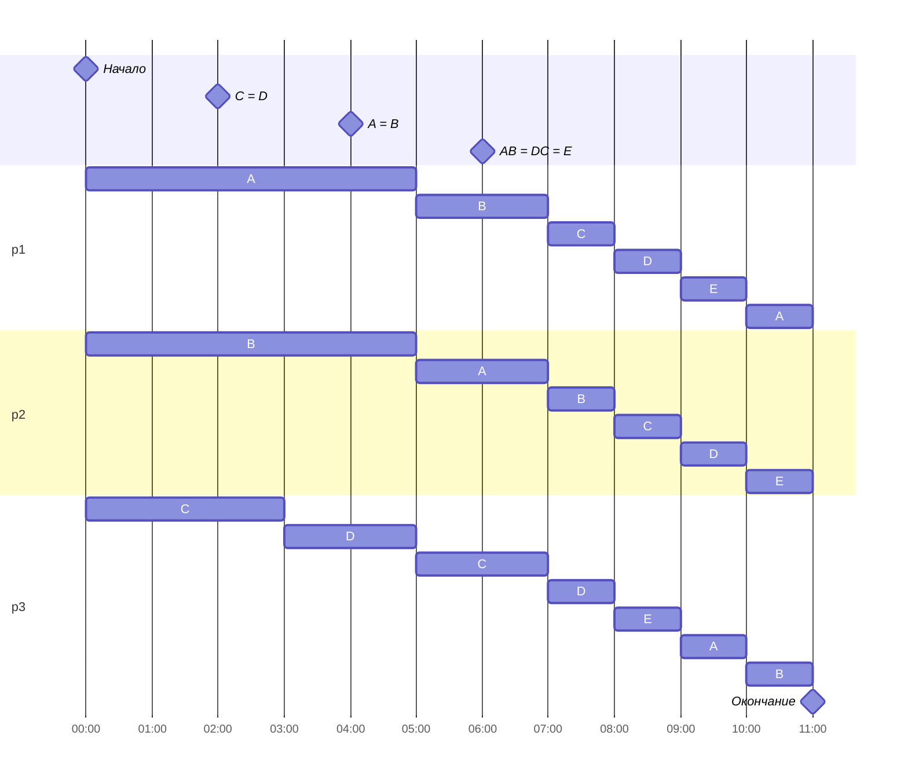

# Задача о разделении процессов

## Условие задачи

Имеется 5 независимых заданий и 3 исполнителя.

| Задачи       | A  | B  | C  | D  | E |
|:-------------|:--:|:--:|:--:|:--:|---|
| Длительность | 41 | 25 | 13 | 11 | 9 |

| Исполнители        | $p_1$ | $p_2$ | $p_3$ |
|:-------------------|:-----:|:-----:|-------|
| Производительность | 6     | 2     | 1     |

## Решение
### Длительность оптимального расписания

Длительность оптимального расписания можно рассчитать, разделив сумму длительностей всех работ на сумму производительности исполнителей.  

$$  
T_{min} = \frac {41 + 25 + 13 + 11 + 9}{6 + 2 + 1} = \frac {99}{9} = 11
$$  

### Назначение исполнителей

Исполнители назначаются на работы в соответствии с приоритетами задач: более производительные работники - на задачи с более высоким приоритетом.  Приоритет задачи определяется её объемом: чем больше объем - тем выше приоритет. Таким образом получаем следующее распределение в момент времени $t=0$:

| Задача | Длительность | Приоритет | Исполнитель |
|--------|--------------|-----------|-------------|
| A      | 41           | I         | $p_1$       |
| B      | 25           | II        | $p_2$       |
| C      | 13           | III       | $p_3$       |
| D      | 11           | IV        |             |
| E      | 9            | V         |             |

### Первая точка перераспределения приоритетов

Так как изменение приоритетов задач в ходе выполнения работы требует перераспределения исполнителей, необходимо рассчитать в какой момент времени задача будет выполнена или объемы некоторых задач сравняются. Для этого решим ряд уравнений:

$ A = B: 41-6 \cdot t = 25 - 2 \cdot t \Rightarrow t = 4 $ 

$ B = C: 25 - 2 \cdot t = 13 - t \Rightarrow t = 12 $

$ C = D: 13 - t = 11 \Rightarrow t = 2 $

Так как C и D сравняются раньше, первой точкой перераспределения приоритетов будет $t=2$.

| Задача | Длительность | Приоритет | Исполнитель |
|--------|--------------|-----------|-------------|
| A      | 29           | I         | $p_1$       |
| B      | 21           | II        | $p_2$       |
| C      | 11           | III       | $p_3$       |
| D      | 11           | III       | $p_3$       |
| E      | 9            | IV        |             |

Оставшееся время для задач $C$ и $D$ сравнялось, следовательно, мы можем поставить им один приоритет и назначить исполнителя $P_3$ на обе задачи. Тогда производительность $P_3$ будет равна $\frac {1}{2}$ для работы $CD$ объемом $11$.  

### Вторая точка перераспределения приоритетов

Аналогично решаем уравнения, чтобы найти следующее ближайшее событие. 

$ A = B: 29-6 \cdot t = 21 - 2 \cdot t \Rightarrow t = 2 $

$ B = CD: 21 - 2 \cdot t = 11 - \frac {1}{2} \cdot t \Rightarrow t = 6\frac {2}{3} $ 

$ CD = E: 11 - \frac {1}{2} \cdot t  = 9 \Rightarrow t = 4 $

Таким образом, $A$ сравняется с $B$ еще через 2 единицы времени, что требует перераспределения приоритетов в моменте $t=4$.

| Задача | Длительность | Приоритет | Исполнитель  |
|--------|--------------|-----------|--------------|
| A      | 17           | I         | $p_1$, $p_2$ |
| B      | 17           | I         | $p_1$, $p_2$ |
| C      | 10           | II        | $p_3$        |
| D      | 10           | II        | $p_3$        |
| E      | 9            | III       |              |

После распределения получается, что исполнители $p_1$ и $p_2$ работают над задачей $AB$ объема $17$ с производительностью $4$, а $p_3$ - над задачей $CD$ объема 10 с производительностью $\frac {1}{2}$.

### Третья точка перераспределения приоритетов

Аналогично решаем уравнения, чтобы найти следующее ближайшее событие. 

$ AB = CD: 17 - 4 \cdot t  = 10 - \frac {1}{2} \cdot t \Rightarrow t = 2 $

$ CD = E: 10 - \frac {1}{2} \cdot t = 9 \Rightarrow t = 2 $

В данном случае все задачи сравняются одновременно через 2 единицы времени. 

Распределение работ в момент времени $t=6$ будет выглядеть следующим образом. 

| Задача | Длительность | Приоритет | Исполнитель         |
|--------|--------------|-----------|---------------------|
| A      | 9            | I         | $p_1$, $p_2$, $p_3$ |
| B      | 9            | I         | $p_1$, $p_2$, $p_3$ |
| C      | 9            | I         | $p_1$, $p_2$, $p_3$ |
| D      | 9            | I         | $p_1$, $p_2$, $p_3$ |
| E      | 9            | I         | $p_1$, $p_2$, $p_3$ |

Все работы имеют одинаковый приоритет и все исполнители заняты каждой задачей. 

Время, необходимое для выполнения оставшегося объема работ, вычисляется по формуле:

$$t = \frac{9+9+9+9+9}{6+2+1} = 5$$

## Диаграмма Ганта
 

## Проверка

$A = 6 \cdot 6 + 2 \cdot 2 + 1 \cdot 1 = 41$

$B = 2 \cdot 6 + 6 \cdot 2 + 1 \cdot 1 = 25$

$C = 1 \cdot 6 + 1 \cdot 2 + 5 \cdot 1 = 13$

$D = 1 \cdot 6 + 1 \cdot 2 + 3 \cdot 1 = 11$

$E = 1 \cdot 6 + 1 \cdot 2 + 1 \cdot 1 = 9$

