# Задание №7

## Оптимальное расписание. Лексикографическая стратегия.

**Для выполнения задания рекомендуется установить [Плагин отображения диаграмм Markdown Preview Mermaid Support](https://marketplace.visualstudio.com/items?itemName=bierner.markdown-mermaid)**

Для решения задачи необходимо: 
1. Составить расписание выполнения в кратчайшие сроки указанных заданий двумя идентичными исполнителями. Все задания имеют единичную длительность, а зависимость между ними задана таблицей (задания обозначены буквами A, B, C, …).
2. Оформить решение задачи по шагам с подробными комментариями с использованием лексикографической стратегии.
2. В ответе указать длительность полученного расписания.
3. В ответе вывести полученное расписание **в виде диаграммы Ганта**.

**Решение должно содержать номер варианта и подробное пошаговое описание.**

Условия задачи расположены в файле task-7/task.md в ветке main репозитория для ручных задач.
Решение задачи нужно оформить в формате Markdown в отдельном файле с названием <название_команды>.md, который добавить в каталог task-7 данного репозитория.

## Информация по Markdown разметке:

[Система верстки LaTeX, которую можно использовать для математических формул](https://grammarware.net/text/syutkin/MathInLaTeX.pdf)

[Рисуем диаграммы Mermaid.js в README-файлах GitHub](https://habr.com/ru/articles/652867/)

## Для выполнения задания необходимо:

1. Обновить ветку main в локальном репозитории (git pull).
2. От ветки main создать ветвь с названием <название*команды>-task-7, заменив <название*команды> на название команды.
3. В созданной ветке в каталог task-7 добавить файл с решением задачи с названием <название_команды>.md.
4. Зафиксировать изменения на ветке (git commit).
5. Отравить ветку с изменениями в репозиторий на Github (git push).
6. Создать на Github запрос на слияние (pull request), указав в качестве base ветки main, в качестве compare ветки <название_команды>-task-7.

## Лексикографическая стратегия
### Постановка задачи:
1. количество заданий произвольно;
2. все задания имеют одинаковую длительность;
3. задания зависимы, причём **граф зависимостей не должен содержать транзитивных ребер**;
4. запрещены прерывания при выполнении заданий;
5. количество **работников строго 2**;
6. работники универсальны;
7. производительность работников, размеры оплаты из труда и т.д. не учитываются;

*Требуется построить расписание выполнения всех заданий для заданного 
количества исполнителей в кратчайшие сроки.*
### Алгоритм решения задачи
Перед выполнением алгоритма необходимо удалить из графа зависимостей транзитивные ребра.

Для построения расписания необходимо назначить приоритет для каждой задачи. В первую очередь приоритеты 1, 2, 3, ... назначаются стокам графа (вершины, из которых нет исходящих ребер). 

Для заданий, все прямые потомки которых уже имеют приоритеты, составляется строка из приоритетов прямых потомков, записанных в убывающем порядке. Приоритет (t + 1) назначается заданию, у которого строка из приоритетов является лексикографически наименьшей.

После того как приоритеты для всех задач назначены, задачи добавляются в расписание в соответствии с их приоритетом. В каждый момент времени выбираются задачи готовые к выполнению (для которых все предшествующие задачи выполнены к началу момента времени) из них для добавления в расписание выбирается задача с наибольшим приоритетом.
### Таблица зависимостей

| Предшествующее задание | A | A | C | C | D | E | F | G | G | H | H | I | I | L |
|------------------------|---|---|---|---|---|---|---|---|---|---|---|---|---|---|
| Последующее задание    | B | J | E | F | E | H | H | J | K | A | G | H | L | G |

### Граф зависимостей

### Граф зависимостей с приоритетами
Приоритет - #
Строка приоритетов прямых потомков - <>

### Диаграмма Ганта

```mermaid
gantt
    title Диаграмма Ганта
    dateFormat HH:mm    
    axisFormat %H:%M
    Начало выполнения работ : milestone, m1, 00:00, 0h
    section Исполнитель 1
    C         :c, 00:00, 1h
    I         :i, after c, 1h    
    E         :e, after i, 1h    
    H         :h, after e, 1h
    A         :a, after h, 1h
    B         :b, after a, 1h
    K         :k, after b, 1h
    section Исполнитель 2
    D         :d, 00:00, 1h
    F         :f, after d, 1h
    L         :l, after f, 1h
    G         :g, after h, 1h
    J         :j, after g, 1h
    Окончание выполнения работ : milestone, m2, 07:00, 0h
```

