### Вариант 2:
#### Таблица зависимостей:

|Предшествующее задание| B | C | D | E | F | G | H | I | J | K | L | M |
|----------------------|---|---|---|---|---|---|---|---|---|---|---|---|
|Последующее задание   | E | B | A | A | B | L | L | C | C | D | D | L |

### Граф зависимостей

Транзитивное ребро - это ребро, которое связано через другие вершины. Для продолжения решения задачи, нам нужно его удалить. Наш граф будет выглядеть следующим образом: 

Сток - это вершина из которой ребра не исходят, но входят. Составим граф зависимостей с приоритетами. 

### Граф зависимостей с приоритетами
Приоритет - #
Строка приоритетов прямых потомков - <>

Теперь составим диаграмму Ганта, сначала идут те задачи, у которых нет предшествующих задач. 

### Диаграмма Ганта

```mermaid
gantt
    title Диаграмма Ганта
    dateFormat HH:mm    
    axisFormat %H:%M
    Начало выполнения работ : milestone, m1, 00:00, 0h
    section Исполнитель 1
    I         :i, 00:00, 1h
    F         :f, after i, 1h
    H         :h, after f, 1h
    C         :c, after h, 1h
    K         :k, after c, 1h
    E         :e, after k, 1h
    A         :a, after e, 1h
    section Исполнитель 2
    J         :j, 00:00, 1h
    M         :m, after j, 1h
    G         :g, after m, 1h
    L         :l, after g, 1h
    B         :b, after l, 1h
    D         :d, after b, 1h
    Окончание выполнения работ : milestone, m2, 07:00, 0h
```

В конце есть простой у второго исполнителя. Полное время работы равняется 7 часам.
