### Вариант 3:
#### Таблица зависимостей:

| Предшествующее задание | A | A | A | A | B | C | C | D | E | E | F | F | G | H | I | J | J | K | K |
|------------------------|---|---|---|---|---|---|---|---|---|---|---|---|---|---|---|---|---|---|---|
| Последующее задание    | D | B | C | E | E | F | G | F | H | I | I | J | K | L | L | M | N | N | O | 

### Граф зависимостей

Ребро AE является транзитивным, его нужно удалить, тогда получаем следующий граф.

### Граф зависимостей с приоритетами
Приоритет - #
Строка приоритетов прямых потомков - <>

### Диаграмма Ганта

```mermaid
gantt
    title Диаграмма Ганта
    dateFormat HH:mm    
    axisFormat %H:%M
    Начало выполнения работ : milestone, m1, 00:00, 0h
    section Исполнитель 1
    A         :a, 00:00, 1h
    C         :c, after a, 1h
    B         :b, after c, 1h
    F         :f, after b, 1h
    K         :k, after f, 1h
    I         :i, after k, 1h
    O         :o, after i, 1h
    M         :m, after o, 1h
    section Исполнитель 2
    D         :d, after a, 1h
    G         :g, after d, 1h
    E         :e, after g, 1h
    J         :j, after e, 1h
    H         :h, after j, 1h
    N         :n, after h, 1h
    L         :l, after n, 1h
    Окончание выполнения работ : milestone, m2, 08:00, 0h
```

В самом начале есть простой у второго исполнителя.

Итоговое время работы равно 8