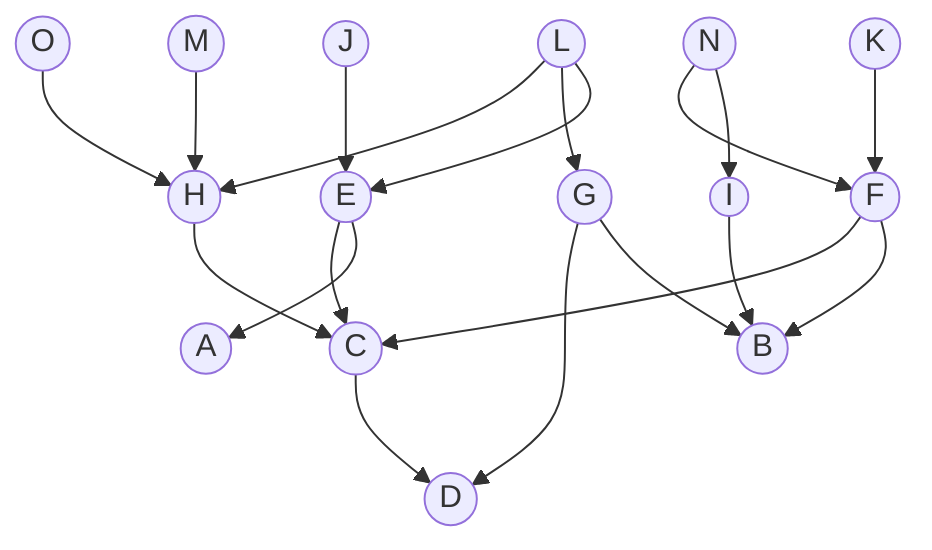
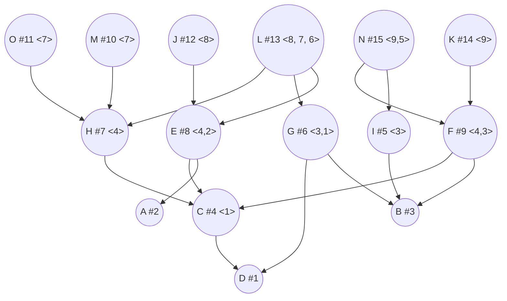

7 Задание,\
1 вариант

Таблица зависимостей:

| Предшествующее задание | J | K | L | L | L | M | N | N | O | O | E | E | F | G | G | H | I | C | F |
|------------------------|---|---|---|---|---|---|---|---|---|---|---|---|---|---|---|---|---|---|---|
| Последующее задание    | E | F | E | G | H | H | I | F | H | D | A | C | B | B | D | C | B | D | C | 

Построим граф зависимостей:

***Транзитивное ребро - это ребро, которое связано через другие вершины***. В нашем варианте такое ребро OD оно будет транзитивным так как от О до D есть так же цепь O-->H-->C-->D.\

 Удаляем ребро OD.

 Граф зависимостей будет выглядеть:

## Граф зависимостей с приоритетами
Присвиваем приоритеты изначальное для стоков(вершины, из которых нет исходящих ребер), у нас это A,D,B; Для заданий, все прямые потомки которых уже имеют приоритеты, составляется строка из приоритетов прямых потомков, записанных в убывающем порядке. Приоритет (t + 1) назначается заданию, у которого строка из приоритетов является лексикографически наименьшей.\
Приоритет - #\
Строка приоритетов прямых потомков - <>

## Диаграмма Ганта

```mermaid
gantt
    title Диаграмма Ганта
    dateFormat HH:mm    
    axisFormat %H:%M
    Начало выполнения работ : milestone, m1, 00:00, 0h
    section Исполнитель 1
    N         :n, 00:00, 1h
    L         :l, after n, 1h
    O         :o, after l, 1h
    F         :f, after o, 1h
    H         :h, after f, 1h
    I         :i, after h, 1h
    B         :b, after i, 1h
    D         :d, after b, 1h
    section Исполнитель 2
    K         :k, 00:00, 1h
    J         :j, after k, 1h
    M         :m, after j, 1h
    E         :e, after m, 1h
    G         :g, after e, 1h
    C         :c, after g, 1h
    A         :a, after c, 1h
    Окончание выполнения работ : milestone, m2, 08:00, 0h
```

В конце есть простой у второго исполнителя. 
 Полное время работы равняется 8 часам.