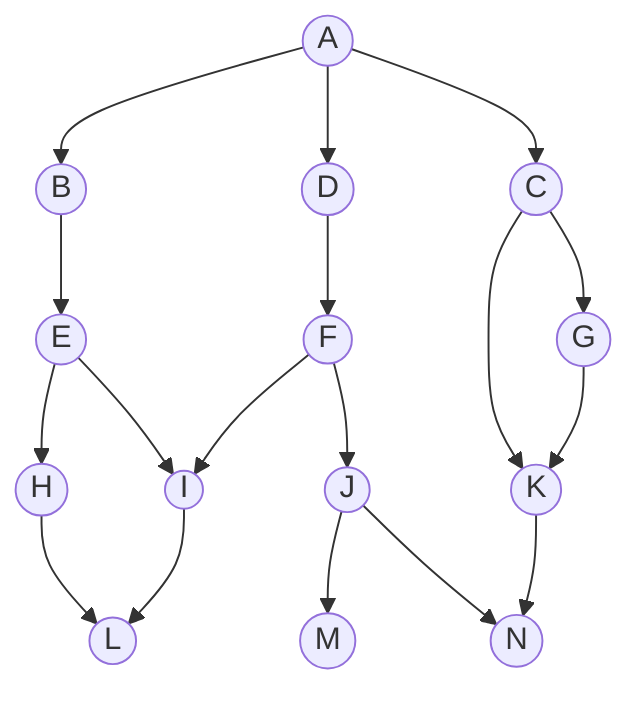
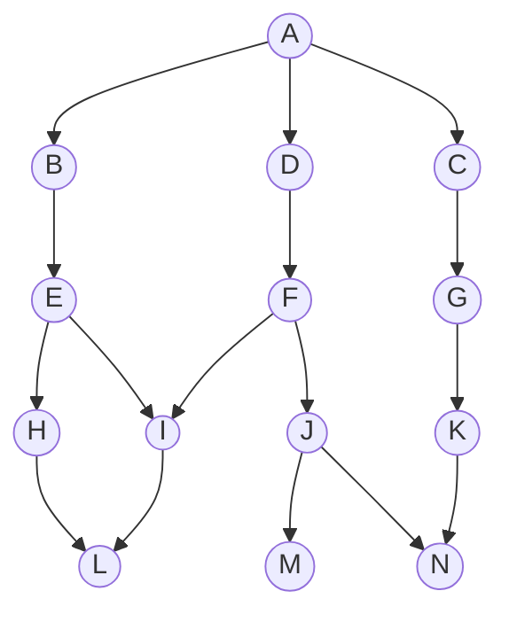
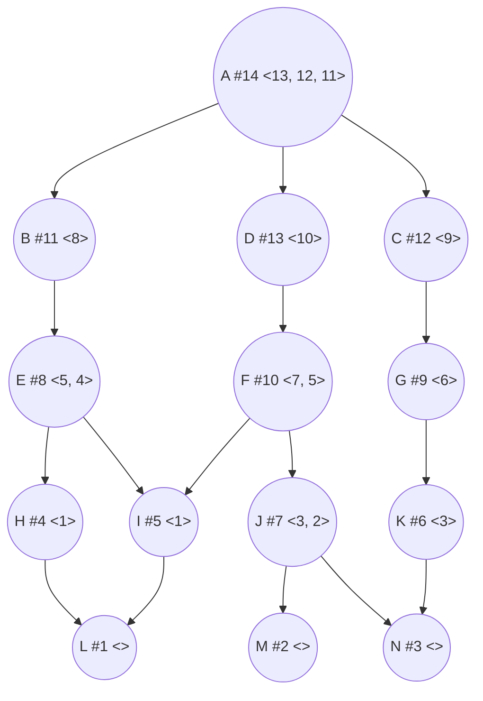
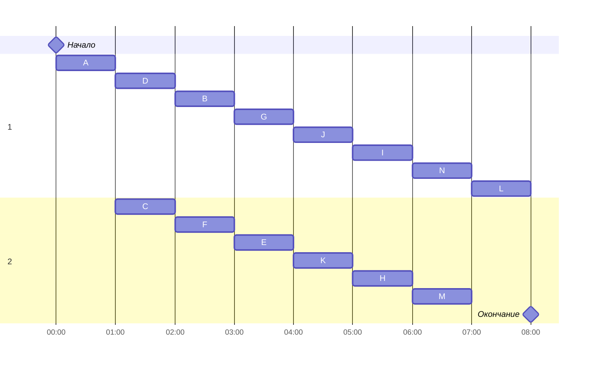

# Оптимальное расписание. Лексикографическая задача. Вариант 5.

### Таблица зависимостей:

| Предшествующее задание | A | A | A | B | C | C | D | E | E | F | F | G | H | I | J | J | K |
|------------------------|---|---|---|---|---|---|---|---|---|---|---|---|---|---|---|---|---|
| Последующее задание    | D | B | C | E | G | K | F | H | I | I | J | K | L | L | M | N | N |

## Решение
### Граф зависимостей

Ребро CK является транзитивным, однако первый пункт алгоритма решения задачи гласит: "Перед выполнением алгоритма необходимо удалить из графа зависимостей транзитивные ребра." После удаления ребра CK граф выглядит так:

### Граф зависимостей с приоритетами
Приоритет задачи указан после символа #  
Номера прямых потомков указаны в <>  
Приоритеты расставляются, начиная со стоков графа (вершины без исходящих из них рёбер).  
Затем для заданий, у прямых потомков которых уже указаны приоритеты, выписываются эти  
самые потомки в убывающем порядке. Далее приоритет назначается задаче, строка потомков  
которой является лексикографически наименьшей(прим.: приоритет E ставится раньше, чем  
приоритет G, т.к. несмотря на кол-во потомков, (5, 4) < (6) лексикографически).

### Диаграмма Ганта
Расписание составляем согласно выставленным приоритетам, от большего к меньшему, при   
этом следим, чтобы все предшествующие задачи для ближайшего приоритета были  
выполнены. Задачи неразделимы и занимают равно кол-во времени.

Итоговое время для выполнения всех поставленных задач - 8.