***ВАРИАНТ 5***

Дана матрица затрат для затрат A, B, C, D, E и исполнителей 1, 2, 3, 4, 5:

|   |  1  |  2  |  3  |  4  |  5  |
|------|-----|-----|-----|-----|-----|
| **A**|  19 |  19 |  14 |  10 |  14 |
| **B**|  17 |  18 |  11 |  16 |  11 |
| **C**|  13 |   5 |  18 |  20 |  10 |
| **D**|  14 |   5 |   9 |  12 |  20 |
| **E**|  15 |   7 |  14 |   8 |  16 |

**Шаг 1:** проведем редукцию матрицы затрат. 

1.1. Вычтем из каждой строки минимальное значение, представленное в этой строке.

|   |  1  |  2  |  3  |  4  |  5  | Min  |
|------|-----|-----|-----|-----|-----|------|
| **A**|   9 |   9 |   4 |   0 |   4 | -10  |
| **B**|   6 |   7 |   0 |   5 |   0 | -11  |
| **C**|   8 |   0 |  13 |  15 |   5 |  -5  |
| **D**|   9 |   0 |   4 |   7 |  15 |  -5  |
| **E**|   8 |   0 |   7 |   1 |   9 |  -7  |

1.2. Ищем столбцы, в которых нет нулей. Если есть, то только из этих столбцов вычитаем минимум данного столбца.

|   |  1  |  2  |  3  |  4  |  5  |
|------|-----|-----|-----|-----|-----|
| **A**|   9 |   9 |   4 |   0 |   4 |
| **B**|   6 |   7 |   0 |   5 |   0 |
| **C**|   8 |   0 |  13 |  15 |   5 |
| **D**|   9 |   0 |   4 |   7 |  15 |
| **E**|   8 |   0 |   7 |   1 |   9 |
| **Min**|   6 |   0 |   0 |   0 |   0 |

1.3. Получим редуцированную матрицу, где нули обозначают наименее затратные варианты назначений.

|   |  1  |  2  |  3  |  4  |  5  |
|------|-----|-----|-----|-----|-----|
| **A**|   3 |   9 |   4 |   **0** |   4 |
| **B**|   **0** |   7 |   **0** |   5 |   **0** |
| **C**|   2 |   **0** |  13 |  15 |   5 |
| **D**|   3 |   **0** |   4 |   7 |  15 |
| **E**|   2 |   **0** |   7 |   1 |   9 |

**Шаг 2**: построим двудольный граф, вынесем на него те ребра, для которых в редуцированной матрице указаны нули.

2.1. Выберем любое паросочетание, например: A --- 4, B --- 1, D --- 2, и попытаемся построить совершенное паросочетание с помощью чередующихся деревьев.

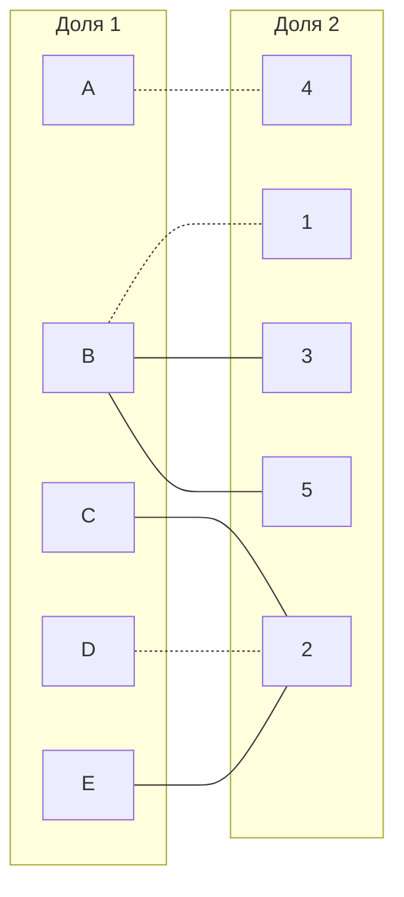

2.2. Попытаемся построить дерево из оставшихся непокрытых вершин C и E.
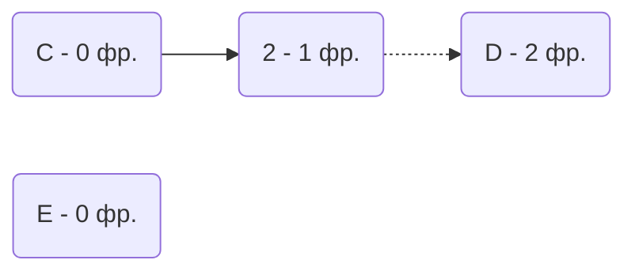
2.3. В построенном дереве нет цепей, чередующихся относительно текущего паросочетания (из вершины D нет непокрытого ребра) , то есть в указанном графе нет совершенного паросочетания.

**Шаг 3:** проведем повторную редукцию матрицы затрат.

3.1. Во множество X выпишем все покрытые построенным деревом вершины первой доли графа, во множество Y все покрытые построенным деревом вершины из второй доли графа.

$$ X = {C, D, E} $$

$$ Y = {2} $$

3.2. Необходимо найти минимальный элемент из строк, включенных во множество X и столбцов, не включенных во множество Y.

В нашем случае, это будут строки: C, D, E и столбцы: 1, 3, 4, 5. Минимальный элемент 1, расположен в строке E и столбце 4.

3.3. Вычтем найденное значение из строк множества X и прибавим к столбцам множества Y. Новая полученная матрица затрат:

|   | 1  | **2**  | 3  | 4  | 5  |
|---|----|----|----|----|----|
| A | 3  | 10 | 4  | 0  | 4  |
| B | 0  | 8  | 0  | 5  | 0  |
| **C** | 1  | 0  | 12 | 14 | 14 |
| **D** | 2  | 0  | 3  | 6  | 14 |
| **E** | 1  | 0  | 6  | **0**  | 8  |

3.4. В ячейке E4 появилось новое нулевое значение, добавим соответствующее ребро в двудольный граф.

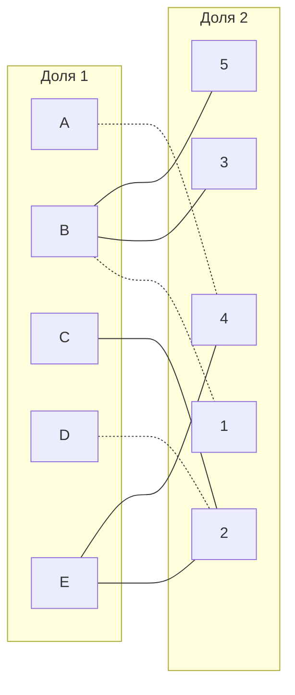

**Шаг 4:** попытаемся построить совершенное паросочетание с помощью чередующихся деревьев на основе обновленного графа.

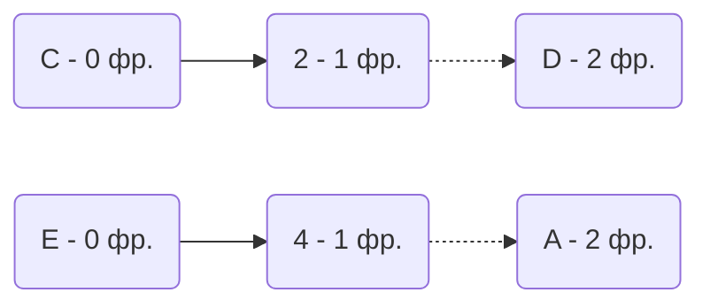

В построенном дереве все еще нет чередующихся цепей, относительно текущего паросочетания, обе ветки закончились в покрытых вершинах, то есть в указанном графе нет совершенного паросочетания. Повторяем шаг 3.

**Шаг 5:** проведем повторную редукцию матрицы затрат

5.1.

$$ X = {A, C, D, E} $$

$$ Y = {2, 4} $$

5.2. Cтроки: A, C, D, E и столбцы 1, 3, 5. Минимальный элемент 1, расположен в строке C и столбце 1.

5.3. Вычтем найденное значение из строк множества X и прибавим к столбцам множества Y. Новая полученная матрица затрат:

|   | 1  | **2**  | 3  | **4**  | 5  |
|---|----|----|----|----|----|
| **A** | 2  | 10 | 3  | 0  | 3  |
| B | 0  | 9  | 0  | 6  | 0  |
| **C** | **0**  | 0  | 11 | 14 | 13 |
| **D** | 1  | 0  | 2  | 6  | 13 |
| **E** | **0**  | 0  | 5  | 0  | 7  |

5.4. В ячейках C1 и E1 появились новые нулевые значения, добавим соответствующие ребра в двудольный граф.

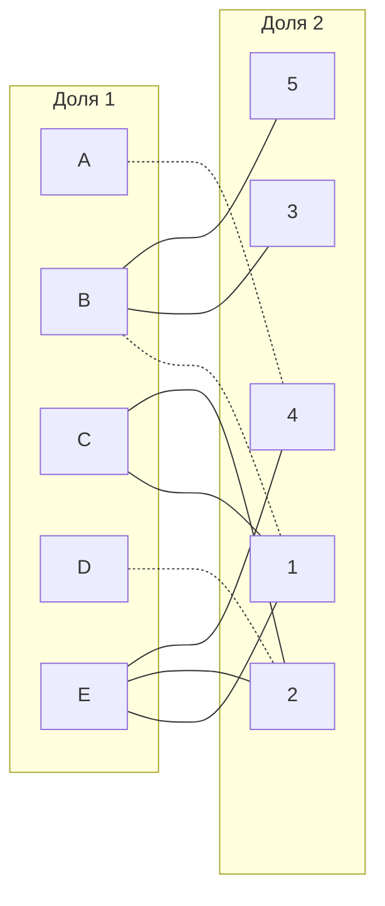

**Шаг 6:** снова попытаемся построить совершенное паросочетание с помощью чередующихся деревьев на основе обновленного графа.

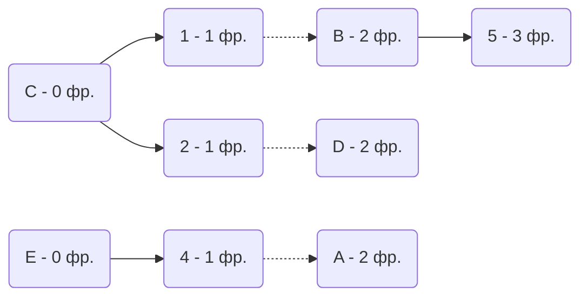

Построенное дерево содержит чередующуюся, относительно текущего паросочетания, цепь C -> 1 -> B -> 5, цепь начинается и заканчивается в непокрытых вершинах, все ребра в цепи чередуются по вхождению в текущее паросочетание.

"Перекрасим" найденную цепь и проверим полученное паросочетание.

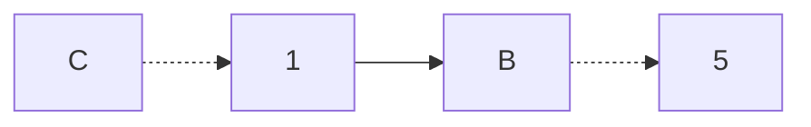

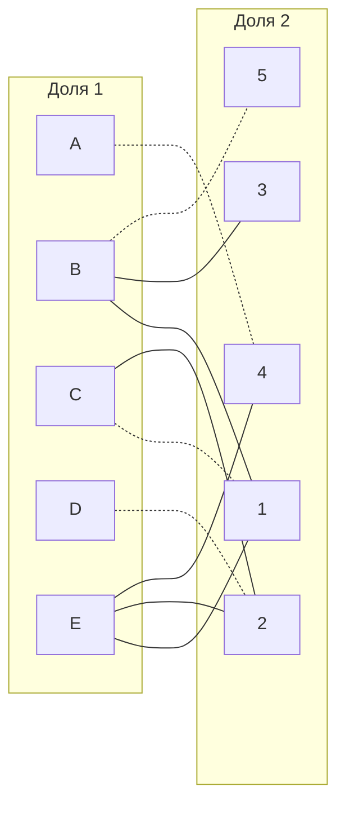

Полученное паросочетание все еще не является совершенным, т.к. оно не покрывает все вершины графа.

**Шаг 7:** снова ищем чередующуюся цепь в обновленном двудольном графе

Граф чередующихся деревьев:
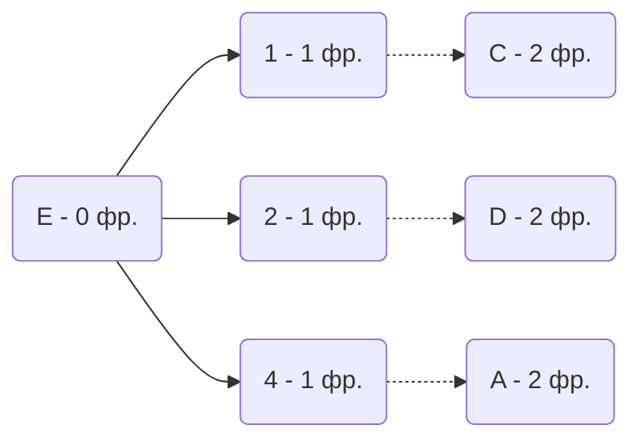

В построенном графе нет чередующихся цепей, поэтому редуцируем матрицу затрат.

**Шаг 8:**

$$ X = {A, C, D, E} $$

$$ Y = {1, 2, 4} $$

Ищем минимальный элемент в строках X и в столбцах 3, 5. Минимальный элемент 2, находится на позиции D3.

Обновленная матрица затрат:
|   | 1  | 2  | **3**  | 4  | **5**  |
|---|----|----|----|----|----|
| **A** | 2  | 10 | 1  | 0  | 1  |
| B | 2  | 11 | 0  | 8  | 0  |
| **C** | 0  | 0  | 9  | 14 | 11 |
| **D** | 1  | 0  | **0**  | 6  | 11 |
| **E** | 0  | 0  | 3  | 0  | 5  |

В ячейке D3 появилось новое нулевое значение, добавим соответствующее ребро в двудольный граф.

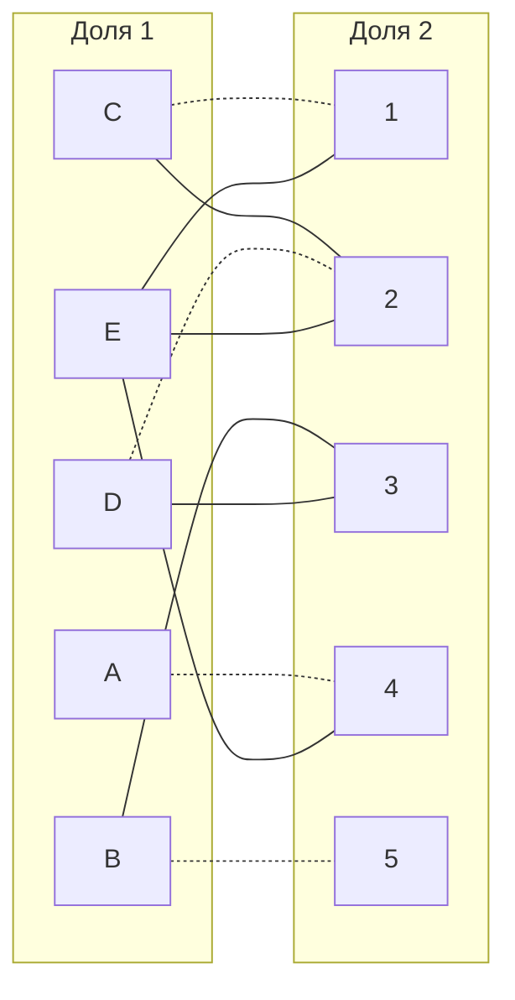

**Шаг 9:** попытаемся построить совершенное паросочетание с помощью чередующихся деревьев на основе обновленного графа.

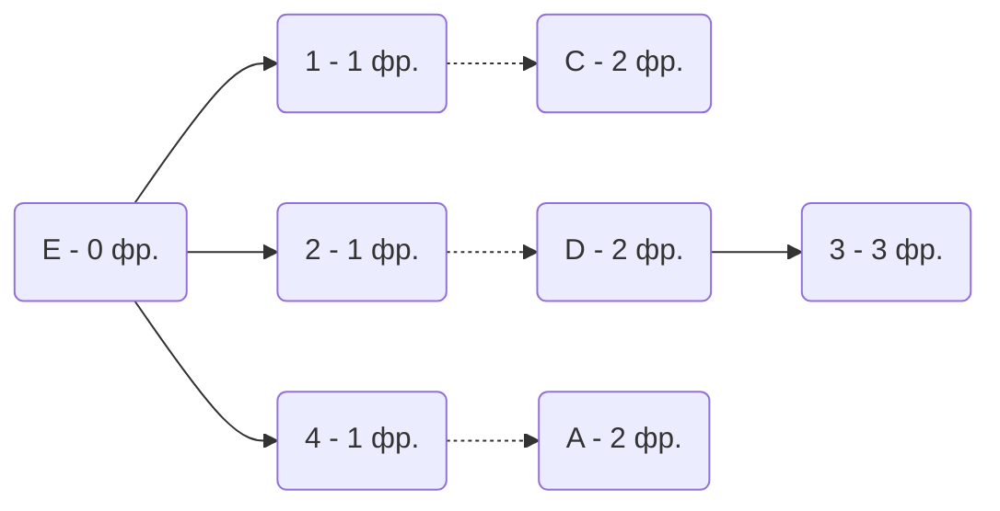

Построенное дерево содержит чередующуюся, относительно текущего паросочетания, цепь E - 2 - D - 3, цепь начинается и заканчивается в непокрытых вершинах, все ребра в цепи чередуются по вхождению в текущее паросочетание.

"Перекрасим" найденную цепь и проверим полученное паросочетание.

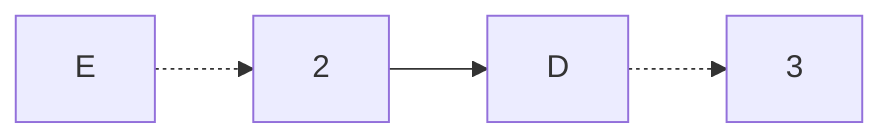

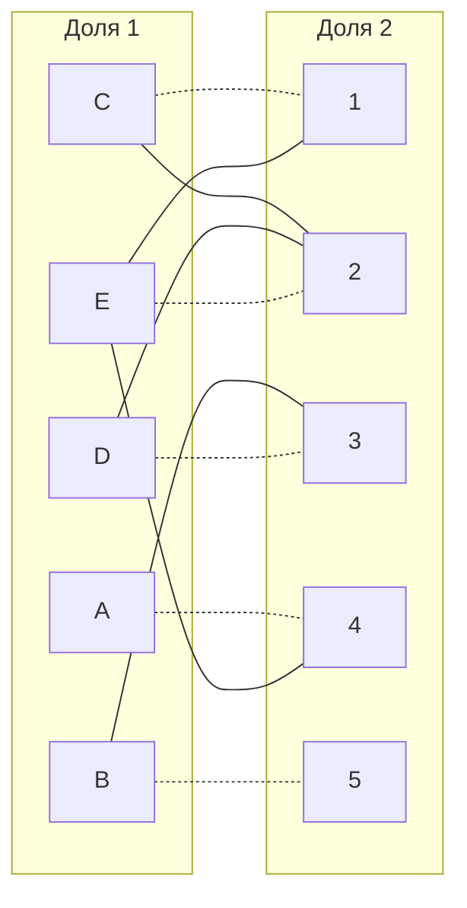

Полученное расписание является совершенным. Выпишем полученные назначения и их стоимости из исходной матрицы:
- A4 - 10;
- B5 - 11;
- C1 - 13;
- D3 - 9;
- E2 - 7.

Общая стоимость затрат = 10 + 11 + 13 + 9 + 7 = 50.

***ОТВЕТ***

Минимальная стоимость затрат 50, при следующих назначениях:

- задача C, исполнитель 1;
- задача E, исполнитель 2;
- задача D, исполнитель 3;
- задача A, исполнитель 4;
- задача B, исполнитель 5.